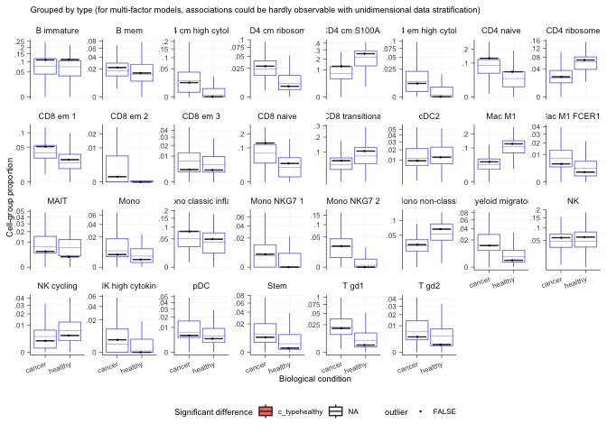

sccomp - Outlier-aware and count-based compositional analysis of
single-cell data
================

<!-- badges: start -->

[](https://www.tidyverse.org/lifecycle/#maturing)
[](https://github.com/stemangiola/tidyseurat/actions/)

<!-- badges: end -->

<a href="https://www.youtube.com/watch?v=R_lt58We9nA&ab_channel=RConsortium" target="_blank">

</a>

# 

Sccomp is a generalised method for differential composition and
variability analyses.

## Characteristics

- Complex linear models with continuous and categorical covariates
- Multilevel modelling, with population (i.e. fixed) and group (random)
  effects
- Modelling counts
- Modelling proportionality
- Modelling cell-type specific variability
- Cell-type information share for variability adaptive shrinkage
- Testing differential variability
- Probabilistic outlier identification
- Cross-dataset learning (hyperpriors).

# Installation

**Bioconductor**

``` r
if (!requireNamespace("BiocManager")) install.packages("BiocManager")
BiocManager::install("sccomp")
```

**Github**

``` r
devtools::install_github("stemangiola/sccomp")
```

| Function                           | Description                                                                                                                 |
|------------------------------------|-----------------------------------------------------------------------------------------------------------------------------|
| `sccomp_estimate`                  | Fit the model onto the data, and estimate the coefficients                                                                  |
| `sccomp_remove_outliers`           | Identify outliers probabilistically based on the model fit, and exclude them from the estimation                            |
| `sccomp_test`                      | Calculate the probability that the coefficients are outside the H0 interval (i.e. test_composition_above_logit_fold_change) |
| `sccomp_replicate`                 | Simulate data from the model, or part of the model                                                                          |
| `sccomp_predict`                   | Predicts proportions, based on the mode, or part of the model                                                               |
| `sccomp_remove_unwanted_variation` | Removes the variability for unwanted factors                                                                                |
| `plot`                             | Plors summary plots to asses significance                                                                                   |

# Analysis

`sccomp` can model changes in composition and variability. By default,
the formula for variability is either `~1`, which assumes that the
cell-group variability is independent of any covariate or
`~ factor_of_interest`, which assumes that the model is dependent on the
factor of interest only. The variability model must be a subset of the
model for composition.

## Binary factor

### From Seurat, SingleCellExperiment, metadata objects

``` r
single_cell_object |>
  sccomp_estimate( 
    formula_composition = ~ type, 
    .sample =  sample, 
    .cell_group = cell_group, 
    bimodal_mean_variability_association = TRUE,
    cores = 1 
  ) |> 
  sccomp_remove_outliers(cores = 1) |> 
    sccomp_test(test_composition_above_logit_fold_change = 0.2)
```

### From counts

``` r
counts_obj |>
  sccomp_estimate( 
    formula_composition = ~ type, 
    .sample = sample,
    .cell_group = cell_group,
    .count = count, 
    bimodal_mean_variability_association = TRUE,
    cores = 1 
  ) |> 
  sccomp_remove_outliers(cores = 1) |> 
    sccomp_test(test_composition_above_logit_fold_change = 0.2)
```

    ## 
    ## SAMPLING FOR MODEL 'glm_multi_beta_binomial' NOW (CHAIN 1).
    ## Chain 1: 
    ## Chain 1: Gradient evaluation took 0.000378 seconds
    ## Chain 1: 1000 transitions using 10 leapfrog steps per transition would take 3.78 seconds.
    ## Chain 1: Adjust your expectations accordingly!
    ## Chain 1: 
    ## Chain 1: 
    ## Chain 1: Iteration:    1 / 4300 [  0%]  (Warmup)
    ## Chain 1: Iteration:  301 / 4300 [  7%]  (Sampling)
    ## Chain 1: Iteration: 1300 / 4300 [ 30%]  (Sampling)
    ## Chain 1: Iteration: 2300 / 4300 [ 53%]  (Sampling)
    ## Chain 1: Iteration: 3300 / 4300 [ 76%]  (Sampling)
    ## Chain 1: Iteration: 4300 / 4300 [100%]  (Sampling)
    ## Chain 1: 
    ## Chain 1:  Elapsed Time: 2.806 seconds (Warm-up)
    ## Chain 1:                19.451 seconds (Sampling)
    ## Chain 1:                22.257 seconds (Total)
    ## Chain 1: 
    ## 
    ## SAMPLING FOR MODEL 'glm_multi_beta_binomial' NOW (CHAIN 1).
    ## Chain 1: 
    ## Chain 1: Gradient evaluation took 0.00041 seconds
    ## Chain 1: 1000 transitions using 10 leapfrog steps per transition would take 4.1 seconds.
    ## Chain 1: Adjust your expectations accordingly!
    ## Chain 1: 
    ## Chain 1: 
    ## Chain 1: Iteration:     1 / 20299 [  0%]  (Warmup)
    ## Chain 1: Iteration:   301 / 20299 [  1%]  (Sampling)
    ## Chain 1: Iteration:  1300 / 20299 [  6%]  (Sampling)
    ## Chain 1: Iteration:  2300 / 20299 [ 11%]  (Sampling)
    ## Chain 1: Iteration:  3300 / 20299 [ 16%]  (Sampling)
    ## Chain 1: Iteration:  4300 / 20299 [ 21%]  (Sampling)
    ## Chain 1: Iteration:  5300 / 20299 [ 26%]  (Sampling)
    ## Chain 1: Iteration:  6300 / 20299 [ 31%]  (Sampling)
    ## Chain 1: Iteration:  7300 / 20299 [ 35%]  (Sampling)
    ## Chain 1: Iteration:  8300 / 20299 [ 40%]  (Sampling)
    ## Chain 1: Iteration:  9300 / 20299 [ 45%]  (Sampling)
    ## Chain 1: Iteration: 10300 / 20299 [ 50%]  (Sampling)
    ## Chain 1: Iteration: 11300 / 20299 [ 55%]  (Sampling)
    ## Chain 1: Iteration: 12300 / 20299 [ 60%]  (Sampling)
    ## Chain 1: Iteration: 13300 / 20299 [ 65%]  (Sampling)
    ## Chain 1: Iteration: 14300 / 20299 [ 70%]  (Sampling)
    ## Chain 1: Iteration: 15300 / 20299 [ 75%]  (Sampling)
    ## Chain 1: Iteration: 16300 / 20299 [ 80%]  (Sampling)
    ## Chain 1: Iteration: 17300 / 20299 [ 85%]  (Sampling)
    ## Chain 1: Iteration: 18300 / 20299 [ 90%]  (Sampling)
    ## Chain 1: Iteration: 19300 / 20299 [ 95%]  (Sampling)
    ## Chain 1: Iteration: 20299 / 20299 [100%]  (Sampling)
    ## Chain 1: 
    ## Chain 1:  Elapsed Time: 2.976 seconds (Warm-up)
    ## Chain 1:                111.381 seconds (Sampling)
    ## Chain 1:                114.357 seconds (Total)
    ## Chain 1: 
    ## 
    ## SAMPLING FOR MODEL 'glm_multi_beta_binomial' NOW (CHAIN 1).
    ## Chain 1: 
    ## Chain 1: Gradient evaluation took 0.000317 seconds
    ## Chain 1: 1000 transitions using 10 leapfrog steps per transition would take 3.17 seconds.
    ## Chain 1: Adjust your expectations accordingly!
    ## Chain 1: 
    ## Chain 1: 
    ## Chain 1: Iteration:    1 / 4300 [  0%]  (Warmup)
    ## Chain 1: Iteration:  301 / 4300 [  7%]  (Sampling)
    ## Chain 1: Iteration: 1300 / 4300 [ 30%]  (Sampling)
    ## Chain 1: Iteration: 2300 / 4300 [ 53%]  (Sampling)
    ## Chain 1: Iteration: 3300 / 4300 [ 76%]  (Sampling)
    ## Chain 1: Iteration: 4300 / 4300 [100%]  (Sampling)
    ## Chain 1: 
    ## Chain 1:  Elapsed Time: 2.74 seconds (Warm-up)
    ## Chain 1:                20.706 seconds (Sampling)
    ## Chain 1:                23.446 seconds (Total)
    ## Chain 1:

    ## # A tibble: 72 × 18
    ##    cell_group parameter  factor c_lower c_effect c_upper   c_pH0   c_FDR c_n_eff
    ##    <chr>      <chr>      <chr>    <dbl>    <dbl>   <dbl>   <dbl>   <dbl>   <dbl>
    ##  1 B1         (Intercep… <NA>    0.892     1.11   1.33   0       0         5144.
    ##  2 B1         typecancer type   -1.18     -0.765 -0.381  1.50e-3 5.50e-4   3943.
    ##  3 B2         (Intercep… <NA>    0.418     0.705  0.990  5.00e-4 5.00e-5   4184.
    ##  4 B2         typecancer type   -1.24     -0.719 -0.260  1.25e-2 2.31e-3   3464.
    ##  5 B3         (Intercep… <NA>   -0.664    -0.381 -0.109  9.45e-2 8.25e-3   4104.
    ##  6 B3         typecancer type   -0.757    -0.317  0.0932 2.86e-1 6.84e-2   5025.
    ##  7 BM         (Intercep… <NA>   -1.32     -1.03  -0.750  0       0         4626.
    ##  8 BM         typecancer type   -0.742    -0.318  0.0838 2.90e-1 7.94e-2   4885.
    ##  9 CD4 1      (Intercep… <NA>    0.0846    0.307  0.511  1.63e-1 2.29e-2   3322.
    ## 10 CD4 1      typecancer type   -0.101     0.181  0.470  5.5 e-1 1.53e-1   3695.
    ## # ℹ 62 more rows
    ## # ℹ 9 more variables: c_R_k_hat <dbl>, v_lower <dbl>, v_effect <dbl>,
    ## #   v_upper <dbl>, v_pH0 <dbl>, v_FDR <dbl>, v_n_eff <dbl>, v_R_k_hat <dbl>,
    ## #   count_data <list>

Of the output table, the estimate columns start with the prefix `c_`
indicate `composition`, or with `v_` indicate `variability` (when
formula_variability is set).

## Contrasts

``` r
seurat_obj |>
  sccomp_estimate( 
    formula_composition = ~ 0 + type, 
    .sample = sample,
    .cell_group = cell_group, 
    bimodal_mean_variability_association = TRUE,
    cores = 1 
  ) |> 
  sccomp_remove_outliers(cores = 1) |> 
    sccomp_test(
      contrasts =  c("typecancer - typehealthy", "typehealthy - typecancer"),
      test_composition_above_logit_fold_change = 0.2
    )
```

    ## 
    ## SAMPLING FOR MODEL 'glm_multi_beta_binomial' NOW (CHAIN 1).
    ## Chain 1: 
    ## Chain 1: Gradient evaluation took 0.000273 seconds
    ## Chain 1: 1000 transitions using 10 leapfrog steps per transition would take 2.73 seconds.
    ## Chain 1: Adjust your expectations accordingly!
    ## Chain 1: 
    ## Chain 1: 
    ## Chain 1: Iteration:    1 / 4300 [  0%]  (Warmup)
    ## Chain 1: Iteration:  301 / 4300 [  7%]  (Sampling)
    ## Chain 1: Iteration: 1300 / 4300 [ 30%]  (Sampling)
    ## Chain 1: Iteration: 2300 / 4300 [ 53%]  (Sampling)
    ## Chain 1: Iteration: 3300 / 4300 [ 76%]  (Sampling)
    ## Chain 1: Iteration: 4300 / 4300 [100%]  (Sampling)
    ## Chain 1: 
    ## Chain 1:  Elapsed Time: 2.042 seconds (Warm-up)
    ## Chain 1:                17.496 seconds (Sampling)
    ## Chain 1:                19.538 seconds (Total)
    ## Chain 1: 
    ## 
    ## SAMPLING FOR MODEL 'glm_multi_beta_binomial' NOW (CHAIN 1).
    ## Chain 1: 
    ## Chain 1: Gradient evaluation took 0.000267 seconds
    ## Chain 1: 1000 transitions using 10 leapfrog steps per transition would take 2.67 seconds.
    ## Chain 1: Adjust your expectations accordingly!
    ## Chain 1: 
    ## Chain 1: 
    ## Chain 1: Iteration:     1 / 20299 [  0%]  (Warmup)
    ## Chain 1: Iteration:   301 / 20299 [  1%]  (Sampling)
    ## Chain 1: Iteration:  1300 / 20299 [  6%]  (Sampling)
    ## Chain 1: Iteration:  2300 / 20299 [ 11%]  (Sampling)
    ## Chain 1: Iteration:  3300 / 20299 [ 16%]  (Sampling)
    ## Chain 1: Iteration:  4300 / 20299 [ 21%]  (Sampling)
    ## Chain 1: Iteration:  5300 / 20299 [ 26%]  (Sampling)
    ## Chain 1: Iteration:  6300 / 20299 [ 31%]  (Sampling)
    ## Chain 1: Iteration:  7300 / 20299 [ 35%]  (Sampling)
    ## Chain 1: Iteration:  8300 / 20299 [ 40%]  (Sampling)
    ## Chain 1: Iteration:  9300 / 20299 [ 45%]  (Sampling)
    ## Chain 1: Iteration: 10300 / 20299 [ 50%]  (Sampling)
    ## Chain 1: Iteration: 11300 / 20299 [ 55%]  (Sampling)
    ## Chain 1: Iteration: 12300 / 20299 [ 60%]  (Sampling)
    ## Chain 1: Iteration: 13300 / 20299 [ 65%]  (Sampling)
    ## Chain 1: Iteration: 14300 / 20299 [ 70%]  (Sampling)
    ## Chain 1: Iteration: 15300 / 20299 [ 75%]  (Sampling)
    ## Chain 1: Iteration: 16300 / 20299 [ 80%]  (Sampling)
    ## Chain 1: Iteration: 17300 / 20299 [ 85%]  (Sampling)
    ## Chain 1: Iteration: 18300 / 20299 [ 90%]  (Sampling)
    ## Chain 1: Iteration: 19300 / 20299 [ 95%]  (Sampling)
    ## Chain 1: Iteration: 20299 / 20299 [100%]  (Sampling)
    ## Chain 1: 
    ## Chain 1:  Elapsed Time: 1.764 seconds (Warm-up)
    ## Chain 1:                82.542 seconds (Sampling)
    ## Chain 1:                84.306 seconds (Total)
    ## Chain 1: 
    ## 
    ## SAMPLING FOR MODEL 'glm_multi_beta_binomial' NOW (CHAIN 1).
    ## Chain 1: 
    ## Chain 1: Gradient evaluation took 0.00027 seconds
    ## Chain 1: 1000 transitions using 10 leapfrog steps per transition would take 2.7 seconds.
    ## Chain 1: Adjust your expectations accordingly!
    ## Chain 1: 
    ## Chain 1: 
    ## Chain 1: Iteration:    1 / 4300 [  0%]  (Warmup)
    ## Chain 1: Iteration:  301 / 4300 [  7%]  (Sampling)
    ## Chain 1: Iteration: 1300 / 4300 [ 30%]  (Sampling)
    ## Chain 1: Iteration: 2300 / 4300 [ 53%]  (Sampling)
    ## Chain 1: Iteration: 3300 / 4300 [ 76%]  (Sampling)
    ## Chain 1: Iteration: 4300 / 4300 [100%]  (Sampling)
    ## Chain 1: 
    ## Chain 1:  Elapsed Time: 1.893 seconds (Warm-up)
    ## Chain 1:                16.955 seconds (Sampling)
    ## Chain 1:                18.848 seconds (Total)
    ## Chain 1:

    ## # A tibble: 60 × 18
    ##    cell_group  parameter factor c_lower c_effect c_upper   c_pH0   c_FDR c_n_eff
    ##    <chr>       <chr>     <chr>    <dbl>    <dbl>   <dbl>   <dbl>   <dbl>   <dbl>
    ##  1 B immature  typecanc… <NA>    -1.90    -1.42   -0.931 0       0            NA
    ##  2 B immature  typeheal… <NA>     0.931    1.42    1.90  0       0            NA
    ##  3 B mem       typecanc… <NA>    -2.33    -1.73   -1.12  0       0            NA
    ##  4 B mem       typeheal… <NA>     1.12     1.73    2.33  0       0            NA
    ##  5 CD4 cm S10… typecanc… <NA>    -1.28    -0.873  -0.519 2.50e-4 5.00e-5      NA
    ##  6 CD4 cm S10… typeheal… <NA>     0.519    0.873   1.28  2.50e-4 5.00e-5      NA
    ##  7 CD4 cm hig… typecanc… <NA>     0.915    1.84    3.00  7.50e-4 1.79e-4      NA
    ##  8 CD4 cm hig… typeheal… <NA>    -3.00    -1.84   -0.915 7.50e-4 1.79e-4      NA
    ##  9 CD4 cm rib… typecanc… <NA>     0.346    1.01    1.72  1.10e-2 3.48e-3      NA
    ## 10 CD4 cm rib… typeheal… <NA>    -1.72    -1.01   -0.346 1.10e-2 3.48e-3      NA
    ## # ℹ 50 more rows
    ## # ℹ 9 more variables: c_R_k_hat <dbl>, v_lower <dbl>, v_effect <dbl>,
    ## #   v_upper <dbl>, v_pH0 <dbl>, v_FDR <dbl>, v_n_eff <dbl>, v_R_k_hat <dbl>,
    ## #   count_data <list>

## Categorical factor (e.g. Bayesian ANOVA)

This is achieved through model comparison with `loo`. In the following
example, the model with association with factors better fits the data
compared to the baseline model with no factor association. For
comparisons `check_outliers` must be set to FALSE as the leave-one-out
must work with the same amount of data, while outlier elimination does
not guarantee it.

If `elpd_diff` is away from zero of \> 5 `se_diff` difference of 5, we
are confident that a model is better than the other
[reference](https://discourse.mc-stan.org/t/interpreting-elpd-diff-loo-package/1628/2?u=stemangiola).
In this case, -79.9 / 11.5 = -6.9, therefore we can conclude that model
one, the one with factor association, is better than model two.

``` r
library(loo)

# Fit first model
model_with_factor_association = 
  seurat_obj |>
  sccomp_estimate( 
    formula_composition = ~ type, 
    .sample =  sample, 
    .cell_group = cell_group, 
    bimodal_mean_variability_association = TRUE,
    cores = 1, 
    enable_loo = TRUE
  )
```

    ## 
    ## SAMPLING FOR MODEL 'glm_multi_beta_binomial' NOW (CHAIN 1).
    ## Chain 1: 
    ## Chain 1: Gradient evaluation took 0.000274 seconds
    ## Chain 1: 1000 transitions using 10 leapfrog steps per transition would take 2.74 seconds.
    ## Chain 1: Adjust your expectations accordingly!
    ## Chain 1: 
    ## Chain 1: 
    ## Chain 1: Iteration:    1 / 4300 [  0%]  (Warmup)
    ## Chain 1: Iteration:  301 / 4300 [  7%]  (Sampling)
    ## Chain 1: Iteration: 1300 / 4300 [ 30%]  (Sampling)
    ## Chain 1: Iteration: 2300 / 4300 [ 53%]  (Sampling)
    ## Chain 1: Iteration: 3300 / 4300 [ 76%]  (Sampling)
    ## Chain 1: Iteration: 4300 / 4300 [100%]  (Sampling)
    ## Chain 1: 
    ## Chain 1:  Elapsed Time: 2.27 seconds (Warm-up)
    ## Chain 1:                19.686 seconds (Sampling)
    ## Chain 1:                21.956 seconds (Total)
    ## Chain 1:

``` r
# Fit second model
model_without_association = 
  seurat_obj |>
  sccomp_estimate( 
    formula_composition = ~ 1, 
    .sample =  sample, 
    .cell_group = cell_group, 
    bimodal_mean_variability_association = TRUE,
    cores = 1 , 
    enable_loo = TRUE
  )
```

    ## 
    ## SAMPLING FOR MODEL 'glm_multi_beta_binomial' NOW (CHAIN 1).
    ## Chain 1: 
    ## Chain 1: Gradient evaluation took 0.00028 seconds
    ## Chain 1: 1000 transitions using 10 leapfrog steps per transition would take 2.8 seconds.
    ## Chain 1: Adjust your expectations accordingly!
    ## Chain 1: 
    ## Chain 1: 
    ## Chain 1: Iteration:    1 / 4300 [  0%]  (Warmup)
    ## Chain 1: Iteration:  301 / 4300 [  7%]  (Sampling)
    ## Chain 1: Iteration: 1300 / 4300 [ 30%]  (Sampling)
    ## Chain 1: Iteration: 2300 / 4300 [ 53%]  (Sampling)
    ## Chain 1: Iteration: 3300 / 4300 [ 76%]  (Sampling)
    ## Chain 1: Iteration: 4300 / 4300 [100%]  (Sampling)
    ## Chain 1: 
    ## Chain 1:  Elapsed Time: 2.128 seconds (Warm-up)
    ## Chain 1:                24.919 seconds (Sampling)
    ## Chain 1:                27.047 seconds (Total)
    ## Chain 1:

``` r
# Compare models
loo_compare(
  model_with_factor_association |> attr("fit") |> loo(),
  model_without_association |> attr("fit") |> loo()
)
```

    ##        elpd_diff se_diff
    ## model1   0.0       0.0  
    ## model2 -80.7      11.4

## Differential variability, binary factor

We can model the cell-group variability also dependent on the type, and
so test differences in variability

``` r
res = 
  seurat_obj |>
  sccomp_estimate( 
    formula_composition = ~ type, 
    formula_variability = ~ type,
    .sample = sample,
    .cell_group = cell_group,
    bimodal_mean_variability_association = TRUE,
    cores = 1 
  ) |> 
  sccomp_remove_outliers(cores = 1) |> 
    sccomp_test(
      test_composition_above_logit_fold_change = 0.2
    )
```

    ## 
    ## SAMPLING FOR MODEL 'glm_multi_beta_binomial' NOW (CHAIN 1).
    ## Chain 1: 
    ## Chain 1: Gradient evaluation took 0.000328 seconds
    ## Chain 1: 1000 transitions using 10 leapfrog steps per transition would take 3.28 seconds.
    ## Chain 1: Adjust your expectations accordingly!
    ## Chain 1: 
    ## Chain 1: 
    ## Chain 1: Iteration:    1 / 4300 [  0%]  (Warmup)
    ## Chain 1: Iteration:  301 / 4300 [  7%]  (Sampling)
    ## Chain 1: Iteration: 1300 / 4300 [ 30%]  (Sampling)
    ## Chain 1: Iteration: 2300 / 4300 [ 53%]  (Sampling)
    ## Chain 1: Iteration: 3300 / 4300 [ 76%]  (Sampling)
    ## Chain 1: Iteration: 4300 / 4300 [100%]  (Sampling)
    ## Chain 1: 
    ## Chain 1:  Elapsed Time: 4.223 seconds (Warm-up)
    ## Chain 1:                34.263 seconds (Sampling)
    ## Chain 1:                38.486 seconds (Total)
    ## Chain 1: 
    ## 
    ## SAMPLING FOR MODEL 'glm_multi_beta_binomial' NOW (CHAIN 1).
    ## Chain 1: 
    ## Chain 1: Gradient evaluation took 0.000272 seconds
    ## Chain 1: 1000 transitions using 10 leapfrog steps per transition would take 2.72 seconds.
    ## Chain 1: Adjust your expectations accordingly!
    ## Chain 1: 
    ## Chain 1: 
    ## Chain 1: Iteration:     1 / 20299 [  0%]  (Warmup)
    ## Chain 1: Iteration:   301 / 20299 [  1%]  (Sampling)
    ## Chain 1: Iteration:  1300 / 20299 [  6%]  (Sampling)
    ## Chain 1: Iteration:  2300 / 20299 [ 11%]  (Sampling)
    ## Chain 1: Iteration:  3300 / 20299 [ 16%]  (Sampling)
    ## Chain 1: Iteration:  4300 / 20299 [ 21%]  (Sampling)
    ## Chain 1: Iteration:  5300 / 20299 [ 26%]  (Sampling)
    ## Chain 1: Iteration:  6300 / 20299 [ 31%]  (Sampling)
    ## Chain 1: Iteration:  7300 / 20299 [ 35%]  (Sampling)
    ## Chain 1: Iteration:  8300 / 20299 [ 40%]  (Sampling)
    ## Chain 1: Iteration:  9300 / 20299 [ 45%]  (Sampling)
    ## Chain 1: Iteration: 10300 / 20299 [ 50%]  (Sampling)
    ## Chain 1: Iteration: 11300 / 20299 [ 55%]  (Sampling)
    ## Chain 1: Iteration: 12300 / 20299 [ 60%]  (Sampling)
    ## Chain 1: Iteration: 13300 / 20299 [ 65%]  (Sampling)
    ## Chain 1: Iteration: 14300 / 20299 [ 70%]  (Sampling)
    ## Chain 1: Iteration: 15300 / 20299 [ 75%]  (Sampling)
    ## Chain 1: Iteration: 16300 / 20299 [ 80%]  (Sampling)
    ## Chain 1: Iteration: 17300 / 20299 [ 85%]  (Sampling)
    ## Chain 1: Iteration: 18300 / 20299 [ 90%]  (Sampling)
    ## Chain 1: Iteration: 19300 / 20299 [ 95%]  (Sampling)
    ## Chain 1: Iteration: 20299 / 20299 [100%]  (Sampling)
    ## Chain 1: 
    ## Chain 1:  Elapsed Time: 4.5 seconds (Warm-up)
    ## Chain 1:                161.717 seconds (Sampling)
    ## Chain 1:                166.217 seconds (Total)
    ## Chain 1: 
    ## 
    ## SAMPLING FOR MODEL 'glm_multi_beta_binomial' NOW (CHAIN 1).
    ## Chain 1: 
    ## Chain 1: Gradient evaluation took 0.000274 seconds
    ## Chain 1: 1000 transitions using 10 leapfrog steps per transition would take 2.74 seconds.
    ## Chain 1: Adjust your expectations accordingly!
    ## Chain 1: 
    ## Chain 1: 
    ## Chain 1: Iteration:    1 / 4300 [  0%]  (Warmup)
    ## Chain 1: Iteration:  301 / 4300 [  7%]  (Sampling)
    ## Chain 1: Iteration: 1300 / 4300 [ 30%]  (Sampling)
    ## Chain 1: Iteration: 2300 / 4300 [ 53%]  (Sampling)
    ## Chain 1: Iteration: 3300 / 4300 [ 76%]  (Sampling)
    ## Chain 1: Iteration: 4300 / 4300 [100%]  (Sampling)
    ## Chain 1: 
    ## Chain 1:  Elapsed Time: 4.221 seconds (Warm-up)
    ## Chain 1:                33.257 seconds (Sampling)
    ## Chain 1:                37.478 seconds (Total)
    ## Chain 1:

``` r
res
```

    ## # A tibble: 60 × 18
    ##    cell_group parameter factor c_lower c_effect  c_upper   c_pH0   c_FDR c_n_eff
    ##    <chr>      <chr>     <chr>    <dbl>    <dbl>    <dbl>   <dbl>   <dbl>   <dbl>
    ##  1 B immature (Interce… <NA>     0.572    0.940  1.32    2.50e-4 2.08e-5   6761.
    ##  2 B immature typeheal… type     0.803    1.34   1.85    2.50e-4 8.33e-5   4614.
    ##  3 B mem      (Interce… <NA>    -1.31    -0.756 -0.139   3.65e-2 2.61e-3   6068.
    ##  4 B mem      typeheal… type     1.04     1.80   2.53    0       0         5288.
    ##  5 CD4 cm S1… (Interce… <NA>     1.73     1.98   2.22    0       0         7429.
    ##  6 CD4 cm S1… typeheal… type     0.300    0.685  1.07    6.25e-3 2.00e-3   4611.
    ##  7 CD4 cm hi… (Interce… <NA>    -0.868   -0.401  0.0916  2.01e-1 2.77e-2   4554.
    ##  8 CD4 cm hi… typeheal… type    -3.25    -1.45   0.985   1.55e-1 5.69e-2   3161.
    ##  9 CD4 cm ri… (Interce… <NA>     0.119    0.474  0.820   5.70e-2 7.33e-3   4625.
    ## 10 CD4 cm ri… typeheal… type    -1.90    -1.08   0.00448 4.60e-2 1.31e-2   4191.
    ## # ℹ 50 more rows
    ## # ℹ 9 more variables: c_R_k_hat <dbl>, v_lower <dbl>, v_effect <dbl>,
    ## #   v_upper <dbl>, v_pH0 <dbl>, v_FDR <dbl>, v_n_eff <dbl>, v_R_k_hat <dbl>,
    ## #   count_data <list>

# Suggested settings

## For single-cell RNA sequencing

We recommend setting `bimodal_mean_variability_association  = TRUE`. The
bimodality of the mean-variability association can be confirmed from the
plots\$credible_intervals_2D (see below).

## For CyTOF and microbiome data

We recommend setting `bimodal_mean_variability_association  = FALSE`
(Default).

# Visualisation

## Summary plots

``` r
plots = plot(res) 
```

    ## Joining with `by = join_by(cell_group, sample)`
    ## Joining with `by = join_by(cell_group, type)`

    ## Warning: Expected 2 pieces. Additional pieces discarded in 4 rows [6, 7, 13,
    ## 14].

A plot of group proportion, faceted by groups. The blue boxplots
represent the posterior predictive check. If the model is likely to be
descriptively adequate to the data, the blue box plot should roughly
overlay with the black box plot, which represents the observed data. The
outliers are coloured in red. A box plot will be returned for every
(discrete) covariate present in `formula_composition`. The colour coding
represents the significant associations for composition and/or
variability.

``` r
plots$boxplot
```

    ## [[1]]

<!-- -->

A plot of estimates of differential composition (c\_) on the x-axis and
differential variability (v\_) on the y-axis. The error bars represent
95% credible intervals. The dashed lines represent the minimal effect
that the hypothesis test is based on. An effect is labelled as
significant if bigger than the minimal effect according to the 95%
credible interval. Facets represent the covariates in the model.

``` r
plots$credible_intervals_1D
```

<!-- -->

## Visualisation of the MCMC chains from the posterior distribution

It is possible to directly evaluate the posterior distribution. In this
example, we plot the Monte Carlo chain for the slope parameter of the
first cell type. We can see that it has converged and is negative with
probability 1.

``` r
res %>% attr("fit") %>% rstan::traceplot("beta[2,1]")
```

<!-- -->

Plot 1D significance plot

``` r
plots = plot(res)
```

    ## Joining with `by = join_by(cell_group, sample)`
    ## Joining with `by = join_by(cell_group, type)`

    ## Warning: Expected 2 pieces. Additional pieces discarded in 4 rows [6, 7, 13,
    ## 14].

``` r
plots$credible_intervals_1D
```

<!-- -->

Plot 2D significance plot. Data points are cell groups. Error bars are
the 95% credible interval. The dashed lines represent the default
threshold fold change for which the probabilities (c_pH0, v_pH0) are
calculated. pH0 of 0 represent the rejection of the null hypothesis that
no effect is observed.

This plot is provided only if differential variability has been tested.
The differential variability estimates are reliable only if the linear
association between mean and variability for `(intercept)` (left-hand
side facet) is satisfied. A scatterplot (besides the Intercept) is
provided for each category of interest. The for each category of
interest, the composition and variability effects should be generally
uncorrelated.

``` r
plots$credible_intervals_2D
```

<!-- -->

# Multilevel modelling

`sccomp` is cabable of estimating population (i.e. fixed) and group
(i.e. random) effects. The formulation is analogous to the `lme4`
package and `brms`.

!! For now, only one grouping is allowed (e.g. group2\_\_).

``` r
res = 
  seurat_obj |>
  sccomp_estimate( 
    formula_composition = ~ type + continuous_covariate + (type | group2__), 
    formula_variability = ~ type,
    .sample = sample,
    .cell_group = cell_group,
    bimodal_mean_variability_association = TRUE,
    cores = 1 
  ) |> 
  sccomp_remove_outliers(cores = 1) |> 
    sccomp_test(
      test_composition_above_logit_fold_change = 0.2
    )
```

    ## 
    ## SAMPLING FOR MODEL 'glm_multi_beta_binomial' NOW (CHAIN 1).
    ## Chain 1: 
    ## Chain 1: Gradient evaluation took 0.00036 seconds
    ## Chain 1: 1000 transitions using 10 leapfrog steps per transition would take 3.6 seconds.
    ## Chain 1: Adjust your expectations accordingly!
    ## Chain 1: 
    ## Chain 1: 
    ## Chain 1: Iteration:    1 / 4300 [  0%]  (Warmup)
    ## Chain 1: Iteration:  301 / 4300 [  7%]  (Sampling)
    ## Chain 1: Iteration: 1300 / 4300 [ 30%]  (Sampling)
    ## Chain 1: Iteration: 2300 / 4300 [ 53%]  (Sampling)
    ## Chain 1: Iteration: 3300 / 4300 [ 76%]  (Sampling)
    ## Chain 1: Iteration: 4300 / 4300 [100%]  (Sampling)
    ## Chain 1: 
    ## Chain 1:  Elapsed Time: 5.574 seconds (Warm-up)
    ## Chain 1:                40.312 seconds (Sampling)
    ## Chain 1:                45.886 seconds (Total)
    ## Chain 1: 
    ## 
    ## SAMPLING FOR MODEL 'glm_multi_beta_binomial' NOW (CHAIN 1).
    ## Chain 1: 
    ## Chain 1: Gradient evaluation took 0.000331 seconds
    ## Chain 1: 1000 transitions using 10 leapfrog steps per transition would take 3.31 seconds.
    ## Chain 1: Adjust your expectations accordingly!
    ## Chain 1: 
    ## Chain 1: 
    ## Chain 1: Iteration:     1 / 20299 [  0%]  (Warmup)
    ## Chain 1: Iteration:   301 / 20299 [  1%]  (Sampling)
    ## Chain 1: Iteration:  1300 / 20299 [  6%]  (Sampling)
    ## Chain 1: Iteration:  2300 / 20299 [ 11%]  (Sampling)
    ## Chain 1: Iteration:  3300 / 20299 [ 16%]  (Sampling)
    ## Chain 1: Iteration:  4300 / 20299 [ 21%]  (Sampling)
    ## Chain 1: Iteration:  5300 / 20299 [ 26%]  (Sampling)
    ## Chain 1: Iteration:  6300 / 20299 [ 31%]  (Sampling)
    ## Chain 1: Iteration:  7300 / 20299 [ 35%]  (Sampling)
    ## Chain 1: Iteration:  8300 / 20299 [ 40%]  (Sampling)
    ## Chain 1: Iteration:  9300 / 20299 [ 45%]  (Sampling)
    ## Chain 1: Iteration: 10300 / 20299 [ 50%]  (Sampling)
    ## Chain 1: Iteration: 11300 / 20299 [ 55%]  (Sampling)
    ## Chain 1: Iteration: 12300 / 20299 [ 60%]  (Sampling)
    ## Chain 1: Iteration: 13300 / 20299 [ 65%]  (Sampling)
    ## Chain 1: Iteration: 14300 / 20299 [ 70%]  (Sampling)
    ## Chain 1: Iteration: 15300 / 20299 [ 75%]  (Sampling)
    ## Chain 1: Iteration: 16300 / 20299 [ 80%]  (Sampling)
    ## Chain 1: Iteration: 17300 / 20299 [ 85%]  (Sampling)
    ## Chain 1: Iteration: 18300 / 20299 [ 90%]  (Sampling)
    ## Chain 1: Iteration: 19300 / 20299 [ 95%]  (Sampling)
    ## Chain 1: Iteration: 20299 / 20299 [100%]  (Sampling)
    ## Chain 1: 
    ## Chain 1:  Elapsed Time: 5.802 seconds (Warm-up)
    ## Chain 1:                194.745 seconds (Sampling)
    ## Chain 1:                200.547 seconds (Total)
    ## Chain 1: 
    ## 
    ## SAMPLING FOR MODEL 'glm_multi_beta_binomial' NOW (CHAIN 1).
    ## Chain 1: 
    ## Chain 1: Gradient evaluation took 0.000328 seconds
    ## Chain 1: 1000 transitions using 10 leapfrog steps per transition would take 3.28 seconds.
    ## Chain 1: Adjust your expectations accordingly!
    ## Chain 1: 
    ## Chain 1: 
    ## Chain 1: Iteration:    1 / 4300 [  0%]  (Warmup)
    ## Chain 1: Iteration:  301 / 4300 [  7%]  (Sampling)
    ## Chain 1: Iteration: 1300 / 4300 [ 30%]  (Sampling)
    ## Chain 1: Iteration: 2300 / 4300 [ 53%]  (Sampling)
    ## Chain 1: Iteration: 3300 / 4300 [ 76%]  (Sampling)
    ## Chain 1: Iteration: 4300 / 4300 [100%]  (Sampling)
    ## Chain 1: 
    ## Chain 1:  Elapsed Time: 5.498 seconds (Warm-up)
    ## Chain 1:                38.42 seconds (Sampling)
    ## Chain 1:                43.918 seconds (Total)
    ## Chain 1:

``` r
res
```

    ## # A tibble: 210 × 18
    ##    cell_group parameter  factor c_lower c_effect c_upper   c_pH0   c_FDR c_n_eff
    ##    <chr>      <chr>      <chr>    <dbl>    <dbl>   <dbl>   <dbl>   <dbl>   <dbl>
    ##  1 B immature (Intercep… <NA>     0.544   1.05     1.61  0.00100 1.25e-4   3767.
    ##  2 B immature typehealt… type     0.591   1.25     1.90  0.00150 7.50e-4   3693.
    ##  3 B immature continuou… conti…  -0.212   0.0438   0.324 0.872   6.35e-1   7309.
    ##  4 B immature (Intercep… <NA>    -0.607  -0.0772   0.375 0.700   5.95e-1     NA 
    ##  5 B immature typehealt… <NA>    -0.375   0.0772   0.607 0.700   5.95e-1     NA 
    ##  6 B immature (Intercep… <NA>    -0.592  -0.0422   0.445 0.750   6.63e-1     NA 
    ##  7 B immature typehealt… <NA>    -0.445   0.0422   0.592 0.750   6.63e-1     NA 
    ##  8 B mem      (Intercep… <NA>    -1.02   -0.360    0.495 0.327   5.66e-2   2659.
    ##  9 B mem      typehealt… type     0.500   1.40     2.21  0.00625 3.60e-3   2927.
    ## 10 B mem      continuou… conti…  -0.234   0.0651   0.388 0.792   5.86e-1   8030.
    ## # ℹ 200 more rows
    ## # ℹ 9 more variables: c_R_k_hat <dbl>, v_lower <dbl>, v_effect <dbl>,
    ## #   v_upper <dbl>, v_pH0 <dbl>, v_FDR <dbl>, v_n_eff <dbl>, v_R_k_hat <dbl>,
    ## #   count_data <list>

# Removal of unwanted variation

After you model your dataset, you can remove the unwanted variation from
your input data, **for visualisation purposes**

We decide to just keep the type population (i.e. fixed) effect for
abundance, and do not keep it for variability.

``` r
res |> sccomp_remove_unwanted_variation(~type)
```

    ## sccomp says: calculating residuals

    ## sccomp says: regressing out unwanted factors

    ## # A tibble: 600 × 5
    ##    sample       cell_group adjusted_proportion adjusted_counts logit_residuals
    ##    <chr>        <chr>                    <dbl>           <dbl>           <dbl>
    ##  1 10x_6K       B immature              0.0551           258.          -0.703 
    ##  2 10x_8K       B immature              0.143           1079.           0.374 
    ##  3 GSE115189    B immature              0.113            266.           0.0741
    ##  4 SCP345_580   B immature              0.0903           520.          -0.152 
    ##  5 SCP345_860   B immature              0.151            970.           0.431 
    ##  6 SCP424_pbmc1 B immature              0.112            300.           0.0356
    ##  7 SCP424_pbmc2 B immature              0.201            599.           0.769 
    ##  8 SCP591       B immature              0.0248            14.1         -1.52  
    ##  9 SI-GA-E5     B immature              0.0270           113.          -0.679 
    ## 10 SI-GA-E7     B immature              0.104            762.           0.755 
    ## # ℹ 590 more rows

# Analyses with no replication, N = 1

As a premise, you should try to avoid no-replication analyses at all
costs, as they carry no proof or experimental reproducibility. An
example is a datasets with 2 samples, one treated and another one
untreated (while testing for treatment).

However, if you are in the situation of having to extract the most of
your no-replication experiment, `sccomp` can transfer information about
the noise structure from a compatible, reference high-replication
dataset (with the same properties as yours, including technology,
tissue) to your no-replication dataset.

The first step is to collect your reference high-replication, and model
it including all factor of interest (could be different from the ones
from your experiment), and all counfounders (could be different from the
ones from your experiment).

``` r
res = 
  seurat_obj_with_high_replication |>
  sccomp_estimate( 
    formula_composition = ~ type + continuous_covariate + (1 | group2__), 
    .sample = sample,
    .cell_group = cell_group,
    bimodal_mean_variability_association = TRUE,
    cores = 1 
  ) |> 
  sccomp_remove_outliers(cores = 1) 
```

    ## sccomp says: estimation

    ## sccomp says: the composition design matrix has columns: (Intercept), typehealthy, continuous_covariate

    ## sccomp says: the variability design matrix has columns: (Intercept)

    ## 
    ## SAMPLING FOR MODEL 'glm_multi_beta_binomial' NOW (CHAIN 1).
    ## Chain 1: 
    ## Chain 1: Gradient evaluation took 0.00032 seconds
    ## Chain 1: 1000 transitions using 10 leapfrog steps per transition would take 3.2 seconds.
    ## Chain 1: Adjust your expectations accordingly!
    ## Chain 1: 
    ## Chain 1: 
    ## Chain 1: Iteration:    1 / 4300 [  0%]  (Warmup)
    ## Chain 1: Iteration:  301 / 4300 [  7%]  (Sampling)
    ## Chain 1: Iteration: 1300 / 4300 [ 30%]  (Sampling)
    ## Chain 1: Iteration: 2300 / 4300 [ 53%]  (Sampling)
    ## Chain 1: Iteration: 3300 / 4300 [ 76%]  (Sampling)
    ## Chain 1: Iteration: 4300 / 4300 [100%]  (Sampling)
    ## Chain 1: 
    ## Chain 1:  Elapsed Time: 3.859 seconds (Warm-up)
    ## Chain 1:                37.57 seconds (Sampling)
    ## Chain 1:                41.429 seconds (Total)
    ## Chain 1:

    ## sccomp says: outlier identification - step 1/2

    ## 
    ## SAMPLING FOR MODEL 'glm_multi_beta_binomial' NOW (CHAIN 1).
    ## Chain 1: 
    ## Chain 1: Gradient evaluation took 0.000336 seconds
    ## Chain 1: 1000 transitions using 10 leapfrog steps per transition would take 3.36 seconds.
    ## Chain 1: Adjust your expectations accordingly!
    ## Chain 1: 
    ## Chain 1: 
    ## Chain 1: Iteration:     1 / 20299 [  0%]  (Warmup)
    ## Chain 1: Iteration:   301 / 20299 [  1%]  (Sampling)
    ## Chain 1: Iteration:  1300 / 20299 [  6%]  (Sampling)
    ## Chain 1: Iteration:  2300 / 20299 [ 11%]  (Sampling)
    ## Chain 1: Iteration:  3300 / 20299 [ 16%]  (Sampling)
    ## Chain 1: Iteration:  4300 / 20299 [ 21%]  (Sampling)
    ## Chain 1: Iteration:  5300 / 20299 [ 26%]  (Sampling)
    ## Chain 1: Iteration:  6300 / 20299 [ 31%]  (Sampling)
    ## Chain 1: Iteration:  7300 / 20299 [ 35%]  (Sampling)
    ## Chain 1: Iteration:  8300 / 20299 [ 40%]  (Sampling)
    ## Chain 1: Iteration:  9300 / 20299 [ 45%]  (Sampling)
    ## Chain 1: Iteration: 10300 / 20299 [ 50%]  (Sampling)
    ## Chain 1: Iteration: 11300 / 20299 [ 55%]  (Sampling)
    ## Chain 1: Iteration: 12300 / 20299 [ 60%]  (Sampling)
    ## Chain 1: Iteration: 13300 / 20299 [ 65%]  (Sampling)
    ## Chain 1: Iteration: 14300 / 20299 [ 70%]  (Sampling)
    ## Chain 1: Iteration: 15300 / 20299 [ 75%]  (Sampling)
    ## Chain 1: Iteration: 16300 / 20299 [ 80%]  (Sampling)
    ## Chain 1: Iteration: 17300 / 20299 [ 85%]  (Sampling)
    ## Chain 1: Iteration: 18300 / 20299 [ 90%]  (Sampling)
    ## Chain 1: Iteration: 19300 / 20299 [ 95%]  (Sampling)
    ## Chain 1: Iteration: 20299 / 20299 [100%]  (Sampling)
    ## Chain 1: 
    ## Chain 1:  Elapsed Time: 3.981 seconds (Warm-up)
    ## Chain 1:                180.286 seconds (Sampling)
    ## Chain 1:                184.267 seconds (Total)
    ## Chain 1:

    ## sccomp says: outlier-free model fitting - step 2/2

    ## sccomp says: the composition design matrix has columns: (Intercept), typehealthy, continuous_covariate

    ## sccomp says: the variability design matrix has columns: (Intercept)

    ## 
    ## SAMPLING FOR MODEL 'glm_multi_beta_binomial' NOW (CHAIN 1).
    ## Chain 1: 
    ## Chain 1: Gradient evaluation took 0.000329 seconds
    ## Chain 1: 1000 transitions using 10 leapfrog steps per transition would take 3.29 seconds.
    ## Chain 1: Adjust your expectations accordingly!
    ## Chain 1: 
    ## Chain 1: 
    ## Chain 1: Iteration:    1 / 4300 [  0%]  (Warmup)
    ## Chain 1: Iteration:  301 / 4300 [  7%]  (Sampling)
    ## Chain 1: Iteration: 1300 / 4300 [ 30%]  (Sampling)
    ## Chain 1: Iteration: 2300 / 4300 [ 53%]  (Sampling)
    ## Chain 1: Iteration: 3300 / 4300 [ 76%]  (Sampling)
    ## Chain 1: Iteration: 4300 / 4300 [100%]  (Sampling)
    ## Chain 1: 
    ## Chain 1:  Elapsed Time: 4.028 seconds (Warm-up)
    ## Chain 1:                28.584 seconds (Sampling)
    ## Chain 1:                32.612 seconds (Total)
    ## Chain 1:

Now you can get the priors learned by this data-rich dataset

``` r
prior_overdispersion_mean_association = res |> attr("prior_overdispersion_mean_association")
```

These priors are encoded as lists, that can be readily applied to your
next data-poor estimate

``` r
prior_overdispersion_mean_association
```

    ## $intercept_normal
    ##      mean        sd 
    ## 4.7409433 0.1119308 
    ## 
    ## $slope_normal
    ##        mean          sd 
    ## -0.85179579  0.09768222 
    ## 
    ## $sd_gamma
    ##    shape     rate 
    ## 35.71227 76.97253

You can now attempt your informed no-replication analysis

``` r
seurat_obj_NO_replicates = seurat_obj[,seurat_obj[[]]$sample %in% c("SI-GA-E8", "GSE115189")] 
```

``` r
res_NO_replicates_UNinformed = 
  seurat_obj_NO_replicates |>
  sccomp_estimate( 
    formula_composition = ~ type, 
    .sample = sample,
    .cell_group = cell_group,
    bimodal_mean_variability_association = TRUE,
    cores = 1
  ) |> 
  sccomp_test()
```

    ## sccomp says: estimation

    ## sccomp says: the composition design matrix has columns: (Intercept), typehealthy

    ## sccomp says: the variability design matrix has columns: (Intercept)

    ## 
    ## SAMPLING FOR MODEL 'glm_multi_beta_binomial' NOW (CHAIN 1).
    ## Chain 1: 
    ## Chain 1: Gradient evaluation took 7.7e-05 seconds
    ## Chain 1: 1000 transitions using 10 leapfrog steps per transition would take 0.77 seconds.
    ## Chain 1: Adjust your expectations accordingly!
    ## Chain 1: 
    ## Chain 1: 
    ## Chain 1: Iteration:    1 / 4300 [  0%]  (Warmup)
    ## Chain 1: Iteration:  301 / 4300 [  7%]  (Sampling)
    ## Chain 1: Iteration: 1300 / 4300 [ 30%]  (Sampling)
    ## Chain 1: Iteration: 2300 / 4300 [ 53%]  (Sampling)
    ## Chain 1: Iteration: 3300 / 4300 [ 76%]  (Sampling)
    ## Chain 1: Iteration: 4300 / 4300 [100%]  (Sampling)
    ## Chain 1: 
    ## Chain 1:  Elapsed Time: 0.641 seconds (Warm-up)
    ## Chain 1:                6.948 seconds (Sampling)
    ## Chain 1:                7.589 seconds (Total)
    ## Chain 1:

``` r
res_NO_replicates_UNinformed
```

    ## # A tibble: 60 × 18
    ##    cell_group     parameter factor c_lower c_effect c_upper c_pH0  c_FDR c_n_eff
    ##    <chr>          <chr>     <chr>    <dbl>    <dbl>   <dbl> <dbl>  <dbl>   <dbl>
    ##  1 B immature     (Interce… <NA>    -0.470   1.06     1.86  0.116 0.0993   1141.
    ##  2 B immature     typeheal… type    -1.40    0.389    2.10  0.392 0.256    3018.
    ##  3 B mem          (Interce… <NA>    -1.38   -0.0503   0.998 0.609 0.368    3908.
    ##  4 B mem          typeheal… type    -1.60    0.0908   1.73  0.548 0.337    3388.
    ##  5 CD4 cm S100A4  (Interce… <NA>    -0.703   1.08     2.04  0.142 0.110     431.
    ##  6 CD4 cm S100A4  typeheal… type    -0.908   1.14     2.82  0.125 0.108    2643.
    ##  7 CD4 cm high c… (Interce… <NA>    -1.48   -0.0433   1.37  0.596 0.360    1109.
    ##  8 CD4 cm high c… typeheal… type    -2.76   -0.837    1.25  0.262 0.175    2126.
    ##  9 CD4 cm riboso… (Interce… <NA>    -1.22    0.133    1.12  0.552 0.323    3934.
    ## 10 CD4 cm riboso… typeheal… type    -2.20   -0.557    1.34  0.337 0.213    2246.
    ## # ℹ 50 more rows
    ## # ℹ 9 more variables: c_R_k_hat <dbl>, v_lower <dbl>, v_effect <dbl>,
    ## #   v_upper <dbl>, v_pH0 <dbl>, v_FDR <dbl>, v_n_eff <dbl>, v_R_k_hat <dbl>,
    ## #   count_data <list>

``` r
res_NO_replicates_UNinformed |> plot() %$% boxplot
```

    ## Joining with `by = join_by(cell_group, sample)`

    ## Joining with `by = join_by(cell_group, type)`

    ## Warning: Expected 2 pieces. Additional pieces discarded in 4 rows [6, 7, 13,
    ## 14].

    ## [[1]]

<!-- -->

``` r
res_NO_replicates_informed = 
  seurat_obj_NO_replicates |>
  sccomp_estimate( 
    formula_composition = ~ type, 
    .sample = sample,
    .cell_group = cell_group,
    bimodal_mean_variability_association = TRUE,
    cores = 1 , 
    
    # These are the priors
    prior_overdispersion_mean_association = prior_overdispersion_mean_association
  ) |> 
  sccomp_test()
```

    ## sccomp says: estimation

    ## sccomp says: the composition design matrix has columns: (Intercept), typehealthy

    ## sccomp says: the variability design matrix has columns: (Intercept)

    ## 
    ## SAMPLING FOR MODEL 'glm_multi_beta_binomial' NOW (CHAIN 1).
    ## Chain 1: 
    ## Chain 1: Gradient evaluation took 7.5e-05 seconds
    ## Chain 1: 1000 transitions using 10 leapfrog steps per transition would take 0.75 seconds.
    ## Chain 1: Adjust your expectations accordingly!
    ## Chain 1: 
    ## Chain 1: 
    ## Chain 1: Iteration:    1 / 4300 [  0%]  (Warmup)
    ## Chain 1: Iteration:  301 / 4300 [  7%]  (Sampling)
    ## Chain 1: Iteration: 1300 / 4300 [ 30%]  (Sampling)
    ## Chain 1: Iteration: 2300 / 4300 [ 53%]  (Sampling)
    ## Chain 1: Iteration: 3300 / 4300 [ 76%]  (Sampling)
    ## Chain 1: Iteration: 4300 / 4300 [100%]  (Sampling)
    ## Chain 1: 
    ## Chain 1:  Elapsed Time: 0.794 seconds (Warm-up)
    ## Chain 1:                7.315 seconds (Sampling)
    ## Chain 1:                8.109 seconds (Total)
    ## Chain 1:

``` r
res_NO_replicates_informed
```

    ## # A tibble: 60 × 18
    ##    cell_group    parameter factor c_lower c_effect c_upper  c_pH0  c_FDR c_n_eff
    ##    <chr>         <chr>     <chr>    <dbl>    <dbl>   <dbl>  <dbl>  <dbl>   <dbl>
    ##  1 B immature    (Interce… <NA>    -0.172  1.21      2.03  0.0437 0.0437    86.2
    ##  2 B immature    typeheal… type    -1.47   0.446     1.90  0.377  0.242    357. 
    ##  3 B mem         (Interce… <NA>    -0.995 -0.0515    0.992 0.617  0.309   5073. 
    ##  4 B mem         typeheal… type    -1.56   0.105     1.38  0.551  0.320   5044. 
    ##  5 CD4 cm S100A4 (Interce… <NA>    -0.314  1.31      2.16  0.0495 0.0459   103. 
    ##  6 CD4 cm S100A4 typeheal… type    -0.289  1.36      2.69  0.0647 0.0635  1312. 
    ##  7 CD4 cm high … (Interce… <NA>    -1.29   0.00553   1.41  0.613  0.298   3356. 
    ##  8 CD4 cm high … typeheal… type    -2.86  -1.07      1.28  0.193  0.117    144. 
    ##  9 CD4 cm ribos… (Interce… <NA>    -0.835  0.178     1.22  0.520  0.225   4527. 
    ## 10 CD4 cm ribos… typeheal… type    -2.15  -0.681     0.668 0.25   0.156   1933. 
    ## # ℹ 50 more rows
    ## # ℹ 9 more variables: c_R_k_hat <dbl>, v_lower <dbl>, v_effect <dbl>,
    ## #   v_upper <dbl>, v_pH0 <dbl>, v_FDR <dbl>, v_n_eff <dbl>, v_R_k_hat <dbl>,
    ## #   count_data <list>

``` r
res_NO_replicates_informed |> plot() %$% boxplot
```

    ## Joining with `by = join_by(cell_group, sample)`

    ## Joining with `by = join_by(cell_group, type)`

    ## Warning: Expected 2 pieces. Additional pieces discarded in 4 rows [6, 7, 13,
    ## 14].

    ## [[1]]

<!-- -->
