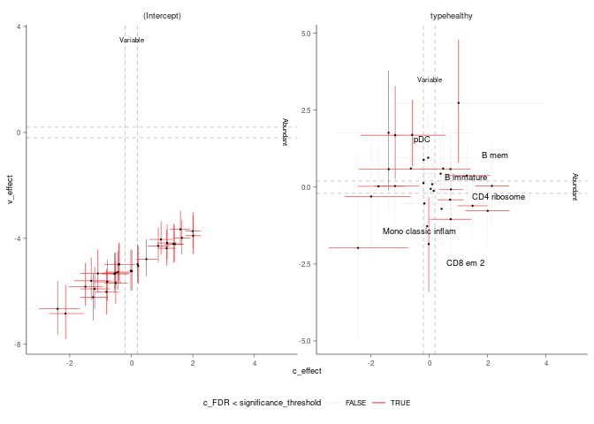

sccomp - Outlier-aware and count-based compositional analysis of
single-cell data
================

<!-- badges: start -->

[](https://www.tidyverse.org/lifecycle/#maturing)
[](https://github.com/stemangiola/tidyseurat/actions/)
<!-- badges: end -->

# 

Cell omics such as single-cell genomics, proteomics and microbiomics allow the characterisation of tissue and microbial community composition, which can be compared between conditions to identify biological drivers. This strategy has been critical to unveiling markers of disease progression such as cancer and pathogen infection. For cell omic data, no method for differential variability analysis exists, and methods for differential composition analysis only take a few fundamental data properties into account. Here we introduce sccomp, a generalised method for differential composition and variability analyses able to jointly model data count distribution, compositionality, group-specific variability and proportion mean-variability association, with awareness against outliers. Sccomp is an extensive analysis framework that allows realistic data simulation and cross-study knowledge transfer. Here, we demonstrate that mean-variability association is ubiquitous across technologies showing the inadequacy of the very popular Dirichlet-multinomial modelling and provide mandatory principles for differential variability analysis. We show that sccomp accurately fits experimental data, with a 50% incremental improvement over state-of-the-art algorithms. Using sccomp, we identified novel differential constraints and composition in the microenvironment of primary breast cancer. 

# Installation

## (simple) Suggested for single-cell and CyTOF analyses

**Bioconductor**

``` r
if (!requireNamespace("BiocManager")) {
   install.packages("BiocManager")
 }
 BiocManager::install("sccomp")
```

**Github**

``` r
devtools::install_github("stemangiola/sccomp")
```

## (more complex and efficient, until further optimisation of the default installation) Suggested for microbiomics

**Github**

``` r
install.packages("cmdstanr", repos = c("https://mc-stan.org/r-packages/", getOption("repos")))
check_cmdstan_toolchain()
install_cmdstan(cores = 2)
# Then, check the correct cmdstanr installation here
# https://mc-stan.org/cmdstanr/articles/cmdstanr.html

# Then install sccomp with the cmdstanr branch
devtools::install_github("stemangiola/sccomp@cmdstanr")
```

# Analysis

`sccomp` can model changes in composition and variability. Normally the furmula for variability is either `~1`, which assumes that the cell-group variability is independent on any covariate, or `~ factor_of_interest`, which assumes that the model is dependent on the factor of interest only. However, more complex models for variability are possible, is the sample size is large. In any case the model for variability must be a subset of the model for composition.

## From Seurat Object

``` r
res =
  seurat_obj |>
  sccomp_glm( 
   formula_composition = ~ type, 
    formula_variability = ~ 1, 
    sample, 
    cell_group 
  )
```

## From SingleCellExperiment Object

``` r
res =
  sce_obj |>
  sccomp_glm( 
    formula_composition = ~ type, 
    formula_variability = ~ 1, 
    sample, 
    cell_group 
  )
```

## From data.frame

``` r
res =
  seurat_obj[[]] |>
  sccomp_glm(
    formula_composition = ~ type, 
    formula_variability = ~ 1, 
    sample, 
    cell_group 
  )
```

## From counts

``` r
res =
  counts_obj |>
  sccomp_glm( 
    formula_composition = ~ type, 
    formula_variability = ~ 1, 
    .sample = sample,
    .cell_group = cell_group,
    .count = count
  )
```

    ## sccomp says: outlier identification first pass - step 1/3 [ETA: ~20s]

    ## sccomp says: outlier identification second pass - step 2/3 [ETA: ~60s]

    ## sccomp says: outlier-free model fitting - step 3/3 [ETA: ~20s]

    ## sccomp says: the composition design matrix has columns: (Intercept), typecancer

    ## sccomp says: the variability design matrix has columns: (Intercept)

## Suggested settings for single-cell RNA sequencing

We reccommend to set `bimodal_mean_variability_association  = TRUE`. The bimodality of the mean-variability association can be confirmed from the plots$credible_intervals_2D (see below).

## Suggested settings for CyTOF and microbiome data

We reccommend to set `bimodal_mean_variability_association  = FALSE` (Default).

``` r
res
```

    ## # A tibble: 72 × 9
    ##    cell_group parameter   covariate c_lower c_effect c_upper   c_pH0   c_FDR
    ##    <chr>      <chr>       <chr>       <dbl>    <dbl>   <dbl>   <dbl>   <dbl>
    ##  1 B1         (Intercept) <NA>       0.557     0.710  0.866  0       0      
    ##  2 B1         typecancer  type      -1.19     -0.888 -0.587  0       0      
    ##  3 B2         (Intercept) <NA>       0.177     0.414  0.657  0.0368  0.00286
    ##  4 B2         typecancer  type      -1.18     -0.748 -0.312  0.00976 0.00177
    ##  5 B3         (Intercept) <NA>      -0.610    -0.409 -0.205  0.0225  0.00165
    ##  6 B3         typecancer  type      -0.593    -0.219  0.151  0.461   0.113  
    ##  7 BM         (Intercept) <NA>      -1.31     -1.10  -0.884  0       0      
    ##  8 BM         typecancer  type      -0.736    -0.344  0.0415 0.234   0.0643 
    ##  9 CD4 1      (Intercept) <NA>       0.362     0.490  0.627  0       0      
    ## 10 CD4 1      typecancer  type      -0.0882    0.161  0.420  0.622   0.163  
    ## # … with 62 more rows, and 1 more variable: count_data <list>
    
Of the output table, the estimate columns startwith the prefix `c_` indicate `composition`.

## Visualise data + inference

``` r
plots = plot_summary(res) 
```

    ## Joining, by = c("sample", "cell_group")
    ## Joining, by = c("cell_group", "type")

    ## Warning: Ignoring unknown aesthetics: label

Plot of group proportion, faceted by groups. The blue boxplots represent the posterior predictive check. If the model is likely be descriptively adequate to the data, the blue boxplot should roughly overlay with the black boxplot, which represent the observed data. The outliers are coloured in red. A boxplot will be returned for every (discrete) covariates present in `formula_composition`. The color coding represent the significant associations for composition and/or variability.

``` r
plots$boxplot
```

    ## [[1]]

<!-- -->

Plot of estimates of differential composition (c\_) on the x axis, and
differential variability (v\_) on the y axis. The error bars represent
95% credible intervals. The dashed lines represent the minimal effect
that the hypothesis test is based on. An effect is labelled as
significant if bigger than the minimal effect according to the 95%
credible interval. Facets represent the covariates in the model.

``` r
plots$credible_intervals_1D
```

<!-- -->

## Visualisation of the MCMC chains from the posterior distribution

It is possible to directly evaluate the posterior distribution. In this
example we plot the Monte Carlo chain for the slope parameter of the
first cell type. We can see that has converged and is negative with
probability 1.

``` r
res %>% attr("fit") %>% rstan::traceplot("beta[2,1]")
```

<!-- -->

## Differential variability

We can model the cell-group variability also dependent on type, and so
test differences in variability

``` r
res = 
  counts_obj |>
  sccomp_glm( 
    formula_composition = ~ type, 
    formula_variability = ~ type, 
    .sample = sample,
    .cell_group = cell_group,
    .count = count
  )
```

    ## sccomp says: outlier identification first pass - step 1/3 [ETA: ~20s]

    ## sccomp says: outlier identification second pass - step 2/3 [ETA: ~60s]

    ## sccomp says: outlier-free model fitting - step 3/3 [ETA: ~20s]

    ## sccomp says: the composition design matrix has columns: (Intercept), typecancer

    ## sccomp says: the variability design matrix has columns: (Intercept), typecancer

``` r
res
```

    ## # A tibble: 72 × 14
    ##    cell_group parameter   covariate c_lower c_effect c_upper    c_pH0     c_FDR
    ##    <chr>      <chr>       <chr>       <dbl>    <dbl>   <dbl>    <dbl>     <dbl>
    ##  1 B1         (Intercept) <NA>        0.627    0.796  0.972  0        0        
    ##  2 B1         typecancer  type       -1.26    -0.930 -0.602  0.000250 0.0000501
    ##  3 B2         (Intercept) <NA>        0.190    0.417  0.667  0.0315   0.00150  
    ##  4 B2         typecancer  type       -1.04    -0.561 -0.0636 0.0673   0.0108   
    ##  5 B3         (Intercept) <NA>       -0.557   -0.360 -0.150  0.0618   0.00526  
    ##  6 B3         typecancer  type       -0.518   -0.124  0.296  0.648    0.203    
    ##  7 BM         (Intercept) <NA>       -1.26    -1.05  -0.822  0        0        
    ##  8 BM         typecancer  type       -0.741   -0.298  0.163  0.323    0.0956   
    ##  9 CD4 1      (Intercept) <NA>        0.370    0.510  0.655  0        0        
    ## 10 CD4 1      typecancer  type       -0.117    0.176  0.470  0.569    0.139    
    ## # … with 62 more rows, and 6 more variables: v_lower <dbl>, v_effect <dbl>,
    ## #   v_upper <dbl>, v_pH0 <dbl>, v_FDR <dbl>, count_data <list>
    
Of the output table, the estimate columns startwith the prefix `c_` indicate `composition`, the estimate columns with the prefix `v_` indicate `variability`.


Plot 1D significance plot

``` r
plots = plot_summary(res)
```

    ## Joining, by = c("sample", "cell_group")
    ## Joining, by = c("cell_group", "type")

    ## Warning: Ignoring unknown aesthetics: label

``` r
plots$credible_intervals_1D
```

<!-- -->

Plot 2D significance plot. Data points are cell groups. Error bars are the 95% credible interval. The dashed lines represent the default threshold fold change for which the probabilities (c_pH0, v_pH0) are calculated. pH0 of 0 represent the rejection of the null hypothesis, that no effect is observed.

This plot is provided only if differential variability has been tested. The differential variability estimates are reliable only if the linear association between mean and variability for `(intercept)` (left-hand side facet) is satisfied. A scatterplot (beside the Intercept) is provided for each of the categories of interest. The for each category of interest, the composition and variability effects should be generally uncorrelated. 

``` r
plots$credible_intervals_2D
```

<!-- -->
