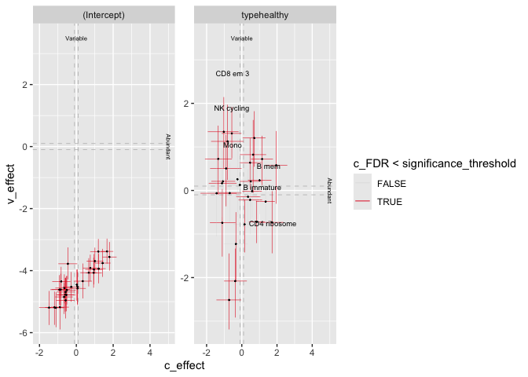

sccomp - Outlier-aware and count-based compositional analysis of
single-cell data
================

<!-- badges: start -->

[](https://www.tidyverse.org/lifecycle/#maturing)
[](https://github.com/MangiolaLaboratory/sccomp/actions/)

<!-- badges: end -->

Cell omics such as single-cell genomics, proteomics, and microbiomics
allow the characterisation of tissue and microbial community
composition, which can be compared between conditions to identify
biological drivers. This strategy has been critical to unveiling markers
of disease progression, such as cancer and pathogen infection.

For cell omic data, no method for differential variability analysis
exists, and methods for differential composition analysis only take a
few fundamental data properties into account. Here we introduce sccomp,
a generalised method for differential composition and variability
analyses capable of jointly modelling data count distribution,
compositionality, group-specific variability, and proportion
mean-variability association, with awareness against outliers.

Sccomp is an extensive analysis framework that allows realistic data
simulation and cross-study knowledge transfer. We demonstrate that
mean-variability association is ubiquitous across technologies,
highlighting the inadequacy of the very popular Dirichlet-multinomial
modelling and providing essential principles for differential
variability analysis.

We show that sccomp accurately fits experimental data, with a 50%
incremental improvement over state-of-the-art algorithms. Using sccomp,
we identified novel differential constraints and composition in the
microenvironment of primary breast cancer.

<a href="https://www.youtube.com/watch?v=R_lt58We9nA&ab_channel=RConsortium" target="_blank">

</a>

# 

`sccomp` tests differences in cell type proportions from single-cell
data. It is robust against outliers, it models continuous and discrete
factors, and capable of random-effect/intercept modelling.

Please cite [PNAS - sccomp: Robust differential composition and
variability analysis for single-cell
data](https://www.pnas.org/doi/full/10.1073/pnas.2203828120)

## Characteristics

- Complex linear models with continuous and categorical covariates
- Multilevel modelling, with population fixed and random
  effects/intercept
- Modelling data from counts
- Testing differences in cell-type proportionality
- Testing differences in cell-type specific variability
- Cell-type information share for variability adaptive shrinkage
- Testing differential variability
- Probabilistic outlier identification
- Cross-dataset learning (hyperpriors).

# Installation

`sccomp` is based on `cmdstanr` which provides the latest version of
`cmdstan` the Bayesian modelling tool. `cmdstanr` is not on CRAN, so we
need to have 3 simple step process (that will be prompted to the user is
forgot).

1.  R installation of `sccomp`
2.  R installation of `cmdstanr`
3.  `cmdstanr` call to `cmdstan` installation

**Bioconductor**

``` r
if (!requireNamespace("BiocManager")) install.packages("BiocManager")

# Step 1
BiocManager::install("sccomp")

# Step 2
install.packages("cmdstanr", repos = c("https://stan-dev.r-universe.dev/", getOption("repos")))

# Step 3
cmdstanr::check_cmdstan_toolchain(fix = TRUE) # Just checking system setting
cmdstanr::install_cmdstan()
```

**Github**

``` r
# Step 1
devtools::install_github("MangiolaLaboratory/sccomp")

# Step 2
install.packages("cmdstanr", repos = c("https://stan-dev.r-universe.dev/", getOption("repos")))

# Step 3
cmdstanr::check_cmdstan_toolchain(fix = TRUE) # Just checking system setting
cmdstanr::install_cmdstan()
```

| Function                           | Description                                                                                                                 |
|------------------------------------|-----------------------------------------------------------------------------------------------------------------------------|
| `sccomp_estimate`                  | Fit the model onto the data, and estimate the coefficients                                                                  |
| `sccomp_remove_outliers`           | Identify outliers probabilistically based on the model fit, and exclude them from the estimation                            |
| `sccomp_test`                      | Calculate the probability that the coefficients are outside the H0 interval (i.e. test_composition_above_logit_fold_change) |
| `sccomp_replicate`                 | Simulate data from the model, or part of the model                                                                          |
| `sccomp_predict`                   | Predicts proportions, based on the model, or part of the model                                                              |
| `sccomp_remove_unwanted_variation` | Removes the variability for unwanted factors                                                                                |
| `plot`                             | Plots summary plots to asses significance                                                                                   |

# Analysis

``` r
library(dplyr)
library(sccomp)
library(ggplot2)
library(forcats)
library(tidyr)
data("seurat_obj")
data("sce_obj")
data("counts_obj")
```

`sccomp` can model changes in composition and variability. By default,
the formula for variability is either `~1`, which assumes that the
cell-group variability is independent of any covariate or
`~ factor_of_interest`, which assumes that the model is dependent on the
factor of interest only. The variability model must be a subset of the
model for composition.

## Binary factor

Of the output table, the estimate columns start with the prefix `c_`
indicate `composition`, or with `v_` indicate `variability` (when
formula_variability is set).

### From Seurat, SingleCellExperiment, metadata objects

``` r
sccomp_result = 
  sce_obj |>
  sccomp_estimate( 
    formula_composition = ~ type, 
    .sample =  sample, 
    .cell_group = cell_group, 
    cores = 1 
  ) |> 
  sccomp_remove_outliers(cores = 1) |> # Optional
  sccomp_test()
```

### From counts

``` r
sccomp_result = 
  counts_obj |>
  sccomp_estimate( 
    formula_composition = ~ type, 
    .sample = sample,
    .cell_group = cell_group,
    .count = count, 
    cores = 1, verbose = FALSE
  ) |> 
  sccomp_remove_outliers(cores = 1, verbose = FALSE) |> # Optional
  sccomp_test()
```

    ## Running make \
    ##   /var/folders/7w/rg5zrgd17dn9pfwgpbgwdvxc0000gp/T/RtmpmgShz1/model-bf9420b81204 \
    ##   "STAN_THREADS=TRUE" \
    ##   "STANCFLAGS +=  --name='glm_multi_beta_binomial_generate_data_model'"
    ## 
    ## --- Translating Stan model to C++ code ---
    ## bin/stanc --name='glm_multi_beta_binomial_generate_data_model' --o=/var/folders/7w/rg5zrgd17dn9pfwgpbgwdvxc0000gp/T/RtmpmgShz1/model-bf9420b81204.hpp /var/folders/7w/rg5zrgd17dn9pfwgpbgwdvxc0000gp/T/RtmpmgShz1/model-bf9420b81204.stan
    ## 
    ## --- Compiling C++ code ---
    ## arch -arch arm64e clang++ -Wno-deprecated-declarations -std=c++17 -Wno-unknown-warning-option -Wno-tautological-compare -Wno-sign-compare -D_REENTRANT -ffp-contract=off -Wno-ignored-attributes     -DSTAN_THREADS -I stan/lib/stan_math/lib/tbb_2020.3/include    -O3 -I src -I stan/src -I stan/lib/rapidjson_1.1.0/ -I lib/CLI11-1.9.1/ -I stan/lib/stan_math/ -I stan/lib/stan_math/lib/eigen_3.4.0 -I stan/lib/stan_math/lib/boost_1.84.0 -I stan/lib/stan_math/lib/sundials_6.1.1/include -I stan/lib/stan_math/lib/sundials_6.1.1/src/sundials    -DBOOST_DISABLE_ASSERTS          -c -include-pch stan/src/stan/model/model_header.hpp.gch/model_header_threads_15_0.hpp.gch -x c++ -o /var/folders/7w/rg5zrgd17dn9pfwgpbgwdvxc0000gp/T/RtmpmgShz1/model-bf9420b81204.o /var/folders/7w/rg5zrgd17dn9pfwgpbgwdvxc0000gp/T/RtmpmgShz1/model-bf9420b81204.hpp
    ## 
    ## --- Linking model ---
    ## arch -arch arm64e clang++ -Wno-deprecated-declarations -std=c++17 -Wno-unknown-warning-option -Wno-tautological-compare -Wno-sign-compare -D_REENTRANT -ffp-contract=off -Wno-ignored-attributes     -DSTAN_THREADS -I stan/lib/stan_math/lib/tbb_2020.3/include    -O3 -I src -I stan/src -I stan/lib/rapidjson_1.1.0/ -I lib/CLI11-1.9.1/ -I stan/lib/stan_math/ -I stan/lib/stan_math/lib/eigen_3.4.0 -I stan/lib/stan_math/lib/boost_1.84.0 -I stan/lib/stan_math/lib/sundials_6.1.1/include -I stan/lib/stan_math/lib/sundials_6.1.1/src/sundials    -DBOOST_DISABLE_ASSERTS               -Wl,-L,"/Users/a1234450/.cmdstan/cmdstan-2.35.0/stan/lib/stan_math/lib/tbb"   -Wl,-rpath,"/Users/a1234450/.cmdstan/cmdstan-2.35.0/stan/lib/stan_math/lib/tbb"      /var/folders/7w/rg5zrgd17dn9pfwgpbgwdvxc0000gp/T/RtmpmgShz1/model-bf9420b81204.o src/cmdstan/main_threads.o       -ltbb   stan/lib/stan_math/lib/sundials_6.1.1/lib/libsundials_nvecserial.a stan/lib/stan_math/lib/sundials_6.1.1/lib/libsundials_cvodes.a stan/lib/stan_math/lib/sundials_6.1.1/lib/libsundials_idas.a stan/lib/stan_math/lib/sundials_6.1.1/lib/libsundials_kinsol.a  stan/lib/stan_math/lib/tbb/libtbb.dylib stan/lib/stan_math/lib/tbb/libtbbmalloc.dylib stan/lib/stan_math/lib/tbb/libtbbmalloc_proxy.dylib -o /var/folders/7w/rg5zrgd17dn9pfwgpbgwdvxc0000gp/T/RtmpmgShz1/model-bf9420b81204
    ## rm /var/folders/7w/rg5zrgd17dn9pfwgpbgwdvxc0000gp/T/RtmpmgShz1/model-bf9420b81204.hpp /var/folders/7w/rg5zrgd17dn9pfwgpbgwdvxc0000gp/T/RtmpmgShz1/model-bf9420b81204.o

    ## Running standalone generated quantities after 1 MCMC chain, with 1 thread(s) per chain...
    ## 
    ## Chain 1 finished in 0.0 seconds.

    ## Running standalone generated quantities after 1 MCMC chain, with 1 thread(s) per chain...
    ## 
    ## Chain 1 finished in 0.0 seconds.

Here you see the results of the fit, the effects of the factor on
composition and variability. You also can see the uncertainty around
those effects.

``` r
sccomp_result
```

    ## # A tibble: 72 × 14
    ##    cell_group parameter  factor c_lower c_effect c_upper   c_pH0   c_FDR v_lower
    ##    <chr>      <chr>      <chr>    <dbl>    <dbl>   <dbl>   <dbl>   <dbl>   <dbl>
    ##  1 B1         (Intercep… <NA>     0.974    1.13   1.28   0       0         -6.34
    ##  2 B1         typecancer type    -1.16    -0.894 -0.649  0       0         NA   
    ##  3 B2         (Intercep… <NA>     0.478    0.768  1.06   0       0         -5.64
    ##  4 B2         typecancer type    -1.18    -0.765 -0.355  1.50e-3 1.36e-4   NA   
    ##  5 B3         (Intercep… <NA>    -0.616   -0.334 -0.0393 5.35e-2 3.87e-3   -6.83
    ##  6 B3         typecancer type    -0.620   -0.214  0.199  2.92e-1 8.30e-2   NA   
    ##  7 BM         (Intercep… <NA>    -1.26    -0.954 -0.661  0       0         -7.50
    ##  8 BM         typecancer type    -0.738   -0.335  0.0885 1.31e-1 3.70e-2   NA   
    ##  9 CD4 1      (Intercep… <NA>     0.216    0.380  0.548  2.50e-4 1.14e-5   -6.91
    ## 10 CD4 1      typecancer type    -0.120    0.107  0.327  4.76e-1 1.29e-1   NA   
    ## # ℹ 62 more rows
    ## # ℹ 5 more variables: v_effect <dbl>, v_upper <dbl>, v_pH0 <dbl>, v_FDR <dbl>,
    ## #   count_data <list>

### From proportions

!!! If counts are available we strongly discourage the use of
proportions, as an important source of uncertainty (i.e. for rare
groups/cell-types) is not modeled.

The use of proportions is more better suited in modelling deconvolution
results (e.g. of bulk RNA data), in which case counts are not available.

Proportions should be bigger than 0. Assuming that 0s derive from a
precision threshold (e.g. deconvolution), 0s are converted to the
smaller non 0 value.

``` r
res = 
  counts_obj |>
  sccomp_estimate( 
    formula_composition = ~ type, 
    .sample = sample,
    .cell_group = cell_group,
    .abundance = proportion, 
    bimodal_mean_variability_association = TRUE,
    cores = 1, verbose = FALSE
  ) |> 
  sccomp_remove_outliers(cores = 1, verbose = FALSE) |> # Optional
  sccomp_test()
```

    ## sccomp says: proportion column is a proportion. The sum-constrained beta model will be used. When possible using counts is preferred as the binomial noise component is often dominating for rare groups (e.g. rare cell types).

    ## sccomp says: estimation

    ## Warning in data_spread_to_model_input(., formula_composition, !!.sample, :
    ## sccomp says: your proportion values include 0. Assuming that 0s derive from a
    ## precision threshold (e.g. deconvolution), 0s are converted to the smaller non 0
    ## proportion value.

    ## sccomp says: the composition design matrix has columns: (Intercept), typecancer

    ## sccomp says: the variability design matrix has columns: (Intercept)

    ## Loading model from cache...

    ## sccomp says: to do hypothesis testing run `sccomp_test()`,
    ##   the `test_composition_above_logit_fold_change` = 0.1 equates to a change of ~10%, and
    ##   0.7 equates to ~100% increase, if the baseline is ~0.1 proportion.
    ##   Use `sccomp_proportional_fold_change` to convert c_effect (linear) to proportion difference (non-linear).

    ## Loading model from cache...

    ## Running standalone generated quantities after 1 MCMC chain, with 1 thread(s) per chain...
    ## 
    ## Chain 1 finished in 0.0 seconds.

    ## sccomp says: outlier identification - step 1/2
    ## Loading model from cache...

    ## Running standalone generated quantities after 1 MCMC chain, with 1 thread(s) per chain...
    ## 
    ## Chain 1 finished in 0.0 seconds.

    ## sccomp says: outlier-free model fitting - step 2/2

    ## sccomp says: the composition design matrix has columns: (Intercept), typecancer

    ## sccomp says: the variability design matrix has columns: (Intercept)

    ## Loading model from cache...

``` r
res
```

    ## # A tibble: 72 × 14
    ##    cell_group parameter  factor c_lower c_effect c_upper   c_pH0   c_FDR v_lower
    ##    <chr>      <chr>      <chr>    <dbl>    <dbl>   <dbl>   <dbl>   <dbl>   <dbl>
    ##  1 B1         (Intercep… <NA>     0.653    1.17    1.68  0       0         -5.00
    ##  2 B1         typecancer type    -2.04    -1.37   -0.639 2.50e-4 1.25e-4   NA   
    ##  3 B2         (Intercep… <NA>    -1.17    -0.451   0.254 2.01e-1 9.27e-2   -1.24
    ##  4 B2         typecancer type    -0.604    0.231   1.16  3.97e-1 2.54e-1   NA   
    ##  5 B3         (Intercep… <NA>    -1.17    -0.375   0.364 2.85e-1 1.70e-1   -1.39
    ##  6 B3         typecancer type    -0.686    0.181   1.15  4.40e-1 3.16e-1   NA   
    ##  7 BM         (Intercep… <NA>    -1.07    -0.341   0.291 2.53e-1 1.35e-1   -1.23
    ##  8 BM         typecancer type    -0.767    0.160   1.09  4.46e-1 3.30e-1   NA   
    ##  9 CD4 1      (Intercep… <NA>    -0.981   -0.288   0.296 2.90e-1 1.74e-1   -1.25
    ## 10 CD4 1      typecancer type    -0.631    0.149   0.952 4.54e-1 3.39e-1   NA   
    ## # ℹ 62 more rows
    ## # ℹ 5 more variables: v_effect <dbl>, v_upper <dbl>, v_pH0 <dbl>, v_FDR <dbl>,
    ## #   count_data <list>

## An aid to result interpretation and communication

The estimated effects are expressed in the unconstrained space of the
parameters. Similarly, to differential expression analysis that express
change in terms of log fold change. However, for differences, in
proportion, logit foold change must be used. This measure is harder to
interpret and understand.

Therefore, we provide a more intuitive proportion, full change, that can
be easier understood. However, these cannot be used to infer
significance (use sccomp_test() instead), and a lot of care must be
taken given the nonlinearity of these measure (1 fold increase from
0.0001 to 0.0002 carried a different weight that 1 fold increase from
0.4 to 0.8).

From your estimates, you can state which effects you are interested
about (this can be a part of the full model, in case you want to not
consider unwanted effects), and the two points you would like to
compare.

In case of a chategorical variable, the starting and ending points are
categories.

``` r
sccomp_result |> 
   sccomp_proportional_fold_change(
     formula_composition = ~  type,
     from =  "healthy", 
     to = "cancer"
    ) |> 
  select(cell_group, statement)
```

    ## Loading model from cache...

    ## Running standalone generated quantities after 1 MCMC chain, with 1 thread(s) per chain...
    ## 
    ## Chain 1 finished in 0.0 seconds.

    ## # A tibble: 36 × 2
    ##    cell_group statement                                
    ##    <chr>      <glue>                                   
    ##  1 B1         2.5-fold decrease (from 0.0539 to 0.022) 
    ##  2 B2         2.1-fold decrease (from 0.0378 to 0.0177)
    ##  3 B3         1.2-fold decrease (from 0.0126 to 0.0102)
    ##  4 BM         1.4-fold decrease (from 0.0068 to 0.0049)
    ##  5 CD4 1      1.1-fold increase (from 0.0256 to 0.0285)
    ##  6 CD4 2      1.5-fold increase (from 0.0497 to 0.0764)
    ##  7 CD4 3      3.3-fold decrease (from 0.1078 to 0.0328)
    ##  8 CD4 4      1.2-fold increase (from 0.0016 to 0.002) 
    ##  9 CD4 5      1.1-fold increase (from 0.0304 to 0.0326)
    ## 10 CD8 1      1.2-fold increase (from 0.1071 to 0.1268)
    ## # ℹ 26 more rows

## Summary plots

A plot of group proportion, faceted by groups. The blue boxplots
represent the posterior predictive check. If the model is likely to be
descriptively adequate to the data, the blue box plot should roughly
overlay with the black box plot, which represents the observed data. The
outliers are coloured in red. A box plot will be returned for every
(discrete) covariate present in `formula_composition`. The colour coding
represents the significant associations for composition and/or
variability.

``` r
sccomp_result |> 
  sccomp_boxplot(factor = "type")
```

    ## Loading model from cache...

    ## Running standalone generated quantities after 1 MCMC chain, with 1 thread(s) per chain...
    ## 
    ## Chain 1 finished in 0.0 seconds.

    ## Joining with `by = join_by(cell_group, sample)`

    ## Joining with `by = join_by(cell_group, type)`

<!-- -->

A plot of estimates of differential composition (c\_) on the x-axis and
differential variability (v\_) on the y-axis. The error bars represent
95% credible intervals. The dashed lines represent the minimal effect
that the hypothesis test is based on. An effect is labelled as
significant if bigger than the minimal effect according to the 95%
credible interval. Facets represent the covariates in the model.

``` r
sccomp_result |> 
  plot_1D_intervals()
```

<!-- -->

We can plot the relationship between abundance and variability. As we
can see below, they are positively correlated, you also appreciate that
this relationship is by model for single cell RNA sequencing data.

`sccomp` models, these relationship to obtain a shrinkage effect on the
estimates of both the abundance and the variability. This shrinkage is
adaptive as it is modelled jointly, thanks for Bayesian inference.

``` r
sccomp_result |> 
  plot_2D_intervals()
```

<!-- -->

You can produce the series of plots calling the `plot` method.

``` r
sccomp_result |> plot() 
```

## Contrasts

``` r
seurat_obj |>
  sccomp_estimate( 
    formula_composition = ~ 0 + type, 
    .sample = sample,
    .cell_group = cell_group, 
    cores = 1, verbose = FALSE
  ) |> 
  sccomp_test( contrasts =  c("typecancer - typehealthy", "typehealthy - typecancer"))
```

    ## # A tibble: 60 × 14
    ##    cell_group  parameter factor c_lower c_effect c_upper   c_pH0   c_FDR v_lower
    ##    <chr>       <chr>     <chr>    <dbl>    <dbl>   <dbl>   <dbl>   <dbl>   <dbl>
    ##  1 B immature  typecanc… <NA>    -1.89    -1.35   -0.820 0       0            NA
    ##  2 B immature  typeheal… <NA>     0.820    1.35    1.89  0       0            NA
    ##  3 B mem       typecanc… <NA>    -2.22    -1.63   -1.03  0       0            NA
    ##  4 B mem       typeheal… <NA>     1.03     1.63    2.22  0       0            NA
    ##  5 CD4 cm S10… typecanc… <NA>    -1.45    -0.990  -0.570 0       0            NA
    ##  6 CD4 cm S10… typeheal… <NA>     0.570    0.990   1.45  0       0            NA
    ##  7 CD4 cm hig… typecanc… <NA>     0.831    1.54    2.28  0       0            NA
    ##  8 CD4 cm hig… typeheal… <NA>    -2.28    -1.54   -0.831 0       0            NA
    ##  9 CD4 cm rib… typecanc… <NA>     0.314    0.925   1.54  0.00350 7.78e-4      NA
    ## 10 CD4 cm rib… typeheal… <NA>    -1.54    -0.925  -0.314 0.00350 7.78e-4      NA
    ## # ℹ 50 more rows
    ## # ℹ 5 more variables: v_effect <dbl>, v_upper <dbl>, v_pH0 <dbl>, v_FDR <dbl>,
    ## #   count_data <list>

## Categorical factor (e.g. Bayesian ANOVA)

This is achieved through model comparison with `loo`. In the following
example, the model with association with factors better fits the data
compared to the baseline model with no factor association. For
comparisons `check_outliers` must be set to FALSE as the leave-one-out
must work with the same amount of data, while outlier elimination does
not guarantee it.

If `elpd_diff` is away from zero of \> 5 `se_diff` difference of 5, we
are confident that a model is better than the other
[reference](https://discourse.mc-stan.org/t/interpreting-elpd-diff-loo-package/1628/2?u=stemangiola).
In this case, -79.9 / 11.5 = -6.9, therefore we can conclude that model
one, the one with factor association, is better than model two.

``` r
library(loo)

# Fit first model
model_with_factor_association = 
  seurat_obj |>
  sccomp_estimate( 
    formula_composition = ~ type, 
    .sample =  sample, 
    .cell_group = cell_group, 
    inference_method = "hmc",
    enable_loo = TRUE
  )
```

    ## Running MCMC with 6 parallel chains, with 3 thread(s) per chain...
    ## 
    ## Chain 1 Iteration:   1 / 966 [  0%]  (Warmup) 
    ## Chain 1 Iteration: 100 / 966 [ 10%]  (Warmup) 
    ## Chain 1 Iteration: 200 / 966 [ 20%]  (Warmup)

    ## Chain 2 Iteration:   1 / 966 [  0%]  (Warmup) 
    ## Chain 2 Iteration: 100 / 966 [ 10%]  (Warmup)

    ## Chain 3 Iteration:   1 / 966 [  0%]  (Warmup) 
    ## Chain 3 Iteration: 100 / 966 [ 10%]  (Warmup)

    ## Chain 4 Iteration:   1 / 966 [  0%]  (Warmup)

    ## Chain 5 Iteration:   1 / 966 [  0%]  (Warmup)

    ## Chain 6 Iteration:   1 / 966 [  0%]  (Warmup)

    ## Chain 1 Iteration: 300 / 966 [ 31%]  (Warmup) 
    ## Chain 1 Iteration: 301 / 966 [ 31%]  (Sampling) 
    ## Chain 2 Iteration: 200 / 966 [ 20%]  (Warmup) 
    ## Chain 4 Iteration: 100 / 966 [ 10%]  (Warmup) 
    ## Chain 5 Iteration: 100 / 966 [ 10%]  (Warmup) 
    ## Chain 2 Iteration: 300 / 966 [ 31%]  (Warmup) 
    ## Chain 2 Iteration: 301 / 966 [ 31%]  (Sampling) 
    ## Chain 3 Iteration: 200 / 966 [ 20%]  (Warmup) 
    ## Chain 6 Iteration: 100 / 966 [ 10%]  (Warmup) 
    ## Chain 4 Iteration: 200 / 966 [ 20%]  (Warmup) 
    ## Chain 5 Iteration: 200 / 966 [ 20%]  (Warmup) 
    ## Chain 1 Iteration: 400 / 966 [ 41%]  (Sampling) 
    ## Chain 3 Iteration: 300 / 966 [ 31%]  (Warmup) 
    ## Chain 3 Iteration: 301 / 966 [ 31%]  (Sampling) 
    ## Chain 6 Iteration: 200 / 966 [ 20%]  (Warmup) 
    ## Chain 2 Iteration: 400 / 966 [ 41%]  (Sampling) 
    ## Chain 4 Iteration: 300 / 966 [ 31%]  (Warmup) 
    ## Chain 4 Iteration: 301 / 966 [ 31%]  (Sampling) 
    ## Chain 5 Iteration: 300 / 966 [ 31%]  (Warmup) 
    ## Chain 5 Iteration: 301 / 966 [ 31%]  (Sampling) 
    ## Chain 1 Iteration: 500 / 966 [ 51%]  (Sampling) 
    ## Chain 3 Iteration: 400 / 966 [ 41%]  (Sampling) 
    ## Chain 6 Iteration: 300 / 966 [ 31%]  (Warmup) 
    ## Chain 6 Iteration: 301 / 966 [ 31%]  (Sampling) 
    ## Chain 2 Iteration: 500 / 966 [ 51%]  (Sampling) 
    ## Chain 4 Iteration: 400 / 966 [ 41%]  (Sampling) 
    ## Chain 5 Iteration: 400 / 966 [ 41%]  (Sampling) 
    ## Chain 1 Iteration: 600 / 966 [ 62%]  (Sampling) 
    ## Chain 3 Iteration: 500 / 966 [ 51%]  (Sampling) 
    ## Chain 2 Iteration: 600 / 966 [ 62%]  (Sampling) 
    ## Chain 4 Iteration: 500 / 966 [ 51%]  (Sampling) 
    ## Chain 5 Iteration: 500 / 966 [ 51%]  (Sampling) 
    ## Chain 6 Iteration: 400 / 966 [ 41%]  (Sampling) 
    ## Chain 1 Iteration: 700 / 966 [ 72%]  (Sampling) 
    ## Chain 3 Iteration: 600 / 966 [ 62%]  (Sampling) 
    ## Chain 2 Iteration: 700 / 966 [ 72%]  (Sampling) 
    ## Chain 4 Iteration: 600 / 966 [ 62%]  (Sampling) 
    ## Chain 6 Iteration: 500 / 966 [ 51%]  (Sampling) 
    ## Chain 1 Iteration: 800 / 966 [ 82%]  (Sampling) 
    ## Chain 5 Iteration: 600 / 966 [ 62%]  (Sampling) 
    ## Chain 3 Iteration: 700 / 966 [ 72%]  (Sampling) 
    ## Chain 4 Iteration: 700 / 966 [ 72%]  (Sampling) 
    ## Chain 6 Iteration: 600 / 966 [ 62%]  (Sampling) 
    ## Chain 2 Iteration: 800 / 966 [ 82%]  (Sampling) 
    ## Chain 5 Iteration: 700 / 966 [ 72%]  (Sampling) 
    ## Chain 1 Iteration: 900 / 966 [ 93%]  (Sampling) 
    ## Chain 3 Iteration: 800 / 966 [ 82%]  (Sampling) 
    ## Chain 6 Iteration: 700 / 966 [ 72%]  (Sampling) 
    ## Chain 1 Iteration: 966 / 966 [100%]  (Sampling) 
    ## Chain 2 Iteration: 900 / 966 [ 93%]  (Sampling) 
    ## Chain 4 Iteration: 800 / 966 [ 82%]  (Sampling) 
    ## Chain 5 Iteration: 800 / 966 [ 82%]  (Sampling) 
    ## Chain 1 finished in 2.3 seconds.
    ## Chain 2 Iteration: 966 / 966 [100%]  (Sampling) 
    ## Chain 3 Iteration: 900 / 966 [ 93%]  (Sampling) 
    ## Chain 2 finished in 2.4 seconds.
    ## Chain 3 Iteration: 966 / 966 [100%]  (Sampling) 
    ## Chain 4 Iteration: 900 / 966 [ 93%]  (Sampling) 
    ## Chain 5 Iteration: 900 / 966 [ 93%]  (Sampling) 
    ## Chain 6 Iteration: 800 / 966 [ 82%]  (Sampling) 
    ## Chain 3 finished in 2.4 seconds.
    ## Chain 4 Iteration: 966 / 966 [100%]  (Sampling) 
    ## Chain 5 Iteration: 966 / 966 [100%]  (Sampling) 
    ## Chain 6 Iteration: 900 / 966 [ 93%]  (Sampling) 
    ## Chain 4 finished in 2.3 seconds.
    ## Chain 5 finished in 2.3 seconds.
    ## Chain 6 Iteration: 966 / 966 [100%]  (Sampling) 
    ## Chain 6 finished in 2.3 seconds.
    ## 
    ## All 6 chains finished successfully.
    ## Mean chain execution time: 2.3 seconds.
    ## Total execution time: 3.0 seconds.

``` r
# Fit second model
model_without_association = 
  seurat_obj |>
  sccomp_estimate( 
    formula_composition = ~ 1, 
    .sample =  sample, 
    .cell_group = cell_group, 
    inference_method = "hmc",
    enable_loo = TRUE
  )
```

    ## Running MCMC with 6 parallel chains, with 3 thread(s) per chain...
    ## 
    ## Chain 1 Iteration:   1 / 966 [  0%]  (Warmup) 
    ## Chain 1 Iteration: 100 / 966 [ 10%]  (Warmup) 
    ## Chain 1 Iteration: 200 / 966 [ 20%]  (Warmup)

    ## Chain 2 Iteration:   1 / 966 [  0%]  (Warmup) 
    ## Chain 2 Iteration: 100 / 966 [ 10%]  (Warmup)

    ## Chain 3 Iteration:   1 / 966 [  0%]  (Warmup) 
    ## Chain 3 Iteration: 100 / 966 [ 10%]  (Warmup)

    ## Chain 4 Iteration:   1 / 966 [  0%]  (Warmup)

    ## Chain 5 Iteration:   1 / 966 [  0%]  (Warmup)

    ## Chain 6 Iteration:   1 / 966 [  0%]  (Warmup)

    ## Chain 1 Iteration: 300 / 966 [ 31%]  (Warmup) 
    ## Chain 1 Iteration: 301 / 966 [ 31%]  (Sampling) 
    ## Chain 2 Iteration: 200 / 966 [ 20%]  (Warmup) 
    ## Chain 3 Iteration: 200 / 966 [ 20%]  (Warmup) 
    ## Chain 4 Iteration: 100 / 966 [ 10%]  (Warmup) 
    ## Chain 5 Iteration: 100 / 966 [ 10%]  (Warmup) 
    ## Chain 4 Iteration: 200 / 966 [ 20%]  (Warmup) 
    ## Chain 6 Iteration: 100 / 966 [ 10%]  (Warmup) 
    ## Chain 1 Iteration: 400 / 966 [ 41%]  (Sampling) 
    ## Chain 2 Iteration: 300 / 966 [ 31%]  (Warmup) 
    ## Chain 2 Iteration: 301 / 966 [ 31%]  (Sampling) 
    ## Chain 3 Iteration: 300 / 966 [ 31%]  (Warmup) 
    ## Chain 3 Iteration: 301 / 966 [ 31%]  (Sampling) 
    ## Chain 5 Iteration: 200 / 966 [ 20%]  (Warmup) 
    ## Chain 4 Iteration: 300 / 966 [ 31%]  (Warmup) 
    ## Chain 4 Iteration: 301 / 966 [ 31%]  (Sampling) 
    ## Chain 6 Iteration: 200 / 966 [ 20%]  (Warmup) 
    ## Chain 1 Iteration: 500 / 966 [ 51%]  (Sampling) 
    ## Chain 2 Iteration: 400 / 966 [ 41%]  (Sampling) 
    ## Chain 3 Iteration: 400 / 966 [ 41%]  (Sampling) 
    ## Chain 5 Iteration: 300 / 966 [ 31%]  (Warmup) 
    ## Chain 5 Iteration: 301 / 966 [ 31%]  (Sampling) 
    ## Chain 6 Iteration: 300 / 966 [ 31%]  (Warmup) 
    ## Chain 6 Iteration: 301 / 966 [ 31%]  (Sampling) 
    ## Chain 1 Iteration: 600 / 966 [ 62%]  (Sampling) 
    ## Chain 4 Iteration: 400 / 966 [ 41%]  (Sampling) 
    ## Chain 5 Iteration: 400 / 966 [ 41%]  (Sampling) 
    ## Chain 2 Iteration: 500 / 966 [ 51%]  (Sampling) 
    ## Chain 3 Iteration: 500 / 966 [ 51%]  (Sampling) 
    ## Chain 6 Iteration: 400 / 966 [ 41%]  (Sampling) 
    ## Chain 1 Iteration: 700 / 966 [ 72%]  (Sampling) 
    ## Chain 4 Iteration: 500 / 966 [ 51%]  (Sampling) 
    ## Chain 2 Iteration: 600 / 966 [ 62%]  (Sampling) 
    ## Chain 3 Iteration: 600 / 966 [ 62%]  (Sampling) 
    ## Chain 5 Iteration: 500 / 966 [ 51%]  (Sampling) 
    ## Chain 6 Iteration: 500 / 966 [ 51%]  (Sampling) 
    ## Chain 1 Iteration: 800 / 966 [ 82%]  (Sampling) 
    ## Chain 3 Iteration: 700 / 966 [ 72%]  (Sampling) 
    ## Chain 4 Iteration: 600 / 966 [ 62%]  (Sampling) 
    ## Chain 5 Iteration: 600 / 966 [ 62%]  (Sampling) 
    ## Chain 2 Iteration: 700 / 966 [ 72%]  (Sampling) 
    ## Chain 6 Iteration: 600 / 966 [ 62%]  (Sampling) 
    ## Chain 1 Iteration: 900 / 966 [ 93%]  (Sampling) 
    ## Chain 3 Iteration: 800 / 966 [ 82%]  (Sampling) 
    ## Chain 4 Iteration: 700 / 966 [ 72%]  (Sampling) 
    ## Chain 5 Iteration: 700 / 966 [ 72%]  (Sampling) 
    ## Chain 1 Iteration: 966 / 966 [100%]  (Sampling) 
    ## Chain 2 Iteration: 800 / 966 [ 82%]  (Sampling) 
    ## Chain 6 Iteration: 700 / 966 [ 72%]  (Sampling) 
    ## Chain 1 finished in 2.2 seconds.
    ## Chain 2 Iteration: 900 / 966 [ 93%]  (Sampling) 
    ## Chain 3 Iteration: 900 / 966 [ 93%]  (Sampling) 
    ## Chain 4 Iteration: 800 / 966 [ 82%]  (Sampling) 
    ## Chain 5 Iteration: 800 / 966 [ 82%]  (Sampling) 
    ## Chain 6 Iteration: 800 / 966 [ 82%]  (Sampling) 
    ## Chain 3 Iteration: 966 / 966 [100%]  (Sampling) 
    ## Chain 3 finished in 2.3 seconds.
    ## Chain 2 Iteration: 966 / 966 [100%]  (Sampling) 
    ## Chain 4 Iteration: 900 / 966 [ 93%]  (Sampling) 
    ## Chain 5 Iteration: 900 / 966 [ 93%]  (Sampling) 
    ## Chain 6 Iteration: 900 / 966 [ 93%]  (Sampling) 
    ## Chain 2 finished in 2.5 seconds.
    ## Chain 4 Iteration: 966 / 966 [100%]  (Sampling) 
    ## Chain 5 Iteration: 966 / 966 [100%]  (Sampling) 
    ## Chain 4 finished in 2.4 seconds.
    ## Chain 5 finished in 2.3 seconds.
    ## Chain 6 Iteration: 966 / 966 [100%]  (Sampling) 
    ## Chain 6 finished in 2.3 seconds.
    ## 
    ## All 6 chains finished successfully.
    ## Mean chain execution time: 2.3 seconds.
    ## Total execution time: 3.0 seconds.

``` r
# Compare models
loo_compare(
   attr(model_with_factor_association, "fit")$loo(),
   attr(model_without_association, "fit")$loo()
)
```

    ##        elpd_diff se_diff
    ## model1   0.0       0.0  
    ## model2 -79.5      10.8

## Differential variability, binary factor

We can model the cell-group variability also dependent on the type, and
so test differences in variability

``` r
res = 
  seurat_obj |>
  sccomp_estimate( 
    formula_composition = ~ type, 
    formula_variability = ~ type,
    .sample = sample,
    .cell_group = cell_group,
    cores = 1, verbose = FALSE
  )

res
```

    ## # A tibble: 60 × 10
    ##    cell_group parameter factor c_lower c_effect c_upper v_lower v_effect v_upper
    ##    <chr>      <chr>     <chr>    <dbl>    <dbl>   <dbl>   <dbl>    <dbl>   <dbl>
    ##  1 B immature (Interce… <NA>     0.359    0.757  1.17    -4.35    -3.91  -3.49  
    ##  2 B immature typeheal… type     0.810    1.36   1.88    -0.873   -0.256  0.299 
    ##  3 B mem      (Interce… <NA>    -1.34    -0.850 -0.343   -5.12    -4.61  -4.10  
    ##  4 B mem      typeheal… type     1.03     1.72   2.37    -1.44    -0.732 -0.0145
    ##  5 CD4 cm S1… (Interce… <NA>     1.32     1.66   2.01    -3.78    -3.38  -2.97  
    ##  6 CD4 cm S1… typeheal… type     0.402    0.847  1.30    -1.21    -0.723 -0.237 
    ##  7 CD4 cm hi… (Interce… <NA>    -1.02    -0.516 -0.0411  -5.09    -4.63  -4.17  
    ##  8 CD4 cm hi… typeheal… type    -1.93    -1.02  -0.182    0.495    1.35   2.14  
    ##  9 CD4 cm ri… (Interce… <NA>    -0.141    0.348  0.850   -4.90    -4.34  -3.77  
    ## 10 CD4 cm ri… typeheal… type    -1.73    -1.07  -0.375   -0.457    0.210  0.920 
    ## # ℹ 50 more rows
    ## # ℹ 1 more variable: count_data <list>

# Suggested settings

## For single-cell RNA sequencing

We recommend setting `bimodal_mean_variability_association  = TRUE`. The
bimodality of the mean-variability association can be confirmed from the
plots\$credible_intervals_2D (see below).

## For CyTOF and microbiome data

We recommend setting `bimodal_mean_variability_association  = FALSE`
(Default).

## Visualisation of the MCMC chains from the posterior distribution

It is possible to directly evaluate the posterior distribution. In this
example, we plot the Monte Carlo chain for the slope parameter of the
first cell type. We can see that it has converged and is negative with
probability 1.

``` r
library(cmdstanr)
```

    ## This is cmdstanr version 0.8.1

    ## - CmdStanR documentation and vignettes: mc-stan.org/cmdstanr

    ## - CmdStan path: /Users/a1234450/.cmdstan/cmdstan-2.35.0

    ## - CmdStan version: 2.35.0

``` r
library(posterior)
```

    ## This is posterior version 1.6.0

    ## 
    ## Attaching package: 'posterior'

    ## The following objects are masked from 'package:stats':
    ## 
    ##     mad, sd, var

    ## The following objects are masked from 'package:base':
    ## 
    ##     %in%, match

``` r
library(bayesplot)
```

    ## This is bayesplot version 1.11.1

    ## - Online documentation and vignettes at mc-stan.org/bayesplot

    ## - bayesplot theme set to bayesplot::theme_default()

    ##    * Does _not_ affect other ggplot2 plots

    ##    * See ?bayesplot_theme_set for details on theme setting

    ## 
    ## Attaching package: 'bayesplot'

    ## The following object is masked from 'package:posterior':
    ## 
    ##     rhat

``` r
# Assuming res contains the fit object from cmdstanr
fit <- res |> attr("fit")

# Extract draws for 'beta[2,1]'
draws <- as_draws_array(fit$draws("beta[2,1]"))

# Create a traceplot for 'beta[2,1]'
mcmc_trace(draws, pars = "beta[2,1]")
```

<!-- -->

Plot 1D significance plot

``` r
plots = res |> sccomp_test() |> plot()
```

    ## Loading model from cache...

    ## Running standalone generated quantities after 1 MCMC chain, with 1 thread(s) per chain...
    ## 
    ## Chain 1 finished in 0.0 seconds.

    ## Joining with `by = join_by(cell_group, sample)`

    ## Joining with `by = join_by(cell_group, type)`

``` r
plots$credible_intervals_1D
```

<!-- -->

Plot 2D significance plot. Data points are cell groups. Error bars are
the 95% credible interval. The dashed lines represent the default
threshold fold change for which the probabilities (c_pH0, v_pH0) are
calculated. pH0 of 0 represent the rejection of the null hypothesis that
no effect is observed.

This plot is provided only if differential variability has been tested.
The differential variability estimates are reliable only if the linear
association between mean and variability for `(intercept)` (left-hand
side facet) is satisfied. A scatterplot (besides the Intercept) is
provided for each category of interest. For each category of interest,
the composition and variability effects should be generally
uncorrelated.

``` r
plots$credible_intervals_2D
```

<!-- -->

## The old framework

The new tidy framework was introduced in 2024, two, understand the
differences and improvements. Compared to the old framework, please read
this [blog
post](https://tidyomics.github.io/tidyomicsBlog/post/2023-12-07-tidy-sccomp/).
