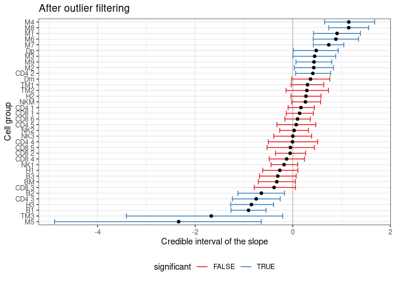
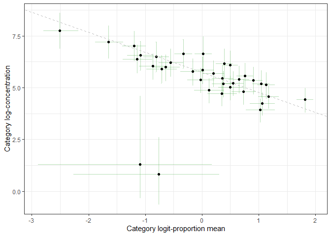

sccomp - Outlier-aware and count-based compositional analysis of
single-cell data
================

<!-- badges: start -->

[](https://www.tidyverse.org/lifecycle/#maturing)
[](https://github.com/stemangiola/tidyseurat/actions/)
<!-- badges: end -->

# 

# Installation

``` r
devtools::install_github("stemangiola/sccomp")
```

# Analysis

## From Seurat Object

``` r
res =
  seurat_obj %>%
  sccomp_glm(  ~ type, sample, cell_group )
```

``` r
res =
  sce_obj %>%
  sccomp_glm( ~ type, sample, cell_group)
```

## From data.frame

``` r
res =
  seurat_obj[[]] %>%
  sccomp_glm(~ type, sample, cell_group )
```

## From counts

``` r
res =
  counts_obj %>%
  sccomp_glm( 
    ~ type, 
    sample, cell_group, count, 
    approximate_posterior_inference = FALSE
  )
```

    ## sccomp says: outlier identification first pass - step 1/3 [ETA: ~20s]

    ## sccomp says: outlier identification second pass - step 2/3 [ETA: ~60s]

    ## sccomp says: outlier-free model fitting - step 3/3 [ETA: ~20s]

Outliers identified

``` r
data_for_plot = 
  res %>% 
    tidyr::unnest(count_data ) %>%
    group_by(sample) %>%
    mutate(proportion = (count+1)/sum(count+1)) %>%
    ungroup(sample) 

 ggplot() +
  geom_boxplot(
    aes(type, proportion, fill=significant),
    outlier.shape = NA, 
    data = data_for_plot %>% filter(!outlier)
  ) + 
  geom_jitter(aes(type, proportion, color=outlier), size = 1, data = data_for_plot) + 
  facet_wrap(~ interaction(cell_group), scale="free_y") +
  scale_y_continuous(trans="logit") +
  scale_color_manual(values = c("black", "#e11f28")) +
  scale_fill_manual(values = c("white", "#E2D379")) +
  xlab("Biological condition") + 
  ylab("Cell-group proportion") + 
  theme_bw() +
  theme(strip.background =element_rect(fill="white"))
```

<!-- -->

Credible intervals

``` r
res %>%
  ggplot(aes(x=`.median_typecancer`, y=fct_reorder(cell_group, .median_typecancer))) +
  geom_vline(xintercept = 0.2, colour="grey") +
  geom_vline(xintercept = -0.2, colour="grey") +
  geom_errorbar(aes(xmin=`.lower_typecancer`, xmax=`.upper_typecancer`, color=significant)) +
  geom_point() +
  scale_color_brewer(palette = "Set1") +
  xlab("Credible interval of the slope") +
  ylab("Cell group") +
  ggtitle("After outlier filtering") +
  theme_bw() +
  theme(legend.position = "bottom")
```

<!-- -->

Relation between proportion mean and concentration (variability). The
regression line is inferred by sccomp.

``` r
res %>% 
  unnest(concentration) %>% 
  ggplot(aes(`.median_(Intercept)`, mean)) + 
  geom_errorbar(aes(ymin = `2.5%`, ymax=`97.5%`), color="#4DAF4A", alpha = 0.4) +
  geom_errorbar(aes(xmin = `.lower_(Intercept)`, xmax=`.upper_(Intercept)`), color="#4DAF4A", alpha = 0.4) +
  geom_point() +
  geom_abline(intercept = 5.7496330, slope = -0.9650953, linetype = "dashed", color="grey") +
  xlab("Category logit-proportion mean") +
  ylab("Category log-concentration") +
    theme_bw() 
```

<!-- -->
