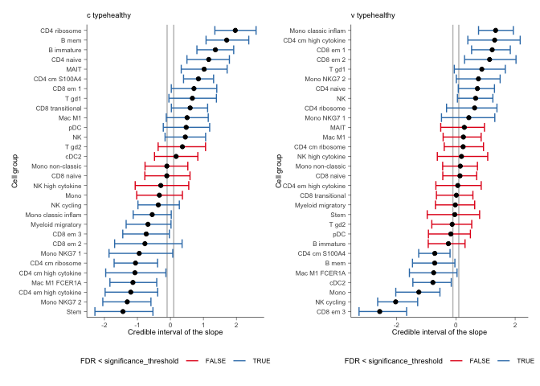

sccomp - Tests differences in cell type proportions and variability from
single-cell data
================

<!-- badges: start -->

[](https://www.tidyverse.org/lifecycle/#maturing)
[](https://github.com/MangiolaLaboratory/sccomp/actions/)

<!-- badges: end -->

Cellular omics such as single-cell genomics, proteomics, and
microbiomics allow the characterization of tissue and microbial
community composition, which can be compared between conditions to
identify biological drivers. This strategy has been critical to
unveiling markers of disease progression in conditions such as cancer
and pathogen infections.

For cellular omic data, no method for differential variability analysis
exists, and methods for differential composition analysis only take a
few fundamental data properties into account. Here we introduce
**sccomp**, a generalised method for differential composition and
variability analyses capable of jointly modelling data count
distribution, compositionality, group-specific variability, and
proportion mean-variability association, while being robust to outliers.

**sccomp** is an extensive analysis framework that allows realistic data
simulation and cross-study knowledge transfer. We demonstrate that
mean-variability association is ubiquitous across technologies,
highlighting the inadequacy of the very popular Dirichlet-multinomial
modeling and providing essential principles for differential variability
analysis.


### Comparison with other methods

- **I**: Data are modelled as counts.
- **II**: Group proportions are modelled as compositional.
- **III**: The proportion variability is modelled as cell-type specific.
- **IV**: Information sharing across cell types, mean–variability
  association.
- **V**: Outlier detection or robustness.
- **VI**: Differential variability analysis.

| Method           | Year | Model                         | I   | II  | III | IV  | V   | VI  |
|------------------|------|-------------------------------|-----|-----|-----|-----|-----|-----|
| **sccomp**       | 2023 | Sum-constrained Beta-binomial | ●   | ●   | ●   | ●   | ●   | ●   |
| **scCODA**       | 2021 | Dirichlet-multinomial         | ●   | ●   |     |     |     |     |
| **quasi-binom.** | 2021 | Quasi-binomial                | ●   |     | ●   |     |     |     |
| **rlm**          | 2021 | Robust-log-linear             |     | ●   |     |     | ●   |     |
| **propeller**    | 2021 | Logit-linear + limma          |     | ●   | ●   | ●   |     |     |
| **ANCOM-BC**     | 2020 | Log-linear                    |     | ●   | ●   |     |     |     |
| **corncob**      | 2020 | Beta-binomial                 | ●   |     | ●   |     |     |     |
| **scDC**         | 2019 | Log-linear                    |     | ●   | ●   |     |     |     |
| **dmbvs**        | 2017 | Dirichlet-multinomial         | ●   | ●   |     |     |     |     |
| **MixMC**        | 2016 | Zero-inflated Log-linear      |     | ●   | ●   |     |     |     |
| **ALDEx2**       | 2014 | Dirichlet-multinomial         | ●   | ●   |     |     |     |     |

### Cite

Mangiola, Stefano, Alexandra J. Roth-Schulze, Marie Trussart, Enrique
Zozaya-Valdés, Mengyao Ma, Zijie Gao, Alan F. Rubin, Terence P. Speed,
Heejung Shim, and Anthony T. Papenfuss. 2023. “Sccomp: Robust
Differential Composition and Variability Analysis for Single-Cell Data.”
Proceedings of the National Academy of Sciences of the United States of
America 120 (33): e2203828120. <https://doi.org/10.1073/pnas.2203828120>
[PNAS - sccomp: Robust differential composition and variability analysis
for single-cell
data](https://www.pnas.org/doi/full/10.1073/pnas.2203828120)

### Talk

<a href="https://www.youtube.com/watch?v=R_lt58We9nA&ab_channel=RConsortium" target="_blank">

</a>

# 

`sccomp` tests differences in cell type proportions from single-cell
data. It is robust against outliers, it models continuous and discrete
factors, and capable of random-effect/intercept modelling.

## Characteristics

- Complex linear models with continuous and categorical covariates
- Multilevel modelling, with population fixed and random
  effects/intercept
- Modelling data from counts
- Testing differences in cell-type proportionality
- Testing differences in cell-type specific variability
- Cell-type information share for variability adaptive shrinkage
- Testing differential variability
- Probabilistic outlier identification
- Cross-dataset learning (hyperpriors).

# Installation

`sccomp` is based on `cmdstanr` which provides the latest version of
`cmdstan` the Bayesian modelling tool. `cmdstanr` is not on CRAN, so we
need to have 3 simple step process (that will be prompted to the user is
forgot).

1.  R installation of `sccomp`
2.  R installation of `cmdstanr`
3.  `cmdstanr` call to `cmdstan` installation

**Bioconductor**

``` r
if (!requireNamespace("BiocManager")) install.packages("BiocManager")

# Step 1
BiocManager::install("sccomp")

# Step 2
install.packages("cmdstanr", repos = c("https://stan-dev.r-universe.dev/", getOption("repos")))

# Step 3
cmdstanr::check_cmdstan_toolchain(fix = TRUE) # Just checking system setting
cmdstanr::install_cmdstan()
```

**Github**

``` r
# Step 1
devtools::install_github("MangiolaLaboratory/sccomp")

# Step 2
install.packages("cmdstanr", repos = c("https://stan-dev.r-universe.dev/", getOption("repos")))

# Step 3
cmdstanr::check_cmdstan_toolchain(fix = TRUE) # Just checking system setting
cmdstanr::install_cmdstan()
```

| Function                           | Description                                                                                                                 |
|------------------------------------|-----------------------------------------------------------------------------------------------------------------------------|
| `sccomp_estimate`                  | Fit the model onto the data, and estimate the coefficients                                                                  |
| `sccomp_remove_outliers`           | Identify outliers probabilistically based on the model fit, and exclude them from the estimation                            |
| `sccomp_test`                      | Calculate the probability that the coefficients are outside the H0 interval (i.e. test_composition_above_logit_fold_change) |
| `sccomp_replicate`                 | Simulate data from the model, or part of the model                                                                          |
| `sccomp_predict`                   | Predicts proportions, based on the model, or part of the model                                                              |
| `sccomp_remove_unwanted_variation` | Removes the variability for unwanted factors                                                                                |
| `plot`                             | Plots summary plots to asses significance                                                                                   |

# Analysis

``` r
library(dplyr)
library(sccomp)
library(ggplot2)
library(forcats)
library(tidyr)
data("seurat_obj")
data("sce_obj")
data("counts_obj")
```

`sccomp` can model changes in composition and variability. By default,
the formula for variability is either `~1`, which assumes that the
cell-group variability is independent of any covariate or
`~ factor_of_interest`, which assumes that the model is dependent on the
factor of interest only. The variability model must be a subset of the
model for composition.

## Binary factor

Of the output table, the estimate columns start with the prefix `c_`
indicate `composition`, or with `v_` indicate `variability` (when
formula_variability is set).

### From Seurat, SingleCellExperiment, metadata objects

``` r
sccomp_result = 
  sce_obj |>
  sccomp_estimate( 
    formula_composition = ~ type, 
    .sample =  sample, 
    .cell_group = cell_group, 
    cores = 1 
  ) |> 
  sccomp_remove_outliers(cores = 1) |> # Optional
  sccomp_test()
```

### From counts

``` r
sccomp_result = 
  counts_obj |>
  sccomp_estimate( 
    formula_composition = ~ type, 
    .sample = sample,
    .cell_group = cell_group,
    .count = count, 
    cores = 1, verbose = FALSE
  ) |> 
  sccomp_remove_outliers(cores = 1, verbose = FALSE) |> # Optional
  sccomp_test()
```

    ## Running standalone generated quantities after 1 MCMC chain, with 1 thread(s) per chain...
    ## 
    ## Chain 1 finished in 0.0 seconds.

    ## Running standalone generated quantities after 1 MCMC chain, with 1 thread(s) per chain...
    ## 
    ## Chain 1 finished in 0.0 seconds.

Here you see the results of the fit, the effects of the factor on
composition and variability. You also can see the uncertainty around
those effects.

The output is a tibble containing the **Following columns**

- `cell_group` - The cell groups being tested.
- `parameter` - The parameter being estimated from the design matrix
  described by the input `formula_composition` and
  `formula_variability`.
- `factor` - The covariate factor in the formula, if applicable (e.g.,
  not present for Intercept or contrasts).
- `c_lower` - Lower (2.5%) quantile of the posterior distribution for a
  composition (c) parameter.
- `c_effect` - Mean of the posterior distribution for a composition (c)
  parameter.
- `c_upper` - Upper (97.5%) quantile of the posterior distribution for a
  composition (c) parameter.
- `c_pH0` - Probability of the null hypothesis (no difference) for a
  composition (c). This is not a p-value.
- `c_FDR` - False-discovery rate of the null hypothesis for a
  composition (c).
- `v_lower` - Lower (2.5%) quantile of the posterior distribution for a
  variability (v) parameter.
- `v_effect` - Mean of the posterior distribution for a variability (v)
  parameter.
- `v_upper` - Upper (97.5%) quantile of the posterior distribution for a
  variability (v) parameter.
- `v_pH0` - Probability of the null hypothesis for a variability (v).
- `v_FDR` - False-discovery rate of the null hypothesis for a
  variability (v).
- `count_data` - Nested input count data.

``` r
sccomp_result
```

    ## # A tibble: 72 × 20
    ##    cell_group parameter   factor c_lower c_effect c_upper   c_pH0   c_FDR c_rhat
    ##    <chr>      <chr>       <chr>    <dbl>    <dbl>   <dbl>   <dbl>   <dbl>  <dbl>
    ##  1 B1         (Intercept) <NA>     0.970    1.13   1.28   0       0         1.00
    ##  2 B1         typecancer  type    -1.14    -0.895 -0.650  0       0         1.00
    ##  3 B2         (Intercept) <NA>     0.467    0.771  1.06   0       0         1.00
    ##  4 B2         typecancer  type    -1.19    -0.766 -0.327  1.25e-3 1.14e-4   1.00
    ##  5 B3         (Intercept) <NA>    -0.611   -0.329 -0.0404 5.65e-2 4.23e-3   1.00
    ##  6 B3         typecancer  type    -0.610   -0.215  0.191  2.80e-1 8.90e-2   1.00
    ##  7 BM         (Intercept) <NA>    -1.24    -0.949 -0.659  0       0         1.00
    ##  8 BM         typecancer  type    -0.752   -0.345  0.0636 1.23e-1 3.09e-2   1.00
    ##  9 CD4 1      (Intercept) <NA>     0.212    0.381  0.546  2.50e-4 1.14e-5   1.00
    ## 10 CD4 1      typecancer  type    -0.118    0.100  0.330  5.00e-1 1.27e-1   1.00
    ## # ℹ 62 more rows
    ## # ℹ 11 more variables: c_ess_bulk <dbl>, c_ess_tail <dbl>, v_lower <dbl>,
    ## #   v_effect <dbl>, v_upper <dbl>, v_pH0 <dbl>, v_FDR <dbl>, v_rhat <dbl>,
    ## #   v_ess_bulk <dbl>, v_ess_tail <dbl>, count_data <list>

## Summary plots

A plot of group proportions, faceted by groups. The blue boxplots
represent the posterior predictive check. If the model is descriptively
adequate for the data, the blue boxplots should roughly overlay the
black boxplots, which represent the observed data. The outliers are
coloured in red. A boxplot will be returned for every (discrete)
covariate present in formula_composition. The colour coding represents
the significant associations for composition and/or variability.

``` r
sccomp_result |> 
  sccomp_boxplot(factor = "type")
```

    ## Loading model from cache...

    ## Running standalone generated quantities after 1 MCMC chain, with 1 thread(s) per chain...
    ## 
    ## Chain 1 finished in 0.0 seconds.

    ## Joining with `by = join_by(cell_group, sample)`

    ## Joining with `by = join_by(cell_group, type)`

<!-- -->

A plot of estimates of differential composition (c\_) on the x-axis and
differential variability (v\_) on the y-axis. The error bars represent
95% credible intervals. The dashed lines represent the minimal effect
that the hypothesis test is based on. An effect is labelled as
significant if it exceeds the minimal effect according to the 95%
credible interval. Facets represent the covariates in the model.

``` r
sccomp_result |> 
  plot_1D_intervals()
```

<!-- -->

We can plot the relationship between abundance and variability. As we
can see below, they are positively correlated. sccomp models this
relationship to obtain a shrinkage effect on the estimates of both the
abundance and the variability. This shrinkage is adaptive as it is
modelled jointly, thanks to Bayesian inference.

``` r
sccomp_result |> 
  plot_2D_intervals()
```

<!-- -->

You can produce the series of plots calling the `plot` method.

``` r
sccomp_result |> plot() 
```

## Model proportions directly (e.g. from deconvolution)

**Note:** If counts are available, we strongly discourage the use of
proportions, as an important source of uncertainty (i.e., for rare
groups/cell types) is not modeled.

The use of proportions is better suited for modelling deconvolution
results (e.g., of bulk RNA data), in which case counts are not
available.

Proportions should be greater than 0. Assuming that zeros derive from a
precision threshold (e.g., deconvolution), zeros are converted to the
smallest non-zero value.

## Continuous factor

`sccomp` is able to fit erbitrary complex models. In this example we
have a continuous and binary covariate.

``` r
res =
    seurat_obj |>
    sccomp_estimate(
      formula_composition = ~ type + continuous_covariate, 
      .sample = sample, .cell_group = cell_group,
      cores = 1, verbose=FALSE
    )
```

    ## Loading required package: SeuratObject

    ## Loading required package: sp

    ## 
    ## Attaching package: 'SeuratObject'

    ## The following objects are masked from 'package:base':
    ## 
    ##     intersect, t

    ## sccomp says: count column is an integer. The sum-constrained beta binomial model will be used

    ## sccomp says: estimation

    ## sccomp says: the composition design matrix has columns: (Intercept), typehealthy, continuous_covariate

    ## sccomp says: the variability design matrix has columns: (Intercept)

    ## Loading model from cache...

    ## sccomp says: to do hypothesis testing run `sccomp_test()`,
    ##   the `test_composition_above_logit_fold_change` = 0.1 equates to a change of ~10%, and
    ##   0.7 equates to ~100% increase, if the baseline is ~0.1 proportion.
    ##   Use `sccomp_proportional_fold_change` to convert c_effect (linear) to proportion difference (non-linear).

``` r
res
```

    ## # A tibble: 90 × 16
    ##    cell_group        parameter factor c_lower c_effect c_upper c_rhat c_ess_bulk
    ##    <chr>             <chr>     <chr>    <dbl>    <dbl>   <dbl>  <dbl>      <dbl>
    ##  1 B immature        (Interce… <NA>    0.385    0.762   1.14     1.00      3988.
    ##  2 B immature        typeheal… type    0.852    1.36    1.86     1.00      3752.
    ##  3 B immature        continuo… conti… -0.233    0.0606  0.352    1.00      3954.
    ##  4 B mem             (Interce… <NA>   -1.24    -0.813  -0.383    1.00      3823.
    ##  5 B mem             typeheal… type    1.07     1.67    2.28     1.00      3839.
    ##  6 B mem             continuo… conti… -0.222    0.0889  0.414    1.00      3959.
    ##  7 CD4 cm S100A4     (Interce… <NA>    1.18     1.50    1.82     1.00      4068.
    ##  8 CD4 cm S100A4     typeheal… type    0.692    1.12    1.54     1.00      3807.
    ##  9 CD4 cm S100A4     continuo… conti… -0.0711   0.183   0.441    1.00      3767.
    ## 10 CD4 cm high cyto… (Interce… <NA>   -0.928   -0.448   0.0252   1.00      3587.
    ## # ℹ 80 more rows
    ## # ℹ 8 more variables: c_ess_tail <dbl>, v_lower <dbl>, v_effect <dbl>,
    ## #   v_upper <dbl>, v_rhat <dbl>, v_ess_bulk <dbl>, v_ess_tail <dbl>,
    ## #   count_data <list>

## Random Effect Modeling

`sccomp` supports multilevel modeling by allowing the inclusion of
random effects in the compositional and variability formulas. This is
particularly useful when your data has hierarchical or grouped
structures, such as measurements nested within subjects, batches, or
experimental units. By incorporating random effects, sccomp can account
for variability at different levels of your data, improving model fit
and inference accuracy.

### Random Intercept Model

In this example, we demonstrate how to fit a random intercept model
using sccomp. We’ll model the cell-type proportions with both fixed
effects (e.g., treatment) and random effects (e.g., subject-specific
variability).

Here is the input data

``` r
seurat_obj[[]] |> as_tibble()
```

    ## # A tibble: 106,297 × 9
    ##    cell_group nCount_RNA nFeature_RNA group__ group__wrong sample type  group2__
    ##    <chr>           <dbl>        <int> <chr>   <chr>        <chr>  <chr> <chr>   
    ##  1 CD4 naive           0            0 GROUP1  1            SI-GA… canc… GROUP21 
    ##  2 Mono clas…          0            0 GROUP1  1            SI-GA… canc… GROUP21 
    ##  3 CD4 cm S1…          0            0 GROUP1  1            SI-GA… canc… GROUP21 
    ##  4 B immature          0            0 GROUP1  1            SI-GA… canc… GROUP21 
    ##  5 CD8 naive           0            0 GROUP1  1            SI-GA… canc… GROUP21 
    ##  6 CD4 naive           0            0 GROUP1  1            SI-GA… canc… GROUP21 
    ##  7 Mono clas…          0            0 GROUP1  1            SI-GA… canc… GROUP21 
    ##  8 CD4 cm S1…          0            0 GROUP1  1            SI-GA… canc… GROUP21 
    ##  9 CD4 cm hi…          0            0 GROUP1  1            SI-GA… canc… GROUP21 
    ## 10 B immature          0            0 GROUP1  1            SI-GA… canc… GROUP21 
    ## # ℹ 106,287 more rows
    ## # ℹ 1 more variable: continuous_covariate <dbl>

``` r
res = 
  seurat_obj |>
  sccomp_estimate( 
    formula_composition = ~ type + (1 | group__), 
    .sample = sample,
    .cell_group = cell_group,
    bimodal_mean_variability_association = TRUE,
    cores = 1, verbose = FALSE
  ) 
```

    ## sccomp says: count column is an integer. The sum-constrained beta binomial model will be used

    ## sccomp says: estimation

    ## sccomp says: the composition design matrix has columns: (Intercept), typehealthy

    ## sccomp says: the variability design matrix has columns: (Intercept)

    ## Loading model from cache...

    ## sccomp says: to do hypothesis testing run `sccomp_test()`,
    ##   the `test_composition_above_logit_fold_change` = 0.1 equates to a change of ~10%, and
    ##   0.7 equates to ~100% increase, if the baseline is ~0.1 proportion.
    ##   Use `sccomp_proportional_fold_change` to convert c_effect (linear) to proportion difference (non-linear).

``` r
res
```

    ## # A tibble: 180 × 16
    ##    cell_group parameter        factor c_lower c_effect c_upper c_rhat c_ess_bulk
    ##    <chr>      <chr>            <chr>    <dbl>    <dbl>   <dbl>  <dbl>      <dbl>
    ##  1 B immature (Intercept)      <NA>    0.538    0.863   1.21     1.00      132. 
    ##  2 B immature typehealthy      type    0.641    1.04    1.42     1.02       84.8
    ##  3 B immature (Intercept)___G… <NA>   -0.218    0.147   0.699   NA          NA  
    ##  4 B immature (Intercept)___G… <NA>   -0.0340   0.299   0.773   NA          NA  
    ##  5 B immature (Intercept)___G… <NA>   -0.218    0.225   0.657   NA          NA  
    ##  6 B immature (Intercept)___G… <NA>   -0.884   -0.320   0.0112  NA          NA  
    ##  7 B mem      (Intercept)      <NA>   -0.715   -0.312   0.103    1.01      142. 
    ##  8 B mem      typehealthy      type    0.397    0.954   1.47     1.03       90.7
    ##  9 B mem      (Intercept)___G… <NA>   -0.277    0.0916  0.660   NA          NA  
    ## 10 B mem      (Intercept)___G… <NA>   -0.0270   0.342   0.847   NA          NA  
    ## # ℹ 170 more rows
    ## # ℹ 8 more variables: c_ess_tail <dbl>, v_lower <dbl>, v_effect <dbl>,
    ## #   v_upper <dbl>, v_rhat <dbl>, v_ess_bulk <dbl>, v_ess_tail <dbl>,
    ## #   count_data <list>

### Random Effect Model (random slopes)

`sccomp` can model random slopes. We providean example below.

``` r
res = 
  seurat_obj |>
  sccomp_estimate(
      formula_composition = ~ type + (type | group__),
      .sample = sample,
      .cell_group = cell_group,
      bimodal_mean_variability_association = TRUE,
      cores = 1, verbose = FALSE
    )
```

    ## sccomp says: count column is an integer. The sum-constrained beta binomial model will be used

    ## sccomp says: estimation

    ## sccomp says: the composition design matrix has columns: (Intercept), typehealthy

    ## sccomp says: the variability design matrix has columns: (Intercept)

    ## Loading model from cache...

    ## sccomp says: to do hypothesis testing run `sccomp_test()`,
    ##   the `test_composition_above_logit_fold_change` = 0.1 equates to a change of ~10%, and
    ##   0.7 equates to ~100% increase, if the baseline is ~0.1 proportion.
    ##   Use `sccomp_proportional_fold_change` to convert c_effect (linear) to proportion difference (non-linear).

``` r
res
```

    ## # A tibble: 240 × 16
    ##    cell_group parameter        factor c_lower c_effect c_upper c_rhat c_ess_bulk
    ##    <chr>      <chr>            <chr>    <dbl>    <dbl>   <dbl>  <dbl>      <dbl>
    ##  1 B immature (Intercept)      <NA>    0.441    0.816  1.26      1.01      107. 
    ##  2 B immature typehealthy      type    0.511    1.02   1.51      1.04       93.5
    ##  3 B immature (Intercept)___G… <NA>   -0.187    0.0741 0.535    NA          NA  
    ##  4 B immature typehealthy___G… <NA>   -0.194    0.0351 0.364    NA          NA  
    ##  5 B immature (Intercept)___G… <NA>   -0.117    0.151  0.590    NA          NA  
    ##  6 B immature typehealthy___G… <NA>   -0.0957   0.128  0.482    NA          NA  
    ##  7 B immature (Intercept)___G… <NA>   -0.109    0.153  0.580    NA          NA  
    ##  8 B immature (Intercept)___G… <NA>   -0.610   -0.186  0.0456   NA          NA  
    ##  9 B mem      (Intercept)      <NA>   -0.900   -0.442  0.00624   1.01      139. 
    ## 10 B mem      typehealthy      type    0.547    1.09   1.67      1.01      116. 
    ## # ℹ 230 more rows
    ## # ℹ 8 more variables: c_ess_tail <dbl>, v_lower <dbl>, v_effect <dbl>,
    ## #   v_upper <dbl>, v_rhat <dbl>, v_ess_bulk <dbl>, v_ess_tail <dbl>,
    ## #   count_data <list>

### Nested Random Effects

If you have a more complex hierarchy, such as measurements nested within
subjects and subjects nested within batches, you can include multiple
grouping variables. Here `group2__` is nested within `group__`.

``` r
res = 
  seurat_obj |>
  sccomp_estimate(
      formula_composition = ~ type + (type | group__) + (1 | group2__),
      .sample = sample,
      .cell_group = cell_group,
      bimodal_mean_variability_association = TRUE,
      cores = 1, verbose = FALSE
    )
```

    ## sccomp says: count column is an integer. The sum-constrained beta binomial model will be used

    ## sccomp says: estimation

    ## sccomp says: the composition design matrix has columns: (Intercept), typehealthy

    ## sccomp says: the variability design matrix has columns: (Intercept)

    ## Loading model from cache...

    ## sccomp says: to do hypothesis testing run `sccomp_test()`,
    ##   the `test_composition_above_logit_fold_change` = 0.1 equates to a change of ~10%, and
    ##   0.7 equates to ~100% increase, if the baseline is ~0.1 proportion.
    ##   Use `sccomp_proportional_fold_change` to convert c_effect (linear) to proportion difference (non-linear).

``` r
res
```

    ## # A tibble: 300 × 16
    ##    cell_group parameter        factor c_lower c_effect c_upper c_rhat c_ess_bulk
    ##    <chr>      <chr>            <chr>    <dbl>    <dbl>   <dbl>  <dbl>      <dbl>
    ##  1 B immature (Intercept)      <NA>    0.406   0.833    1.28     1.00      116. 
    ##  2 B immature typehealthy      type    0.642   1.11     1.65     1.01       74.5
    ##  3 B immature (Intercept)___G… <NA>   -0.134   0.0272   0.405   NA          NA  
    ##  4 B immature typehealthy___G… <NA>   -0.181   0.00380  0.338   NA          NA  
    ##  5 B immature (Intercept)___G… <NA>   -0.206   0.0557   0.311   NA          NA  
    ##  6 B immature typehealthy___G… <NA>   -0.138   0.0645   0.329   NA          NA  
    ##  7 B immature (Intercept)___G… <NA>   -0.0837  0.0729   0.460   NA          NA  
    ##  8 B immature (Intercept)___G… <NA>   -0.608  -0.0948   0.0677  NA          NA  
    ##  9 B immature (Intercept)___G… <NA>   -0.389  -0.0572   0.111   NA          NA  
    ## 10 B immature (Intercept)___G… <NA>   -0.0553  0.133    0.587   NA          NA  
    ## # ℹ 290 more rows
    ## # ℹ 8 more variables: c_ess_tail <dbl>, v_lower <dbl>, v_effect <dbl>,
    ## #   v_upper <dbl>, v_rhat <dbl>, v_ess_bulk <dbl>, v_ess_tail <dbl>,
    ## #   count_data <list>

## An aid to result interpretation and communication

The estimated effects are expressed in the unconstrained space of the
parameters, similar to differential expression analysis that expresses
changes in terms of log fold change. However, for differences in
proportion, logit fold change must be used, which is harder to interpret
and understand.

Therefore, we provide a more intuitive proportional fold change that can
be more easily understood. However, these cannot be used to infer
significance (use sccomp_test() instead), and a lot of care must be
taken given the nonlinearity of these measures (a 1-fold increase from
0.0001 to 0.0002 carries a different weight than a 1-fold increase from
0.4 to 0.8).

From your estimates, you can specify which effects you are interested in
(this can be a subset of the full model if you wish to exclude unwanted
effects), and the two points you would like to compare.

In the case of a categorical variable, the starting and ending points
are categories.

``` r
sccomp_result |> 
   sccomp_proportional_fold_change(
     formula_composition = ~  type,
     from =  "healthy", 
     to = "cancer"
    ) |> 
  select(cell_group, statement)
```

    ## Loading model from cache...

    ## Running standalone generated quantities after 1 MCMC chain, with 1 thread(s) per chain...
    ## 
    ## Chain 1 finished in 0.0 seconds.

    ## # A tibble: 36 × 2
    ##    cell_group statement                                
    ##    <chr>      <glue>                                   
    ##  1 B1         2.4-fold decrease (from 0.0537 to 0.0222)
    ##  2 B2         2.2-fold decrease (from 0.0383 to 0.0174)
    ##  3 B3         1.2-fold decrease (from 0.0127 to 0.0104)
    ##  4 BM         1.4-fold decrease (from 0.0068 to 0.0049)
    ##  5 CD4 1      1.1-fold increase (from 0.0256 to 0.0285)
    ##  6 CD4 2      1.5-fold increase (from 0.05 to 0.0765)  
    ##  7 CD4 3      3.2-fold decrease (from 0.1081 to 0.0334)
    ##  8 CD4 4      1.2-fold increase (from 0.0016 to 0.002) 
    ##  9 CD4 5      1.1-fold increase (from 0.0299 to 0.0322)
    ## 10 CD8 1      1.2-fold increase (from 0.1064 to 0.1284)
    ## # ℹ 26 more rows

## Contrasts

``` r
seurat_obj |>
  sccomp_estimate( 
    formula_composition = ~ 0 + type, 
    .sample = sample,
    .cell_group = cell_group, 
    cores = 1, verbose = FALSE
  ) |> 
  sccomp_test( contrasts =  c("typecancer - typehealthy", "typehealthy - typecancer"))
```

    ## # A tibble: 60 × 12
    ##    cell_group   parameter factor c_lower c_effect c_upper   c_pH0   c_FDR c_rhat
    ##    <chr>        <chr>     <chr>    <dbl>    <dbl>   <dbl>   <dbl>   <dbl>  <dbl>
    ##  1 B immature   typecanc… <NA>    -1.89    -1.35   -0.804 0       0           NA
    ##  2 B immature   typeheal… <NA>     0.804    1.35    1.89  0       0           NA
    ##  3 B mem        typecanc… <NA>    -2.28    -1.64   -0.998 0       0           NA
    ##  4 B mem        typeheal… <NA>     0.998    1.64    2.28  0       0           NA
    ##  5 CD4 cm S100… typecanc… <NA>    -1.44    -0.989  -0.538 0       0           NA
    ##  6 CD4 cm S100… typeheal… <NA>     0.538    0.989   1.44  0       0           NA
    ##  7 CD4 cm high… typecanc… <NA>     0.801    1.55    2.29  0       0           NA
    ##  8 CD4 cm high… typeheal… <NA>    -2.29    -1.55   -0.801 0       0           NA
    ##  9 CD4 cm ribo… typecanc… <NA>     0.314    0.945   1.57  0.00575 0.00180     NA
    ## 10 CD4 cm ribo… typeheal… <NA>    -1.57    -0.945  -0.314 0.00575 0.00180     NA
    ## # ℹ 50 more rows
    ## # ℹ 3 more variables: c_ess_bulk <dbl>, c_ess_tail <dbl>, count_data <list>

## Categorical factor (e.g. Bayesian ANOVA)

This is achieved through model comparison with `loo`. In the following
example, the model with association with factors better fits the data
compared to the baseline model with no factor association. For
comparisons `check_outliers` must be set to FALSE as the leave-one-out
must work with the same amount of data, while outlier elimination does
not guarantee it.

If `elpd_diff` is away from zero of \> 5 `se_diff` difference of 5, we
are confident that a model is better than the other
[reference](https://discourse.mc-stan.org/t/interpreting-elpd-diff-loo-package/1628/2?u=stemangiola).
In this case, -79.9 / 11.5 = -6.9, therefore we can conclude that model
one, the one with factor association, is better than model two.

``` r
library(loo)

# Fit first model
model_with_factor_association = 
  seurat_obj |>
  sccomp_estimate( 
    formula_composition = ~ type, 
    .sample =  sample, 
    .cell_group = cell_group, 
    inference_method = "hmc",
    enable_loo = TRUE
  )
```

    ## Running MCMC with 6 parallel chains, with 3 thread(s) per chain...
    ## 
    ## Chain 1 Iteration:   1 / 966 [  0%]  (Warmup) 
    ## Chain 1 Iteration: 100 / 966 [ 10%]  (Warmup) 
    ## Chain 1 Iteration: 200 / 966 [ 20%]  (Warmup)

    ## Chain 2 Iteration:   1 / 966 [  0%]  (Warmup) 
    ## Chain 2 Iteration: 100 / 966 [ 10%]  (Warmup)

    ## Chain 3 Iteration:   1 / 966 [  0%]  (Warmup) 
    ## Chain 3 Iteration: 100 / 966 [ 10%]  (Warmup)

    ## Chain 4 Iteration:   1 / 966 [  0%]  (Warmup)

    ## Chain 5 Iteration:   1 / 966 [  0%]  (Warmup)

    ## Chain 6 Iteration:   1 / 966 [  0%]  (Warmup)

    ## Chain 1 Iteration: 300 / 966 [ 31%]  (Warmup) 
    ## Chain 1 Iteration: 301 / 966 [ 31%]  (Sampling) 
    ## Chain 2 Iteration: 200 / 966 [ 20%]  (Warmup) 
    ## Chain 4 Iteration: 100 / 966 [ 10%]  (Warmup) 
    ## Chain 5 Iteration: 100 / 966 [ 10%]  (Warmup) 
    ## Chain 3 Iteration: 200 / 966 [ 20%]  (Warmup) 
    ## Chain 2 Iteration: 300 / 966 [ 31%]  (Warmup) 
    ## Chain 2 Iteration: 301 / 966 [ 31%]  (Sampling) 
    ## Chain 4 Iteration: 200 / 966 [ 20%]  (Warmup) 
    ## Chain 6 Iteration: 100 / 966 [ 10%]  (Warmup) 
    ## Chain 1 Iteration: 400 / 966 [ 41%]  (Sampling) 
    ## Chain 3 Iteration: 300 / 966 [ 31%]  (Warmup) 
    ## Chain 3 Iteration: 301 / 966 [ 31%]  (Sampling) 
    ## Chain 5 Iteration: 200 / 966 [ 20%]  (Warmup) 
    ## Chain 2 Iteration: 400 / 966 [ 41%]  (Sampling) 
    ## Chain 4 Iteration: 300 / 966 [ 31%]  (Warmup) 
    ## Chain 4 Iteration: 301 / 966 [ 31%]  (Sampling) 
    ## Chain 6 Iteration: 200 / 966 [ 20%]  (Warmup) 
    ## Chain 5 Iteration: 300 / 966 [ 31%]  (Warmup) 
    ## Chain 5 Iteration: 301 / 966 [ 31%]  (Sampling) 
    ## Chain 1 Iteration: 500 / 966 [ 51%]  (Sampling) 
    ## Chain 3 Iteration: 400 / 966 [ 41%]  (Sampling) 
    ## Chain 6 Iteration: 300 / 966 [ 31%]  (Warmup) 
    ## Chain 6 Iteration: 301 / 966 [ 31%]  (Sampling) 
    ## Chain 2 Iteration: 500 / 966 [ 51%]  (Sampling) 
    ## Chain 4 Iteration: 400 / 966 [ 41%]  (Sampling) 
    ## Chain 1 Iteration: 600 / 966 [ 62%]  (Sampling) 
    ## Chain 3 Iteration: 500 / 966 [ 51%]  (Sampling) 
    ## Chain 5 Iteration: 400 / 966 [ 41%]  (Sampling) 
    ## Chain 2 Iteration: 600 / 966 [ 62%]  (Sampling) 
    ## Chain 6 Iteration: 400 / 966 [ 41%]  (Sampling) 
    ## Chain 1 Iteration: 700 / 966 [ 72%]  (Sampling) 
    ## Chain 3 Iteration: 600 / 966 [ 62%]  (Sampling) 
    ## Chain 4 Iteration: 500 / 966 [ 51%]  (Sampling) 
    ## Chain 5 Iteration: 500 / 966 [ 51%]  (Sampling) 
    ## Chain 6 Iteration: 500 / 966 [ 51%]  (Sampling) 
    ## Chain 2 Iteration: 700 / 966 [ 72%]  (Sampling) 
    ## Chain 1 Iteration: 800 / 966 [ 82%]  (Sampling) 
    ## Chain 3 Iteration: 700 / 966 [ 72%]  (Sampling) 
    ## Chain 4 Iteration: 600 / 966 [ 62%]  (Sampling) 
    ## Chain 5 Iteration: 600 / 966 [ 62%]  (Sampling) 
    ## Chain 6 Iteration: 600 / 966 [ 62%]  (Sampling) 
    ## Chain 2 Iteration: 800 / 966 [ 82%]  (Sampling) 
    ## Chain 3 Iteration: 800 / 966 [ 82%]  (Sampling) 
    ## Chain 5 Iteration: 700 / 966 [ 72%]  (Sampling) 
    ## Chain 1 Iteration: 900 / 966 [ 93%]  (Sampling) 
    ## Chain 4 Iteration: 700 / 966 [ 72%]  (Sampling) 
    ## Chain 6 Iteration: 700 / 966 [ 72%]  (Sampling) 
    ## Chain 1 Iteration: 966 / 966 [100%]  (Sampling) 
    ## Chain 2 Iteration: 900 / 966 [ 93%]  (Sampling) 
    ## Chain 3 Iteration: 900 / 966 [ 93%]  (Sampling) 
    ## Chain 5 Iteration: 800 / 966 [ 82%]  (Sampling) 
    ## Chain 1 finished in 2.5 seconds.
    ## Chain 2 Iteration: 966 / 966 [100%]  (Sampling) 
    ## Chain 2 finished in 2.6 seconds.
    ## Chain 3 Iteration: 966 / 966 [100%]  (Sampling) 
    ## Chain 4 Iteration: 800 / 966 [ 82%]  (Sampling) 
    ## Chain 6 Iteration: 800 / 966 [ 82%]  (Sampling) 
    ## Chain 3 finished in 2.5 seconds.
    ## Chain 5 Iteration: 900 / 966 [ 93%]  (Sampling) 
    ## Chain 4 Iteration: 900 / 966 [ 93%]  (Sampling) 
    ## Chain 5 Iteration: 966 / 966 [100%]  (Sampling) 
    ## Chain 6 Iteration: 900 / 966 [ 93%]  (Sampling) 
    ## Chain 5 finished in 2.6 seconds.
    ## Chain 4 Iteration: 966 / 966 [100%]  (Sampling) 
    ## Chain 6 Iteration: 966 / 966 [100%]  (Sampling) 
    ## Chain 4 finished in 2.8 seconds.
    ## Chain 6 finished in 2.6 seconds.
    ## 
    ## All 6 chains finished successfully.
    ## Mean chain execution time: 2.6 seconds.
    ## Total execution time: 3.2 seconds.

``` r
# Fit second model
model_without_association = 
  seurat_obj |>
  sccomp_estimate( 
    formula_composition = ~ 1, 
    .sample =  sample, 
    .cell_group = cell_group, 
    inference_method = "hmc",
    enable_loo = TRUE
  )
```

    ## Running MCMC with 6 parallel chains, with 3 thread(s) per chain...
    ## 
    ## Chain 1 Iteration:   1 / 966 [  0%]  (Warmup) 
    ## Chain 1 Iteration: 100 / 966 [ 10%]  (Warmup) 
    ## Chain 1 Iteration: 200 / 966 [ 20%]  (Warmup)

    ## Chain 2 Iteration:   1 / 966 [  0%]  (Warmup) 
    ## Chain 2 Iteration: 100 / 966 [ 10%]  (Warmup)

    ## Chain 3 Iteration:   1 / 966 [  0%]  (Warmup) 
    ## Chain 3 Iteration: 100 / 966 [ 10%]  (Warmup)

    ## Chain 4 Iteration:   1 / 966 [  0%]  (Warmup)

    ## Chain 5 Iteration:   1 / 966 [  0%]  (Warmup)

    ## Chain 6 Iteration:   1 / 966 [  0%]  (Warmup)

    ## Chain 1 Iteration: 300 / 966 [ 31%]  (Warmup) 
    ## Chain 1 Iteration: 301 / 966 [ 31%]  (Sampling) 
    ## Chain 2 Iteration: 200 / 966 [ 20%]  (Warmup) 
    ## Chain 4 Iteration: 100 / 966 [ 10%]  (Warmup) 
    ## Chain 5 Iteration: 100 / 966 [ 10%]  (Warmup) 
    ## Chain 3 Iteration: 200 / 966 [ 20%]  (Warmup) 
    ## Chain 6 Iteration: 100 / 966 [ 10%]  (Warmup) 
    ## Chain 2 Iteration: 300 / 966 [ 31%]  (Warmup) 
    ## Chain 2 Iteration: 301 / 966 [ 31%]  (Sampling) 
    ## Chain 3 Iteration: 300 / 966 [ 31%]  (Warmup) 
    ## Chain 3 Iteration: 301 / 966 [ 31%]  (Sampling) 
    ## Chain 4 Iteration: 200 / 966 [ 20%]  (Warmup) 
    ## Chain 5 Iteration: 200 / 966 [ 20%]  (Warmup) 
    ## Chain 1 Iteration: 400 / 966 [ 41%]  (Sampling) 
    ## Chain 2 Iteration: 400 / 966 [ 41%]  (Sampling) 
    ## Chain 4 Iteration: 300 / 966 [ 31%]  (Warmup) 
    ## Chain 4 Iteration: 301 / 966 [ 31%]  (Sampling) 
    ## Chain 5 Iteration: 300 / 966 [ 31%]  (Warmup) 
    ## Chain 5 Iteration: 301 / 966 [ 31%]  (Sampling) 
    ## Chain 6 Iteration: 200 / 966 [ 20%]  (Warmup) 
    ## Chain 1 Iteration: 500 / 966 [ 51%]  (Sampling) 
    ## Chain 3 Iteration: 400 / 966 [ 41%]  (Sampling) 
    ## Chain 2 Iteration: 500 / 966 [ 51%]  (Sampling) 
    ## Chain 4 Iteration: 400 / 966 [ 41%]  (Sampling) 
    ## Chain 6 Iteration: 300 / 966 [ 31%]  (Warmup) 
    ## Chain 6 Iteration: 301 / 966 [ 31%]  (Sampling) 
    ## Chain 3 Iteration: 500 / 966 [ 51%]  (Sampling) 
    ## Chain 5 Iteration: 400 / 966 [ 41%]  (Sampling) 
    ## Chain 1 Iteration: 600 / 966 [ 62%]  (Sampling) 
    ## Chain 4 Iteration: 500 / 966 [ 51%]  (Sampling) 
    ## Chain 6 Iteration: 400 / 966 [ 41%]  (Sampling) 
    ## Chain 2 Iteration: 600 / 966 [ 62%]  (Sampling) 
    ## Chain 3 Iteration: 600 / 966 [ 62%]  (Sampling) 
    ## Chain 5 Iteration: 500 / 966 [ 51%]  (Sampling) 
    ## Chain 1 Iteration: 700 / 966 [ 72%]  (Sampling) 
    ## Chain 6 Iteration: 500 / 966 [ 51%]  (Sampling) 
    ## Chain 2 Iteration: 700 / 966 [ 72%]  (Sampling) 
    ## Chain 3 Iteration: 700 / 966 [ 72%]  (Sampling) 
    ## Chain 4 Iteration: 600 / 966 [ 62%]  (Sampling) 
    ## Chain 5 Iteration: 600 / 966 [ 62%]  (Sampling) 
    ## Chain 1 Iteration: 800 / 966 [ 82%]  (Sampling) 
    ## Chain 6 Iteration: 600 / 966 [ 62%]  (Sampling) 
    ## Chain 3 Iteration: 800 / 966 [ 82%]  (Sampling) 
    ## Chain 4 Iteration: 700 / 966 [ 72%]  (Sampling) 
    ## Chain 2 Iteration: 800 / 966 [ 82%]  (Sampling) 
    ## Chain 5 Iteration: 700 / 966 [ 72%]  (Sampling) 
    ## Chain 6 Iteration: 700 / 966 [ 72%]  (Sampling) 
    ## Chain 1 Iteration: 900 / 966 [ 93%]  (Sampling) 
    ## Chain 4 Iteration: 800 / 966 [ 82%]  (Sampling) 
    ## Chain 1 Iteration: 966 / 966 [100%]  (Sampling) 
    ## Chain 2 Iteration: 900 / 966 [ 93%]  (Sampling) 
    ## Chain 3 Iteration: 900 / 966 [ 93%]  (Sampling) 
    ## Chain 5 Iteration: 800 / 966 [ 82%]  (Sampling) 
    ## Chain 1 finished in 2.5 seconds.
    ## Chain 3 Iteration: 966 / 966 [100%]  (Sampling) 
    ## Chain 4 Iteration: 900 / 966 [ 93%]  (Sampling) 
    ## Chain 6 Iteration: 800 / 966 [ 82%]  (Sampling) 
    ## Chain 3 finished in 2.4 seconds.
    ## Chain 2 Iteration: 966 / 966 [100%]  (Sampling) 
    ## Chain 5 Iteration: 900 / 966 [ 93%]  (Sampling) 
    ## Chain 2 finished in 2.5 seconds.
    ## Chain 4 Iteration: 966 / 966 [100%]  (Sampling) 
    ## Chain 5 Iteration: 966 / 966 [100%]  (Sampling) 
    ## Chain 6 Iteration: 900 / 966 [ 93%]  (Sampling) 
    ## Chain 4 finished in 2.4 seconds.
    ## Chain 5 finished in 2.4 seconds.
    ## Chain 6 Iteration: 966 / 966 [100%]  (Sampling) 
    ## Chain 6 finished in 2.4 seconds.
    ## 
    ## All 6 chains finished successfully.
    ## Mean chain execution time: 2.4 seconds.
    ## Total execution time: 3.0 seconds.

``` r
# Compare models
loo_compare(
   attr(model_with_factor_association, "fit")$loo(),
   attr(model_without_association, "fit")$loo()
)
```

    ##        elpd_diff se_diff
    ## model1   0.0       0.0  
    ## model2 -78.7      10.9

## Differential variability, binary factor

We can model the cell-group variability also dependent on the type, and
so test differences in variability

``` r
res = 
  seurat_obj |>
  sccomp_estimate( 
    formula_composition = ~ type, 
    formula_variability = ~ type,
    .sample = sample,
    .cell_group = cell_group,
    cores = 1, verbose = FALSE
  )

res
```

    ## # A tibble: 60 × 16
    ##    cell_group        parameter factor c_lower c_effect c_upper c_rhat c_ess_bulk
    ##    <chr>             <chr>     <chr>    <dbl>    <dbl>   <dbl>  <dbl>      <dbl>
    ##  1 B immature        (Interce… <NA>     0.363    0.760  1.17     1.00     2835. 
    ##  2 B immature        typeheal… type     0.789    1.35   1.88     1.00     1610. 
    ##  3 B mem             (Interce… <NA>    -1.34    -0.855 -0.380    1.00      939. 
    ##  4 B mem             typeheal… type     1.08     1.72   2.35     1.00     1014. 
    ##  5 CD4 cm S100A4     (Interce… <NA>     1.34     1.67   2.02     1.00     3708. 
    ##  6 CD4 cm S100A4     typeheal… type     0.373    0.828  1.28     1.01     1109. 
    ##  7 CD4 cm high cyto… (Interce… <NA>    -0.999   -0.525 -0.0131   1.00     2973. 
    ##  8 CD4 cm high cyto… typeheal… type    -2.04    -1.10  -0.165    1.01       90.0
    ##  9 CD4 cm ribosome   (Interce… <NA>    -0.159    0.331  0.810    1.00     3531. 
    ## 10 CD4 cm ribosome   typeheal… type    -1.72    -1.03  -0.373    1.00     3475. 
    ## # ℹ 50 more rows
    ## # ℹ 8 more variables: c_ess_tail <dbl>, v_lower <dbl>, v_effect <dbl>,
    ## #   v_upper <dbl>, v_rhat <dbl>, v_ess_bulk <dbl>, v_ess_tail <dbl>,
    ## #   count_data <list>

**Plot 1D significance plot**

``` r
plots = res |> sccomp_test() |> plot()
```

    ## Loading model from cache...

    ## Running standalone generated quantities after 1 MCMC chain, with 1 thread(s) per chain...
    ## 
    ## Chain 1 finished in 0.0 seconds.

    ## Joining with `by = join_by(cell_group, sample)`

    ## Joining with `by = join_by(cell_group, type)`

``` r
plots$credible_intervals_1D
```

<!-- -->

**Plot 2D significance plot** Data points are cell groups. Error bars
are the 95% credible interval. The dashed lines represent the default
threshold fold change for which the probabilities (c_pH0, v_pH0) are
calculated. pH0 of 0 represent the rejection of the null hypothesis that
no effect is observed.

This plot is provided only if differential variability has been tested.
The differential variability estimates are reliable only if the linear
association between mean and variability for `(intercept)` (left-hand
side facet) is satisfied. A scatterplot (besides the Intercept) is
provided for each category of interest. For each category of interest,
the composition and variability effects should be generally
uncorrelated.

``` r
plots$credible_intervals_2D
```

<!-- -->

# Suggested settings

## For single-cell RNA sequencing

We recommend setting `bimodal_mean_variability_association  = TRUE`. The
bimodality of the mean-variability association can be confirmed from the
plots\$credible_intervals_2D (see below).

## For CyTOF and microbiome data

We recommend setting `bimodal_mean_variability_association  = FALSE`
(Default).

## Visualisation of the MCMC chains from the posterior distribution

It is possible to directly evaluate the posterior distribution. In this
example, we plot the Monte Carlo chain for the slope parameter of the
first cell type. We can see that it has converged and is negative with
probability 1.

``` r
library(cmdstanr)
```

    ## This is cmdstanr version 0.8.1

    ## - CmdStanR documentation and vignettes: mc-stan.org/cmdstanr

    ## - CmdStan path: /Users/a1234450/.cmdstan/cmdstan-2.35.0

    ## - CmdStan version: 2.35.0

    ## 
    ## A newer version of CmdStan is available. See ?install_cmdstan() to install it.
    ## To disable this check set option or environment variable cmdstanr_no_ver_check=TRUE.

``` r
library(posterior)
```

    ## This is posterior version 1.6.0

    ## 
    ## Attaching package: 'posterior'

    ## The following objects are masked from 'package:stats':
    ## 
    ##     mad, sd, var

    ## The following objects are masked from 'package:base':
    ## 
    ##     %in%, match

``` r
library(bayesplot)
```

    ## This is bayesplot version 1.11.1

    ## - Online documentation and vignettes at mc-stan.org/bayesplot

    ## - bayesplot theme set to bayesplot::theme_default()

    ##    * Does _not_ affect other ggplot2 plots

    ##    * See ?bayesplot_theme_set for details on theme setting

    ## 
    ## Attaching package: 'bayesplot'

    ## The following object is masked from 'package:posterior':
    ## 
    ##     rhat

``` r
# Assuming res contains the fit object from cmdstanr
fit <- res |> attr("fit")

# Extract draws for 'beta[2,1]'
draws <- as_draws_array(fit$draws("beta[2,1]"))

# Create a traceplot for 'beta[2,1]'
mcmc_trace(draws, pars = "beta[2,1]")
```

<!-- -->

## The old framework

The new tidy framework was introduced in 2024, two, understand the
differences and improvements. Compared to the old framework, please read
this [blog
post](https://tidyomics.github.io/tidyomicsBlog/post/2023-12-07-tidy-sccomp/).
