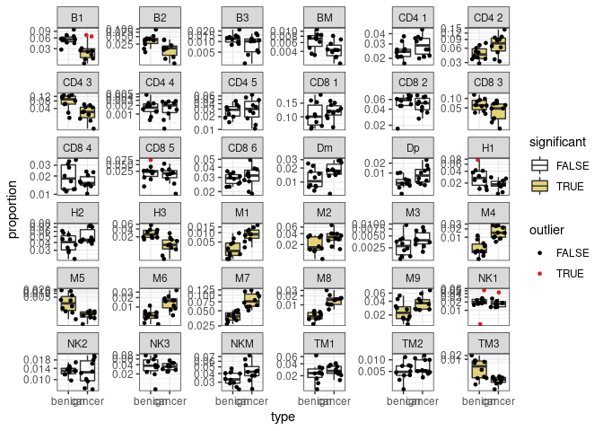
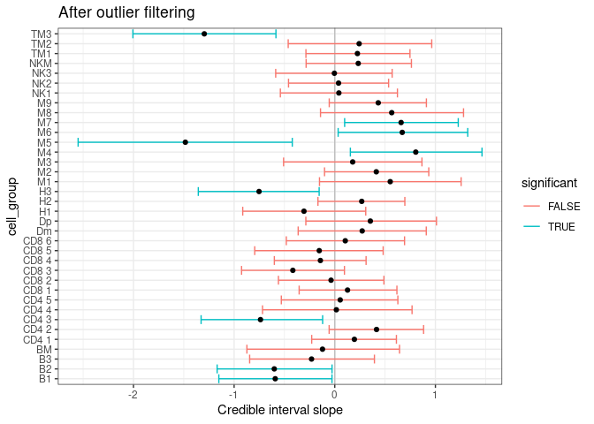

sccomp - Outlier-aware and count-based compositional analysis of
single-cell data
================

<!-- badges: start -->

[](https://www.tidyverse.org/lifecycle/#maturing)
[](https://github.com/stemangiola/tidyseurat/actions/)
<!-- badges: end -->

# 

``` r
library(dplyr)
```

    ## 
    ## Attaching package: 'dplyr'

    ## The following objects are masked from 'package:stats':
    ## 
    ##     filter, lag

    ## The following objects are masked from 'package:base':
    ## 
    ##     intersect, setdiff, setequal, union

``` r
library(sccomp)
```

    ## Loading required package: rstan

    ## Loading required package: StanHeaders

    ## 
    ## rstan version 2.26.1 (Stan version 2.26.1)

    ## For execution on a local, multicore CPU with excess RAM we recommend calling
    ## options(mc.cores = parallel::detectCores()).
    ## To avoid recompilation of unchanged Stan programs, we recommend calling
    ## rstan_options(auto_write = TRUE)
    ## For within-chain threading using `reduce_sum()` or `map_rect()` Stan functions,
    ## change `threads_per_chain` option:
    ## rstan_options(threads_per_chain = 1)

    ## Warning: replacing previous import 'tidyr::extract' by 'rstan::extract' when
    ## loading 'sccomp'

``` r
library(ggplot2)
data("seurat_obj")
data("sce_obj")
data("counts_obj")
```

# From Seurat Object

``` r
  res =
    seurat_obj %>%
    sccomp_glm(  ~ type, sample, cell_group )
```

# From SingleCellExperiment Object

``` r
  res =
    sce_obj %>%
    sccomp_glm( ~ type, sample, cell_group)
```

# From data.frame

``` r
  res =
    seurat_obj[[]] %>%
    sccomp_glm(~ type, sample, cell_group )
```

# From counts

``` r
  res =
    counts_obj %>%
    sccomp_glm( ~ type, sample, cell_group, count)
```

    ## sccomp says: outlier identification first pass - step 1/3 [ETA: ~20s]

    ## Warning: Bulk Effective Samples Size (ESS) is too low, indicating posterior means and medians may be unreliable.
    ## Running the chains for more iterations may help. See
    ## https://mc-stan.org/misc/warnings.html#bulk-ess

    ## sccomp says: outlier identification second pass - step 2/3 [ETA: ~60s]

    ## sccomp says: outlier-free model fitting - step 3/3 [ETA: ~20s]

    ## Warning: Bulk Effective Samples Size (ESS) is too low, indicating posterior means and medians may be unreliable.
    ## Running the chains for more iterations may help. See
    ## https://mc-stan.org/misc/warnings.html#bulk-ess

Outliers identified

``` r
res %>% 
  tidyr::unnest(outliers) %>%
  left_join(counts_obj) %>%
  group_by(sample) %>%
  mutate(proportion = (count+1)/sum(count+1)) %>%
  ungroup(sample) %>%
  ggplot(aes(type, proportion)) +
  geom_boxplot(aes(fill=significant), outlier.shape = NA) + 
  geom_jitter(aes(color=outlier), size = 1) + 
  facet_wrap(~ interaction(cell_group), scale="free_y") +
  scale_y_continuous(trans="logit") +
   scale_color_manual(values = c("black", "#e11f28")) +
  scale_fill_manual(values = c("white", "#E2D379")) +
  theme_bw()
```

    ## Joining, by = c("cell_group", "sample")

<!-- -->

Credible intervals

``` r
res %>%
  ggplot(aes(x=`.median_typecancer`, y=cell_group)) +
  geom_vline(xintercept = 0, colour="grey") +
  geom_errorbar(aes(xmin=`.lower_typecancer`, xmax=`.upper_typecancer`, color=significant)) +
  geom_point() +
  theme_bw() +
  xlab("Credible interval slope") +
  ggtitle("After outlier filtering")
```

<!-- -->
