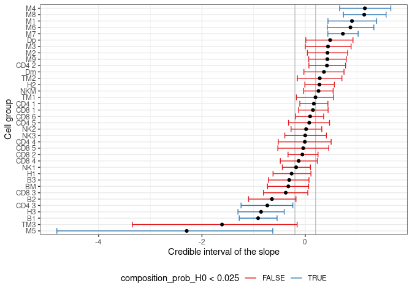
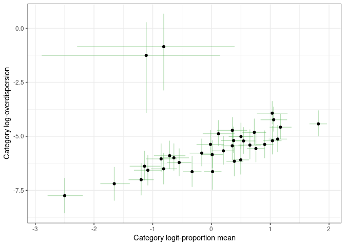
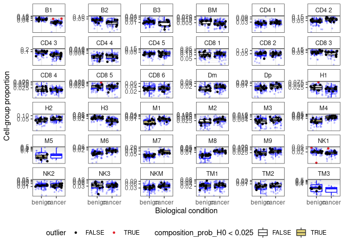
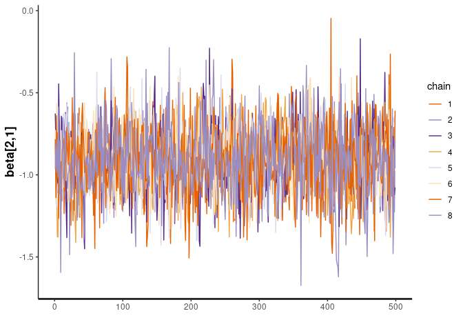

sccomp - Outlier-aware and count-based compositional analysis of
single-cell data
================

<!-- badges: start -->

[](https://www.tidyverse.org/lifecycle/#maturing)
[](https://github.com/stemangiola/tidyseurat/actions/)
<!-- badges: end -->

# 

# Installation

``` r
devtools::install_github("stemangiola/sccomp")
```

# Analysis

## From Seurat Object

``` r
res =
  seurat_obj |>
  sccomp_glm(  ~ type, sample, cell_group )
```

``` r
res =
  sce_obj |>
  sccomp_glm( ~ type, sample, cell_group)
```

## From data.frame

``` r
res =
  seurat_obj[[]] |>
  sccomp_glm(~ type, sample, cell_group )
```

## From counts

``` r
res =
  counts_obj |>
  sccomp_glm( 
    ~ type, 
    sample, cell_group, count, 
    approximate_posterior_inference = FALSE
  )
```

    ## sccomp says: outlier identification first pass - step 1/3 [ETA: ~20s]

    ## sccomp says: outlier identification second pass - step 2/3 [ETA: ~60s]

    ## sccomp says: outlier-free model fitting - step 3/3 [ETA: ~20s]

Outliers identified

``` r
data_for_plot = 
  res |> 
    tidyr::unnest(count_data ) |>
    group_by(sample) |>
    mutate(proportion = (count+1)/sum(count+1)) |>
    ungroup(sample) 

 ggplot() +
  geom_boxplot(
    aes(type, proportion, fill=composition_prob_H0<0.025),
    outlier.shape = NA, 
    data =  filter(data_for_plot, !outlier)
  ) + 
  geom_jitter(aes(type, proportion, color=outlier), size = 1, data = data_for_plot) + 
  facet_wrap(~ interaction(cell_group), scale="free_y") +
  scale_y_continuous(trans="logit") +
  scale_color_manual(values = c("black", "#e11f28")) +
  scale_fill_manual(values = c("white", "#E2D379")) +
  xlab("Biological condition") + 
  ylab("Cell-group proportion") + 
  theme_bw() +
  theme(strip.background =element_rect(fill="white"), legend.position = "bottom")
```

<!-- -->

Credible intervals

``` r
res |>
  unnest(composition_CI) |> 
  ggplot(aes(x=`.median_typecancer`, y=fct_reorder(cell_group, .median_typecancer))) +
  geom_vline(xintercept = 0.2, colour="grey") +
  geom_vline(xintercept = -0.2, colour="grey") +
  geom_errorbar(aes(xmin=`.lower_typecancer`, xmax=`.upper_typecancer`, color=composition_prob_H0<0.025)) +
  geom_point() +
  scale_color_brewer(palette = "Set1") +
  xlab("Credible interval of the slope") +
  ylab("Cell group") + 
  theme_bw() +
  theme(legend.position = "bottom")
```

<!-- -->

Relation between proportion mean and concentration (variability). The
regression line is inferred by sccomp.

``` r
mean_concentration_association = res %>% attr("mean_concentration_association")

res |> 
  unnest(composition_CI) |>
  unnest(concentration) |> 
  ggplot(aes(`.median_(Intercept)`, mean)) + 
  geom_errorbar(aes(ymin = `2.5%`, ymax=`97.5%`), color="#4DAF4A", alpha = 0.4) +
  geom_errorbar(aes(xmin = `.lower_(Intercept)`, xmax=`.upper_(Intercept)`), color="#4DAF4A", alpha = 0.4) +
  geom_point() +
  geom_abline(intercept = mean_concentration_association[1], slope = mean_concentration_association[2], linetype = "dashed", color="grey") +
  xlab("Category logit-proportion mean") +
  ylab("Category log-concentration") +
    theme_bw() 
```

<!-- -->

We can perform posterior predictive checks of the model. This gives
information of how the model “interprets trends” in the data, and gives
confidence on the estimates. The blue shades are the model generated
data.

``` r
data_proportion =
      res |>
      unnest(count_data) |>
      select(cell_group, sample, outlier, count, type, composition_prob_H0) |>
      with_groups(sample, ~ mutate(.x, proportion = (count)/sum(count)) ) 

simulated_proportion = 
  res |>
  replicate_data(number_of_draws = 10) |>
  left_join(data_proportion |> distinct(type, sample))
```

    ## Joining, by = "sample"

``` r
ggplot() +
  
  geom_boxplot(
    aes(type, generated_proportions),
    outlier.shape = NA, alpha=0.2,
    data = simulated_proportion, color="blue"
  ) + 
  geom_jitter(aes(type, generated_proportions), color="blue" ,alpha=0.2, size = 0.6, data = simulated_proportion) + 
  
    geom_boxplot(
    aes(type, proportion, fill=composition_prob_H0<0.025),
    outlier.shape = NA, 
    data = filter(data_proportion, !outlier)
  ) + 
  geom_jitter(aes(type, proportion, color=outlier), size = 1, data = data_proportion) + 
  
  facet_wrap(~ interaction(cell_group), scale="free_y") +
  scale_y_continuous(trans="logit") +
  scale_color_manual(values = c("black", "#e11f28")) +
  scale_fill_manual(values = c("white", "#E2D379")) +
  xlab("Biological condition") + 
  ylab("Cell-group proportion") + 
  theme_bw() +
  theme(strip.background =element_rect(fill="white"), legend.position = "bottom")
```

<!-- -->

It is possible to directly evaluate the posterior distribution. In this
example we plot the Monte Carlo chain for the slope parameter of the
first cell type. We can see that has converged and is negative with
probability 1.

``` r
res %>% attr("fit") %>% rstan::traceplot("beta[2,1]")
```

<!-- -->
