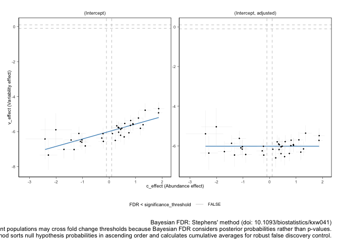

sccomp - Outlier-aware and count-based compositional analysis of
single-cell data
================

<!-- badges: start -->

[](https://www.tidyverse.org/lifecycle/#maturing)
[](https://github.com/stemangiola/tidyseurat/actions/)
<!-- badges: end -->

# 

Single-cell transcriptomics allows the unbiased characterisation of the
cellular composition of tissues. The cellular composition can be
compared between biological or clinical conditions to identify potential
cellular drivers. This strategy has been critical to unveil drivers of
immune response in cancer and pathogen infection from single-cell data.
Developing a robust statistical method for differential composition
analyses from single-cell data is crucial for driving discoveries. The
compositional data from single-cell experiments has four main
properties. The data is in count form; counts underlie inversely
correlated proportions that sum to one; larger cell groups are more
variable across samples than small groups; real-world data is rich in
outlier observation. A model that covers more than two of these
properties is currently lacking. **Here, we present a robust and
outlier-aware method for testing differential tissue composition from
single-cell data. This model can also transfer knowledge from a large
set of integrated datasets to increase accuracy further. We present how
this model can be applied to identify novel compositional and
heterogeneity changes in existing studies.**

# Installation

**Bioconductor**

``` r
if (!requireNamespace("BiocManager")) {
   install.packages("BiocManager")
 }
 BiocManager::install("sccomp")
```

**Github**

``` r
devtools::install_github("stemangiola/sccomp")
```

# Analysis

## From Seurat Object

``` r
res =
  seurat_obj |>
   formula_composition = ~ type, 
    formula_variability = ~ 1, 
    sample, 
    cell_group 
  )
```

``` r
res =
  sce_obj |>
    formula_composition = ~ type, 
    formula_variability = ~ 1, 
    sample, 
    cell_group 
  )
```

## From data.frame

``` r
res =
  seurat_obj[[]] |>
  sccomp_glm(
    formula_composition = ~ type, 
    formula_variability = ~ 1, 
    sample, 
    cell_group 
  )
```

## From counts

``` r
res =
  counts_obj |>
  sccomp_glm( 
    formula_composition = ~ type, 
    formula_variability = ~ 1, 
    .sample = sample,
    .cell_group = cell_group,
    .count = count
  )
```

    ## sccomp says: outlier identification first pass - step 1/3 [ETA: ~20s]

    ## sccomp says: outlier identification second pass - step 2/3 [ETA: ~60s]

    ## sccomp says: outlier-free model fitting - step 3/3 [ETA: ~20s]

``` r
res
```

    ## # A tibble: 72 × 8
    ##    cell_group parameter   c_lower c_effect c_upper    c_pH0     c_FDR count_data
    ##    <chr>      <chr>         <dbl>    <dbl>   <dbl>    <dbl>     <dbl> <list>    
    ##  1 B1         (Intercept)  0.544     0.705  0.858  0        0         <tibble […
    ##  2 B1         typecancer  -1.19     -0.888 -0.580  0.000250 0.0000417 <tibble […
    ##  3 B2         (Intercept)  0.176     0.408  0.654  0.0410   0.00272   <tibble […
    ##  4 B2         typecancer  -1.19     -0.740 -0.297  0.00950  0.00232   <tibble […
    ##  5 B3         (Intercept) -0.618    -0.418 -0.219  0.0168   0.00136   <tibble […
    ##  6 B3         typecancer  -0.566    -0.209  0.151  0.481    0.137     <tibble […
    ##  7 BM         (Intercept) -1.31     -1.11  -0.898  0        0         <tibble […
    ##  8 BM         typecancer  -0.737    -0.343  0.0624 0.239    0.0480    <tibble […
    ##  9 CD4 1      (Intercept)  0.349     0.483  0.620  0        0         <tibble […
    ## 10 CD4 1      typecancer  -0.0798    0.164  0.411  0.629    0.206     <tibble […
    ## # … with 62 more rows

## Visualise data + inference

``` r
plots = plot_summary(res) 
```

    ## Joining, by = c("sample", "cell_group")

    ## Joining, by = c("cell_group", "type")

Plot of group proportion, faceted by groups. The blue boxplots represent
the posterior predictive check. If the model is likely be descriptively
adequate to the data, the blue boxplot should roughly overlay with the
black boxplot, which represent the observed data. The outliers are
coloured in red.

``` r
plots$boxplot
```

<!-- -->

Plot of estimates of differential composition (c\_) on the x axis, and
differential variability (v\_) on the y axis. The error bars represent
95% credible intervals. The dashed lines represent the minimal effect
that the hypothesis test is based on. An effect is labelled as
significant if bigger than the minimal effect according to the 95%
credible interval. Facets represent the covariates in the model.

``` r
plots$credible_intervals_1D
```

<!-- -->

## Visualisation of the MCMC chains from the posterior distribution

It is possible to directly evaluate the posterior distribution. In this
example we plot the Monte Carlo chain for the slope parameter of the
first cell type. We can see that has converged and is negative with
probability 1.

``` r
res %>% attr("fit") %>% rstan::traceplot("beta[2,1]")
```

<!-- -->

## Differential variability

We can model the cell-group variability also dependent on type, and so
test differences in variability

``` r
res = 
  counts_obj |>
  sccomp_glm( 
    formula_composition = ~ type, 
    formula_variability = ~ type, 
    .sample = sample,
    .cell_group = cell_group,
    .count = count
  )
```

    ## sccomp says: outlier identification first pass - step 1/3 [ETA: ~20s]

    ## sccomp says: outlier identification second pass - step 2/3 [ETA: ~60s]

    ## sccomp says: outlier-free model fitting - step 3/3 [ETA: ~20s]

``` r
res
```

    ## # A tibble: 72 × 13
    ##    cell_group parameter   c_lower c_effect c_upper    c_pH0    c_FDR v_lower
    ##    <chr>      <chr>         <dbl>    <dbl>   <dbl>    <dbl>    <dbl>   <dbl>
    ##  1 B1         (Intercept)  0.619     0.786   0.968 0        0         -4.88 
    ##  2 B1         typecancer  -1.25     -0.924  -0.597 0.000750 0.000208   0.942
    ##  3 B2         (Intercept)  0.239     0.455   0.682 0.0122   0.000946  -4.67 
    ##  4 B2         typecancer  -1.09     -0.650  -0.180 0.0290   0.00398    2.10 
    ##  5 B3         (Intercept) -0.633    -0.407  -0.173 0.0385   0.00224   -5.50 
    ##  6 B3         typecancer  -0.659    -0.212   0.224 0.478    0.133      1.99 
    ##  7 BM         (Intercept) -1.27     -1.06   -0.823 0        0         -6.05 
    ##  8 BM         typecancer  -0.741    -0.300   0.142 0.322    0.0805     1.23 
    ##  9 CD4 1      (Intercept)  0.393     0.533   0.681 0        0         -5.46 
    ## 10 CD4 1      typecancer  -0.0478    0.229   0.525 0.411    0.106      1.70 
    ## # … with 62 more rows, and 5 more variables: v_effect <dbl>, v_upper <dbl>,
    ## #   v_pH0 <dbl>, v_FDR <dbl>, count_data <list>

Plot 1D significance plot

``` r
plots = plot_summary(res)
```

    ## Joining, by = c("sample", "cell_group")

    ## Joining, by = c("cell_group", "type")

``` r
plots$credible_intervals_1D
```

<!-- -->

Plot 2D significance plot. This is possible if only differential
variability has been tested

``` r
plots$credible_intervals_2D
```

<!-- -->
