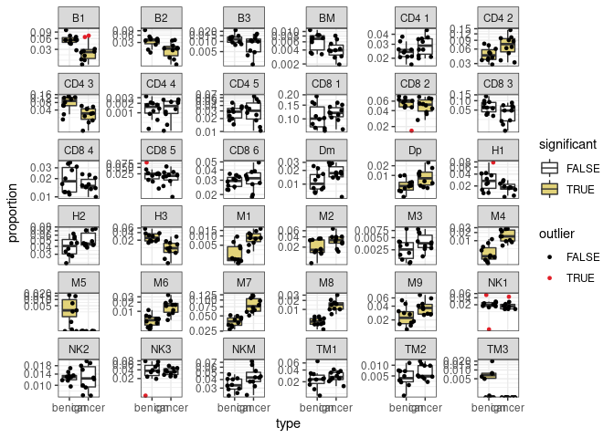
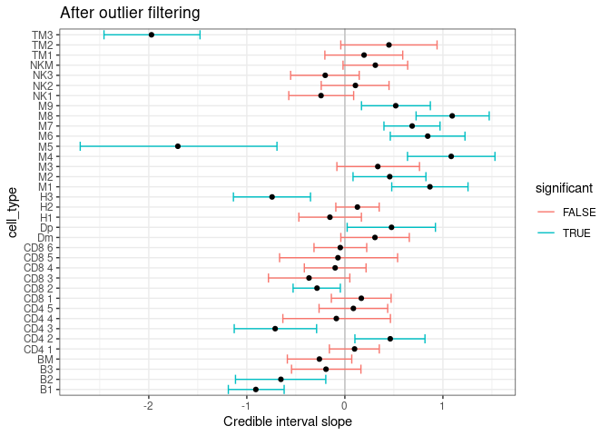

sccomp - outlier-free compositional analysis
================

<!-- badges: start -->

[](https://www.tidyverse.org/lifecycle/#maturing)
[](https://github.com/stemangiola/tidyseurat/actions/)
<!-- badges: end -->

``` r
library(furrr)
```

    ## Loading required package: future

``` r
library(dplyr)
```

    ## 
    ## Attaching package: 'dplyr'

    ## The following objects are masked from 'package:stats':
    ## 
    ##     filter, lag

    ## The following objects are masked from 'package:base':
    ## 
    ##     intersect, setdiff, setequal, union

``` r
library(purrr)
library(sccomp)
```

    ## Warning: replacing previous import 'tidyr::extract' by 'rstan::extract' when
    ## loading 'sccomp'

``` r
library(tidyr)
library(ggplot2)
```

``` r
  res =
    sccomp::cell_counts %>%
    sccomp_glm(
      formula = ~ type,
      sample, cell_type, count
    )
```

    ## sccomp says: started fit 1/3

    ## sccomp says: started fit 2/3

    ## sccomp says: started fit 3/3

These are the cell\_types for which inference was biased by the presence
of outliers

``` r
res %>% 
  unnest(outliers) %>%
  left_join(sccomp::cell_counts) %>%
  group_by(sample) %>%
  mutate(proportion = count/sum(count)) %>%
  ungroup(sample) %>%
  ggplot(aes(type, proportion)) +
  geom_boxplot(aes(fill=significant), outlier.shape = NA) + 
  geom_jitter(aes(color=outlier), size = 1) + 
  facet_wrap(~ interaction(cell_type), scale="free_y") +
  scale_y_continuous(trans="logit") +
   scale_color_manual(values = c("black", "#e11f28")) +
  scale_fill_manual(values = c("white", "#E2D379")) +
  theme_bw()
```

    ## Joining, by = c("cell_type", "sample")

    ## Warning: Transformation introduced infinite values in continuous y-axis

    ## Warning: Transformation introduced infinite values in continuous y-axis

    ## Warning: Removed 27 rows containing non-finite values (stat_boxplot).

<!-- -->

``` r
res %>%
  ggplot(aes(x=`.median_typecancer`, y=cell_type)) +
  geom_vline(xintercept = 0, colour="grey") +
  geom_errorbar(aes(xmin=`.lower_typecancer`, xmax=`.upper_typecancer`, color=significant)) +
  geom_point() +
  theme_bw() +
  xlab("Credible interval slope") +
  ggtitle("After outlier filtering")
```

<!-- -->
