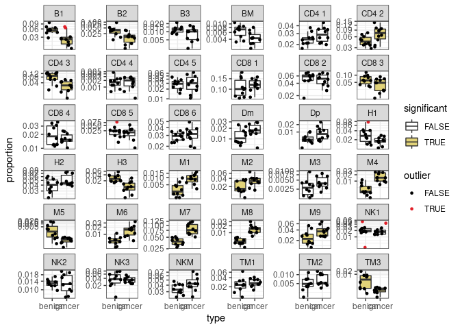

sccomp - Outlier-aware and count-based compositional analysis of
single-cell data
================

<!-- badges: start -->

[](https://www.tidyverse.org/lifecycle/#maturing)
[](https://github.com/stemangiola/tidyseurat/actions/)
<!-- badges: end -->

# 

# From Seurat Object

``` r
  res =
    seurat_obj %>%
    sccomp_glm(  ~ type, sample, cell_group )
```

# From SingleCellExperiment Object

``` r
  res =
    sce_obj %>%
    sccomp_glm( ~ type, sample, cell_group)
```

# From data.frame

``` r
  res =
    seurat_obj[[]] %>%
    sccomp_glm(~ type, sample, cell_group )
```

# From counts

``` r
  res =
    counts_obj %>%
    sccomp_glm( ~ type, sample, cell_group, count)
```

    ## sccomp says: outlier identification first pass - step 1/3 [ETA: ~20s]

    ## sccomp says: outlier identification second pass - step 2/3 [ETA: ~60s]

    ## sccomp says: outlier-free model fitting - step 3/3 [ETA: ~20s]

Outliers identified

``` r
res %>% 
  tidyr::unnest(outliers) %>%
  left_join(counts_obj, by = c("cell_group", "sample")) %>%
  group_by(sample) %>%
  mutate(proportion = (count+1)/sum(count+1)) %>%
  ungroup(sample) %>%
  ggplot(aes(type, proportion)) +
  geom_boxplot(aes(fill=significant), outlier.shape = NA) + 
  geom_jitter(aes(color=outlier), size = 1) + 
  facet_wrap(~ interaction(cell_group), scale="free_y") +
  scale_y_continuous(trans="logit") +
   scale_color_manual(values = c("black", "#e11f28")) +
  scale_fill_manual(values = c("white", "#E2D379")) +
  theme_bw()
```

<!-- -->

Credible intervals

``` r
res %>%
  ggplot(aes(x=`.median_typecancer`, y=cell_group)) +
  geom_vline(xintercept = 0, colour="grey") +
  geom_errorbar(aes(xmin=`.lower_typecancer`, xmax=`.upper_typecancer`, color=significant)) +
  geom_point() +
  theme_bw() +
  xlab("Credible interval slope") +
  ggtitle("After outlier filtering")
```

<!-- -->
