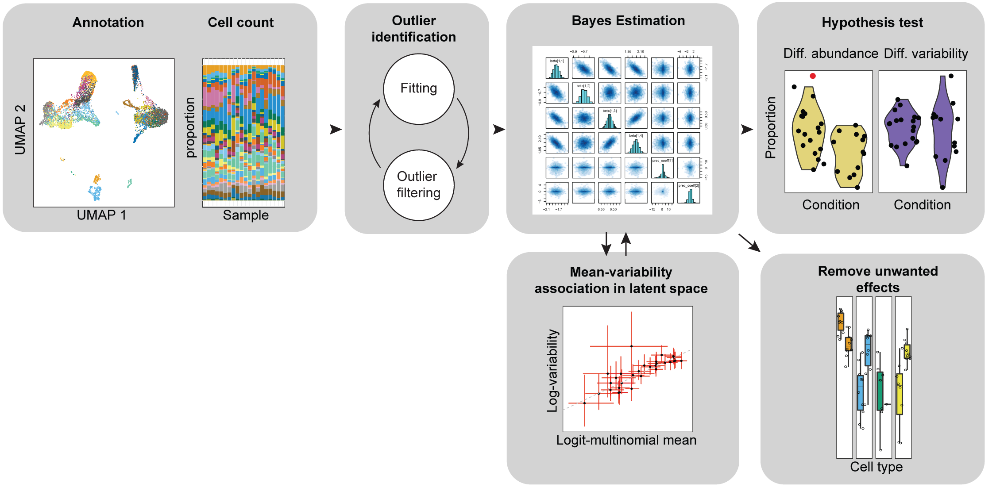
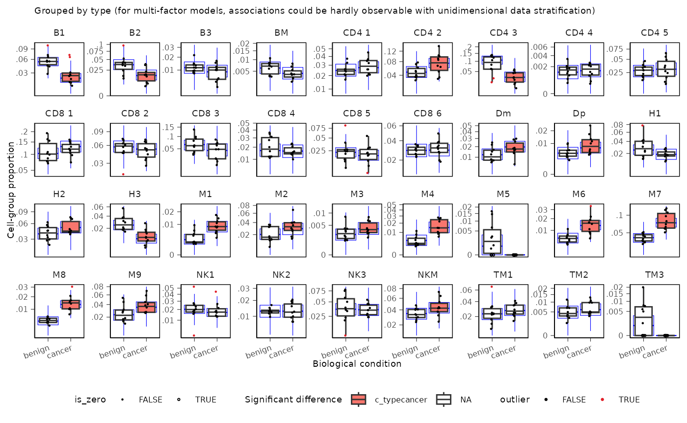
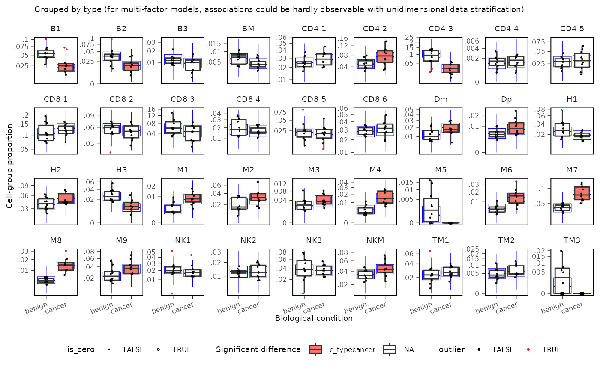
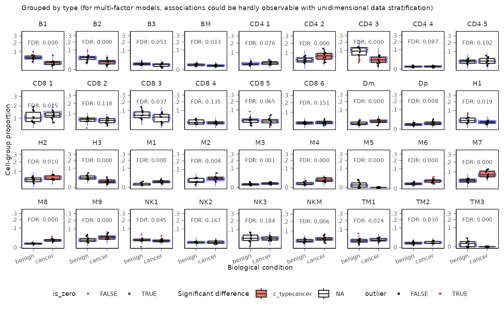
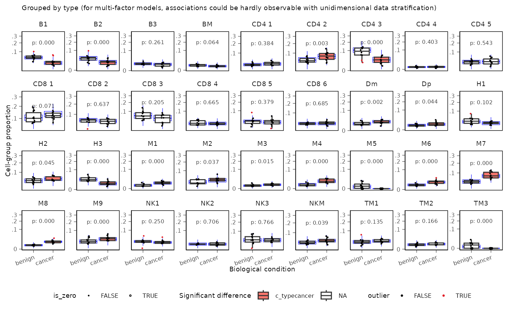
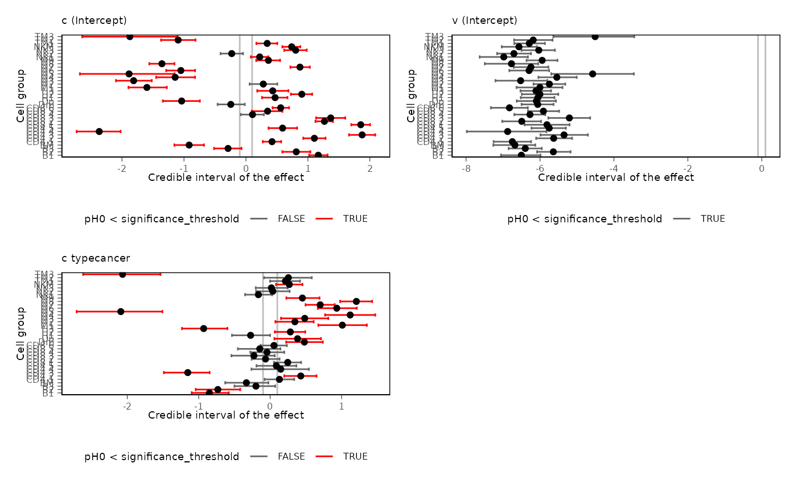
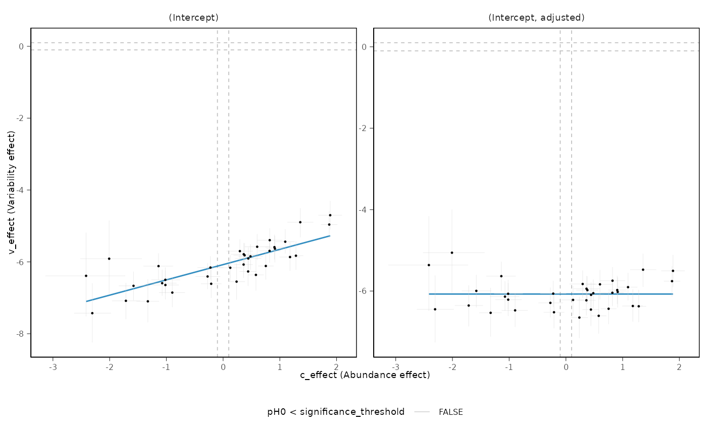
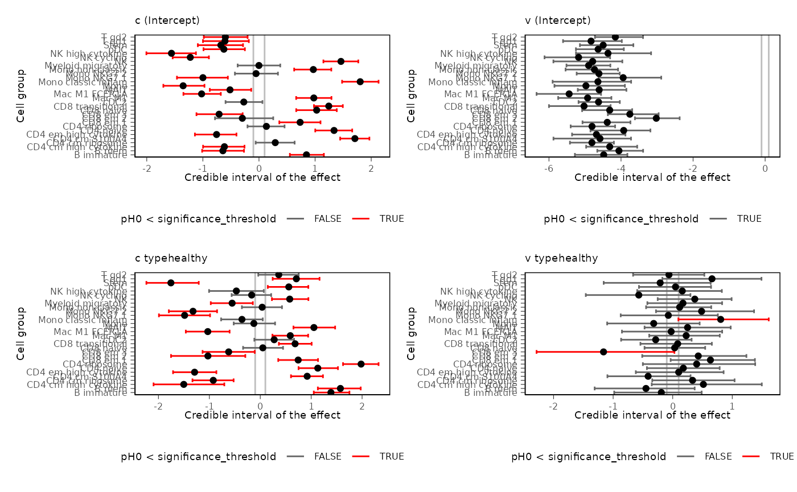
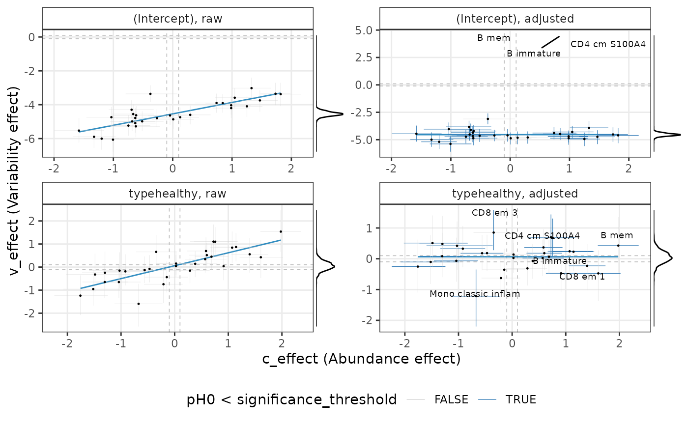
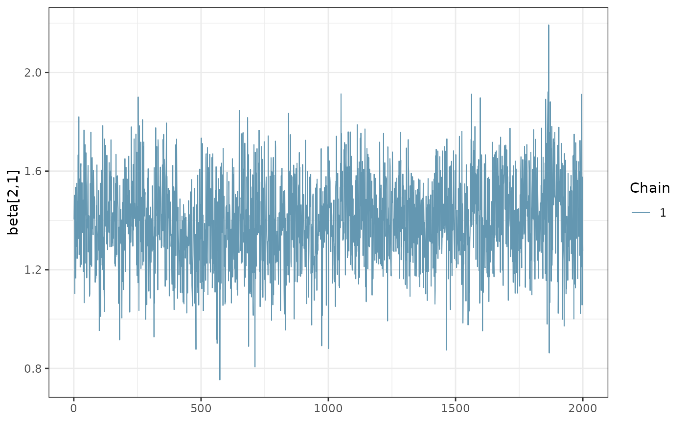

# sccomp: Differential Composition and Variability Analysis for Single-Cell Data

Abstract

Sccomp is a comprehensive R package for differential composition and
variability analysis in single-cell RNA sequencing, CyTOF, and
microbiome data. It provides robust Bayesian modeling with outlier
detection, random effects, and advanced statistical methods for cell
type proportion analysis. Perfect for cancer research, immunology, and
single-cell genomics.

[](https://www.tidyverse.org/lifecycle/#maturing)
[](https://github.com/stemangiola/sccomp/actions/)

## 

**sccomp** is a powerful R package designed for comprehensive
differential composition and variability analysis in single-cell
genomics, proteomics, and microbiomics data.

### Why sccomp?

For cellular omic data, no method for differential variability analysis
exists, and methods for differential composition analysis only take a
few fundamental data properties into account. Here we introduce
**sccomp**, a generalised method for differential composition and
variability analyses capable of jointly modelling data count
distribution, compositionality, group-specific variability, and
proportion mean-variability association, while being robust to outliers.



#### Comprehensive Method Comparison

- **I**: Data are modelled as counts.
- **II**: Group proportions are modelled as compositional.
- **III**: The proportion variability is modelled as cell-type specific.
- **IV**: Information sharing across cell types, mean–variability
  association.
- **V**: Outlier detection or robustness.
- **VI**: Differential variability analysis.
- **VII** Mixed effect modelling
- **VIII** Removal unwanted effects

| Method           | Year | Model                         | I   | II  | III | IV  | V   | VI  | VII | VIII |
|------------------|------|-------------------------------|-----|-----|-----|-----|-----|-----|-----|------|
| **sccomp**       | 2023 | Sum-constrained Beta-binomial | ●   | ●   | ●   | ●   | ●   | ●   | ●   | ●    |
| **scCODA**       | 2021 | Dirichlet-multinomial         | ●   | ●   |     |     |     |     |     |      |
| **quasi-binom.** | 2021 | Quasi-binomial                | ●   |     | ●   |     |     |     |     |      |
| **rlm**          | 2021 | Robust-log-linear             |     | ●   |     |     | ●   |     |     |      |
| **propeller**    | 2021 | Logit-linear + limma          |     | ●   | ●   | ●   |     |     |     |      |
| **ANCOM-BC**     | 2020 | Log-linear                    |     | ●   | ●   |     |     |     |     |      |
| **corncob**      | 2020 | Beta-binomial                 | ●   |     | ●   |     |     |     |     |      |
| **scDC**         | 2019 | Log-linear                    |     | ●   | ●   |     |     |     |     |      |
| **dmbvs**        | 2017 | Dirichlet-multinomial         | ●   | ●   |     |     |     |     |     |      |
| **MixMC**        | 2016 | Zero-inflated Log-linear      |     | ●   | ●   |     |     |     |     |      |
| **ALDEx2**       | 2014 | Dirichlet-multinomial         | ●   | ●   |     |     |     |     |     |      |

#### Scientific Citation

Mangiola, Stefano, Alexandra J. Roth-Schulze, Marie Trussart, Enrique
Zozaya-Valdés, Mengyao Ma, Zijie Gao, Alan F. Rubin, Terence P. Speed,
Heejung Shim, and Anthony T. Papenfuss. 2023. “Sccomp: Robust
Differential Composition and Variability Analysis for Single-Cell Data.”
Proceedings of the National Academy of Sciences of the United States of
America 120 (33): e2203828120. <https://doi.org/10.1073/pnas.2203828120>
[PNAS - sccomp: Robust differential composition and variability analysis
for single-cell
data](https://www.pnas.org/doi/full/10.1073/pnas.2203828120)

#### Talk

[](https://www.youtube.com/watch?v=R_lt58We9nA&ab_channel=RConsortium)

## Installation Guide

`sccomp` is based on `cmdstanr` which provides the latest version of
`cmdstan` the Bayesian modelling tool. `cmdstanr` is not on CRAN, so we
need to have 3 simple step process (that will be prompted to the user is
forgot).

1.  R installation of `sccomp`
2.  R installation of `cmdstanr`
3.  `cmdstanr` call to `cmdstan` installation

**Bioconductor**

``` r
if (!requireNamespace("BiocManager")) install.packages("BiocManager")

# Step 1
BiocManager::install("sccomp")

# Step 2
install.packages("cmdstanr", repos = c("https://stan-dev.r-universe.dev/", getOption("repos")))

# Step 3
cmdstanr::check_cmdstan_toolchain(fix = TRUE) # Just checking system setting
cmdstanr::install_cmdstan()
```

**Github**

``` r
# Step 1
devtools::install_github("MangiolaLaboratory/sccomp")

# Step 2
install.packages("cmdstanr", repos = c("https://stan-dev.r-universe.dev/", getOption("repos")))

# Step 3
cmdstanr::check_cmdstan_toolchain(fix = TRUE) # Just checking system setting
cmdstanr::install_cmdstan()
```

#### Server special requirements: Restricted or read-only environments

`sccomp` needs to write files to disk (compiled Stan models, draw
files). On shared servers or restricted environments:

1.  **Prefer installing locally** – Install sccomp in a user-writable R
    library so it can use the default cache `~/.sccomp_models`.
2.  **Or request write access** – Ask your system administrator for
    permission to write in your user directories.

If your administrator has pre-compiled models in a shared directory
(e.g. `/opt/sccomp_models`), you can point sccomp to that cache
**before** calling any sccomp function. This is required because
`sccomp_boxplot`, `sccomp_estimate`, and other functions use internal
routines that check the cache directory:

``` r
library(sccomp)

cache_stan_model_dir <- "/opt/sccomp_models"

# Set the cache directory before any sccomp call
utils::assignInNamespace("sccomp_stan_models_cache_dir", cache_stan_model_dir, ns = "sccomp")

# Now run your analysis
sccomp_result <- 
  counts_obj |>
  sccomp_estimate(formula_composition = ~ type, sample = "sample", cell_group = "cell_group", 
                  abundance = "count", cores = 1) |>
  sccomp_test()

sccomp_result |> sccomp_boxplot(factor = "type")
```

Alternatively, pass `cache_stan_model` explicitly in each call:

``` r
sccomp_result <- 
  counts_obj |>
  sccomp_estimate(..., cache_stan_model = "/opt/sccomp_models") |>
  sccomp_remove_outliers(cache_stan_model = "/opt/sccomp_models") |>
  sccomp_test()

sccomp_result |> sccomp_boxplot(factor = "type", cache_stan_model = "/opt/sccomp_models")
```

### Core Functions

| Function                         | Description                                                                                                                 |
|----------------------------------|-----------------------------------------------------------------------------------------------------------------------------|
| `sccomp_estimate`                | Fit the model onto the data, and estimate the coefficients                                                                  |
| `sccomp_remove_outliers`         | Identify outliers probabilistically based on the model fit, and exclude them from the estimation                            |
| `sccomp_test`                    | Calculate the probability that the coefficients are outside the H0 interval (i.e. test_composition_above_logit_fold_change) |
| `sccomp_replicate`               | Simulate data from the model, or part of the model                                                                          |
| `sccomp_predict`                 | Predicts proportions, based on the model, or part of the model                                                              |
| `sccomp_remove_unwanted_effects` | Removes the variability for unwanted factors                                                                                |
| `plot`                           | Plots summary plots to assess significance                                                                                  |

## Analysis Tutorial

``` r
library(dplyr)
library(sccomp)
library(ggplot2)
library(forcats)
library(tidyr)
data("seurat_obj")
data("sce_obj")
data("counts_obj")
```

### Binary Factor Analysis

Of the output table, the estimate columns start with the prefix `c_`
indicate `composition`, or with `v_` indicate `variability` (when
formula_variability is set).

#### From Seurat, SingleCellExperiment, metadata objects

``` r
sccomp_result = 
  sce_obj |>
  sccomp_estimate( 
    formula_composition = ~ type, 
    sample = "sample", 
    cell_group = "cell_group", 
    cores = 1,
    verbose = FALSE
  ) |> 
  sccomp_test()
```

#### From counts

``` r
sccomp_result = 
  counts_obj |>
  sccomp_estimate( 
    formula_composition = ~ type, 
    sample = "sample",
    cell_group = "cell_group",
    abundance = "count", 
    cores = 1, verbose = FALSE,
    max_sampling_iterations = 2000
  ) |> 
  sccomp_test()
```

Here you see the results of the fit, the effects of the factor on
composition and variability. You also can see the uncertainty around
those effects.

The output is a tibble containing the **Following columns**

- `cell_group` - The cell groups being tested.
- `parameter` - The parameter being estimated from the design matrix
  described by the input `formula_composition` and
  `formula_variability`.
- `factor` - The covariate factor in the formula, if applicable (e.g.,
  not present for Intercept or contrasts).
- `c_lower` - Lower (2.5%) quantile of the posterior distribution for a
  composition (c) parameter.
- `c_effect` - Mean of the posterior distribution for a composition (c)
  parameter.
- `c_upper` - Upper (97.5%) quantile of the posterior distribution for a
  composition (c) parameter.
- `c_pH0` - Probability of the null hypothesis (no difference) for a
  composition (c). This is not a p-value.
- `c_FDR` - False-discovery rate of the null hypothesis for a
  composition (c).
- `v_lower` - Lower (2.5%) quantile of the posterior distribution for a
  variability (v) parameter.
- `v_effect` - Mean of the posterior distribution for a variability (v)
  parameter.
- `v_upper` - Upper (97.5%) quantile of the posterior distribution for a
  variability (v) parameter.
- `v_pH0` - Probability of the null hypothesis for a variability (v).
- `v_FDR` - False-discovery rate of the null hypothesis for a
  variability (v).
- `count_data` - Nested input count data.

``` r
sccomp_result
```

    ## sccomp model
    ## ============
    ## 
    ## Model specifications:
    ##   Family: multi_beta_binomial 
    ##   Composition formula: ~type 
    ##   Variability formula: ~1 
    ##   Inference method: pathfinder 
    ## 
    ## Data: Samples: 20   Cell groups: 36 
    ## 
    ## Column prefixes: c_ -> composition parameters  v_ -> variability parameters
    ## 
    ## Convergence diagnostics:
    ##   For each parameter, n_eff is the effective sample size and R_k_hat is the potential
    ##   scale reduction factor on split chains (at convergence, R_k_hat = 1).
    ## 
    ## # A tibble: 72 × 19
    ##    cell_group parameter  factor  c_lower c_effect c_upper   c_pH0   c_FDR c_rhat
    ##    <chr>      <chr>      <chr>     <dbl>    <dbl>   <dbl>   <dbl>   <dbl>  <dbl>
    ##  1 B1         (Intercep… NA      0.958      1.21   1.44   0       0        1.00 
    ##  2 B1         typecancer type   -0.917     -0.611 -0.322  1.00e-3 9.09e-5  1.000
    ##  3 B2         (Intercep… NA      0.530      0.768  1.01   0       0        1.000
    ##  4 B2         typecancer type   -0.966     -0.665 -0.368  0       0        1.00 
    ##  5 B3         (Intercep… NA     -0.593     -0.331 -0.0845 3.50e-2 3.23e-3  1.00 
    ##  6 B3         typecancer type   -0.562     -0.274  0.0112 1.03e-1 1.47e-2  1.00 
    ##  7 BM         (Intercep… NA     -1.21      -0.969 -0.713  0       0        1.00 
    ##  8 BM         typecancer type   -0.575     -0.286  0.0236 1.24e-1 2.30e-2  1.000
    ##  9 CD4 1      (Intercep… NA      0.208      0.369  0.532  5.00e-4 1.92e-5  1.00 
    ## 10 CD4 1      typecancer type    0.00284    0.211  0.418  1.49e-1 2.80e-2  1.000
    ## # ℹ 62 more rows
    ## # ℹ 10 more variables: c_ess_bulk <dbl>, c_ess_tail <dbl>, v_lower <dbl>,
    ## #   v_effect <dbl>, v_upper <dbl>, v_pH0 <dbl>, v_FDR <dbl>, v_rhat <dbl>,
    ## #   v_ess_bulk <dbl>, v_ess_tail <dbl>

### Outlier Identification

`sccomp` can identify outliers probabilistically and exclude them from
the estimation.

``` r
sccomp_result = 
  counts_obj |>
  sccomp_estimate( 
    formula_composition = ~ type, 
    sample = "sample",
    cell_group = "cell_group",
    abundance = "count", 
    cores = 1, verbose = FALSE,
    max_sampling_iterations = 2000
  ) |> 
  
  # max_sampling_iterations is used to reduce draw file sizes
  sccomp_remove_outliers(cores = 1, verbose = FALSE, max_sampling_iterations = 2000) |> # Optional
  sccomp_test()
```

    ## Running standalone generated quantities after 1 MCMC chain, with 1 thread(s) per chain...
    ## 
    ## Chain 1 finished in 0.0 seconds.

    ## Running standalone generated quantities after 1 MCMC chain, with 1 thread(s) per chain...
    ## 
    ## Chain 1 finished in 0.0 seconds.

### Visualization and Summary Plots

A plot of group proportions, faceted by groups. The blue boxplots
represent the posterior predictive check. If the model is descriptively
adequate for the data, the blue boxplots should roughly overlay the
black boxplots, which represent the observed data. The outliers are
coloured in red. A boxplot will be returned for every (discrete)
covariate present in formula_composition. The colour coding represents
the significant associations for composition and/or variability.

``` r
sccomp_result |> 
  sccomp_boxplot(factor = "type")
```

    ## Running standalone generated quantities after 1 MCMC chain, with 1 thread(s) per chain...
    ## 
    ## Chain 1 finished in 0.0 seconds.



You can plot proportions adjusted for unwanted effects. This is helpful
especially for complex models, where multiple factors can significantly
impact the proportions.

``` r
sccomp_result |> 
  sccomp_boxplot(factor = "type", remove_unwanted_effects = TRUE)
```

    ## Running standalone generated quantities after 1 MCMC chain, with 1 thread(s) per chain...
    ## 
    ## Chain 1 finished in 0.0 seconds.

    ## Running standalone generated quantities after 1 MCMC chain, with 1 thread(s) per chain...
    ## 
    ## Chain 1 finished in 0.0 seconds.

    ## Running standalone generated quantities after 1 MCMC chain, with 1 thread(s) per chain...
    ## 
    ## Chain 1 finished in 0.0 seconds.



#### Adding Custom Layers to Boxplots

Since
[`sccomp_boxplot()`](https://mangiolalaboratory.github.io/sccomp/reference/sccomp_boxplot.md)
returns a ggplot object, you can add additional layers to customize the
plot. For example, you can add labels showing FDR values or other
statistics:

``` r
sccomp_result |> 
  sccomp_boxplot(factor = "type") +

  # Extendd the ylim to accomodate the label
  coord_cartesian(ylim = c(NA, 0.35)) +
  geom_text(aes(label = sprintf("FDR: %.3f", c_FDR)), 
             x = 1.5, y = 0.45,
             size = 2, alpha = 0.8)
```

    ## Running standalone generated quantities after 1 MCMC chain, with 1 thread(s) per chain...
    ## 
    ## Chain 1 finished in 0.0 seconds.



You can also add text annotations for p-values:

``` r
sccomp_result |> 
  sccomp_boxplot(factor = "type") +

  # Extendd the ylim to accomodate the label
  coord_cartesian(ylim = c(NA, 0.35)) +
  geom_text(aes(label = sprintf("p: %.3f", c_pH0)), 
             x = 1.5, y = 0.45,
             size = 2, alpha = 0.8)
```

    ## Running standalone generated quantities after 1 MCMC chain, with 1 thread(s) per chain...
    ## 
    ## Chain 1 finished in 0.0 seconds.



A plot of estimates of differential composition (c\_) on the x-axis and
differential variability (v\_) on the y-axis. The error bars represent
95% credible intervals. The dashed lines represent the minimal effect
that the hypothesis test is based on. An effect is labelled as
significant if it exceeds the minimal effect according to the 95%
credible interval. Facets represent the covariates in the model.

``` r
sccomp_result |> 
  plot_1D_intervals()
```



We can plot the relationship between abundance and variability. As we
can see below, they are positively correlated. sccomp models this
relationship to obtain a shrinkage effect on the estimates of both the
abundance and the variability. This shrinkage is adaptive as it is
modelled jointly, thanks to Bayesian inference.

``` r
sccomp_result |> 
  plot_2D_intervals()
```



You can produce the series of plots calling the `plot` method.

``` r
sccomp_result |> plot() 
```

### Model Proportions Directly (e.g. from deconvolution)

**Note:** If counts are available, we strongly discourage the use of
proportions, as an important source of uncertainty (i.e., for rare
groups/cell types) is not modeled.

The use of proportions is better suited for modelling deconvolution
results (e.g., of bulk RNA data), in which case counts are not
available.

Proportions should be greater than 0. Assuming that zeros derive from a
precision threshold (e.g., deconvolution), zeros are converted to the
smallest non-zero value.

``` r
sccomp_result = 
  counts_obj |>
  sccomp_estimate( 
    formula_composition = ~ type, 
    sample = "sample",
    cell_group = "cell_group",
    abundance = "proportion", 
    cores = 1, verbose = FALSE,
    max_sampling_iterations = 2000
  ) |> 
  sccomp_test()
```

### Continuous Factor Analysis

`sccomp` is able to fit arbitrary complex models. In this example we
have a continuous and binary covariate.

``` r
res =
    seurat_obj |>
    sccomp_estimate(
      formula_composition = ~ type + continuous_covariate, 
      sample = "sample", 
      cell_group = "cell_group",
      cores = 1, verbose=FALSE,
      max_sampling_iterations = 2000
    )

res
```

    ## sccomp model
    ## ============
    ## 
    ## Model specifications:
    ##   Family: multi_beta_binomial 
    ##   Composition formula: ~type + continuous_covariate 
    ##   Variability formula: ~1 
    ##   Inference method: pathfinder 
    ## 
    ## Data: Samples: 20   Cell groups: 30 
    ## 
    ## Column prefixes: c_ -> composition parameters  v_ -> variability parameters
    ## 
    ## Convergence diagnostics:
    ##   For each parameter, n_eff is the effective sample size and R_k_hat is the potential
    ##   scale reduction factor on split chains (at convergence, R_k_hat = 1).
    ## 
    ## # A tibble: 90 × 15
    ##    cell_group        parameter factor c_lower c_effect c_upper c_rhat c_ess_bulk
    ##    <chr>             <chr>     <chr>    <dbl>    <dbl>   <dbl>  <dbl>      <dbl>
    ##  1 B immature        (Interce… NA      0.569    0.838    1.10   1.00       2043.
    ##  2 B immature        typeheal… type    1.02     1.35     1.69   1.000      2040.
    ##  3 B immature        continuo… conti… -0.271    0.0519   0.371  1.00       2059.
    ##  4 B mem             (Interce… NA     -0.977   -0.677   -0.370  1.000      1926.
    ##  5 B mem             typeheal… type    1.21     1.58     1.94   1.00       1886.
    ##  6 B mem             continuo… conti… -0.262    0.0681   0.401  1.00       1900.
    ##  7 CD4 cm S100A4     (Interce… NA      1.31     1.56     1.79   1.00       1968.
    ##  8 CD4 cm S100A4     typeheal… type    0.861    1.13     1.39   1.000      1960.
    ##  9 CD4 cm S100A4     continuo… conti… -0.0965   0.174    0.468  1.00       1923.
    ## 10 CD4 cm high cyto… (Interce… NA     -0.940   -0.594   -0.227  1.000      2126.
    ## # ℹ 80 more rows
    ## # ℹ 7 more variables: c_ess_tail <dbl>, v_lower <dbl>, v_effect <dbl>,
    ## #   v_upper <dbl>, v_rhat <dbl>, v_ess_bulk <dbl>, v_ess_tail <dbl>

### Random Effect Modeling (Mixed-Effect Modeling)

`sccomp` supports multilevel modeling by allowing the inclusion of
random effects in the compositional and variability formulas. This is
particularly useful when your data has hierarchical or grouped
structures, such as measurements nested within subjects, batches, or
experimental units. By incorporating random effects, sccomp can account
for variability at different levels of your data, improving model fit
and inference accuracy.

#### Random Intercept Model

In this example, we demonstrate how to fit a random intercept model
using sccomp. We’ll model the cell-type proportions with both fixed
effects (e.g., treatment) and random effects (e.g., subject-specific
variability).

Here is the input data

``` r
seurat_obj[[]] |> as_tibble()
```

    ## # A tibble: 106,297 × 9
    ##    cell_group nCount_RNA nFeature_RNA group__ group__wrong sample type  group2__
    ##    <chr>           <dbl>        <int> <chr>   <chr>        <chr>  <chr> <chr>   
    ##  1 CD4 naive           0            0 GROUP1  1            SI-GA… canc… GROUP21 
    ##  2 Mono clas…          0            0 GROUP1  1            SI-GA… canc… GROUP21 
    ##  3 CD4 cm S1…          0            0 GROUP1  1            SI-GA… canc… GROUP21 
    ##  4 B immature          0            0 GROUP1  1            SI-GA… canc… GROUP21 
    ##  5 CD8 naive           0            0 GROUP1  1            SI-GA… canc… GROUP21 
    ##  6 CD4 naive           0            0 GROUP1  1            SI-GA… canc… GROUP21 
    ##  7 Mono clas…          0            0 GROUP1  1            SI-GA… canc… GROUP21 
    ##  8 CD4 cm S1…          0            0 GROUP1  1            SI-GA… canc… GROUP21 
    ##  9 CD4 cm hi…          0            0 GROUP1  1            SI-GA… canc… GROUP21 
    ## 10 B immature          0            0 GROUP1  1            SI-GA… canc… GROUP21 
    ## # ℹ 106,287 more rows
    ## # ℹ 1 more variable: continuous_covariate <dbl>

``` r
res = 
  seurat_obj |>
  sccomp_estimate( 
    formula_composition = ~ type + (1 | group__), 
    sample = "sample",
    cell_group = "cell_group",
    bimodal_mean_variability_association = TRUE,
    cores = 1, verbose = FALSE,
    max_sampling_iterations = 2000
  ) 

res
```

    ## sccomp model
    ## ============
    ## 
    ## Model specifications:
    ##   Family: multi_beta_binomial 
    ##   Composition formula: ~type + (1 | group__) 
    ##   Variability formula: ~1 
    ##   Inference method: pathfinder 
    ## 
    ## Data: Samples: 20   Cell groups: 30 
    ## 
    ## Column prefixes: c_ -> composition parameters  v_ -> variability parameters
    ## 
    ## Convergence diagnostics:
    ##   For each parameter, n_eff is the effective sample size and R_k_hat is the potential
    ##   scale reduction factor on split chains (at convergence, R_k_hat = 1).
    ## 
    ## # A tibble: 180 × 15
    ##    cell_group parameter       factor c_lower c_effect  c_upper c_rhat c_ess_bulk
    ##    <chr>      <chr>           <chr>    <dbl>    <dbl>    <dbl>  <dbl>      <dbl>
    ##  1 B immature (Intercept)     NA      0.552   0.855    1.22      1.01      158. 
    ##  2 B immature typehealthy     type    0.805   1.22     1.69      1.00      127. 
    ##  3 B immature (Intercept)___… NA     -0.422   0.0180   0.487     1.00       92.2
    ##  4 B immature (Intercept)___… NA     -0.266   0.199    0.715     1.01       94.2
    ##  5 B immature (Intercept)___… NA     -0.119   0.219    0.619     1.00      194. 
    ##  6 B immature (Intercept)___… NA     -0.841  -0.284    0.00466   1.01      167. 
    ##  7 B mem      (Intercept)     NA     -0.849  -0.467   -0.111     1.00      161. 
    ##  8 B mem      typehealthy     type    0.737   1.26     1.73      1.01      102. 
    ##  9 B mem      (Intercept)___… NA     -0.432  -0.00353  0.486     1.00      107. 
    ## 10 B mem      (Intercept)___… NA     -0.0342  0.279    0.743     1.03      106. 
    ## # ℹ 170 more rows
    ## # ℹ 7 more variables: c_ess_tail <dbl>, v_lower <dbl>, v_effect <dbl>,
    ## #   v_upper <dbl>, v_rhat <dbl>, v_ess_bulk <dbl>, v_ess_tail <dbl>

#### Random Effect Model (random slopes)

`sccomp` can model random slopes. We provide an example below.

``` r
res = 
  seurat_obj |>
  sccomp_estimate(
      formula_composition = ~ type + (type | group__),
      sample = "sample",
      cell_group = "cell_group",
      bimodal_mean_variability_association = TRUE,
      cores = 1, verbose = FALSE,
      max_sampling_iterations = 2000
    )

res
```

    ## sccomp model
    ## ============
    ## 
    ## Model specifications:
    ##   Family: multi_beta_binomial 
    ##   Composition formula: ~type + (type | group__) 
    ##   Variability formula: ~1 
    ##   Inference method: pathfinder 
    ## 
    ## Data: Samples: 20   Cell groups: 30 
    ## 
    ## Column prefixes: c_ -> composition parameters  v_ -> variability parameters
    ## 
    ## Convergence diagnostics:
    ##   For each parameter, n_eff is the effective sample size and R_k_hat is the potential
    ##   scale reduction factor on split chains (at convergence, R_k_hat = 1).
    ## 
    ## # A tibble: 240 × 15
    ##    cell_group parameter        factor c_lower c_effect c_upper c_rhat c_ess_bulk
    ##    <chr>      <chr>            <chr>    <dbl>    <dbl>   <dbl>  <dbl>      <dbl>
    ##  1 B immature (Intercept)      NA      0.464    0.822   1.18    1.00       134. 
    ##  2 B immature typehealthy      type    0.801    1.21    1.72    1.000       71.1
    ##  3 B immature (Intercept)___G… NA     -0.209    0.0389  0.397   1.00       114. 
    ##  4 B immature typehealthy___G… NA     -0.220    0.0143  0.328   1.00       172. 
    ##  5 B immature (Intercept)___G… NA     -0.110    0.152   0.521   1.01       160. 
    ##  6 B immature typehealthy___G… NA     -0.154    0.119   0.461   1.00       188. 
    ##  7 B immature (Intercept)___G… NA     -0.0498   0.209   0.588   1.00       168. 
    ##  8 B immature (Intercept)___G… NA     -0.625   -0.234   0.0386  1.00       190. 
    ##  9 B mem      (Intercept)      NA     -0.919   -0.509  -0.108   1.00       160. 
    ## 10 B mem      typehealthy      type    0.699    1.26    1.87    1.00        86.6
    ## # ℹ 230 more rows
    ## # ℹ 7 more variables: c_ess_tail <dbl>, v_lower <dbl>, v_effect <dbl>,
    ## #   v_upper <dbl>, v_rhat <dbl>, v_ess_bulk <dbl>, v_ess_tail <dbl>

#### Nested Random Effects

If you have a more complex hierarchy, such as measurements nested within
subjects and subjects nested within batches, you can include multiple
grouping variables. Here `group2__` is nested within `group__`.

``` r
res = 
  seurat_obj |>
  sccomp_estimate(
      formula_composition = ~ type + (type | group__) + (1 | group2__),
      sample = "sample",
      cell_group = "cell_group",
      bimodal_mean_variability_association = TRUE,
      cores = 1, verbose = FALSE,
      max_sampling_iterations = 2000
    )

res
```

    ## sccomp model
    ## ============
    ## 
    ## Model specifications:
    ##   Family: multi_beta_binomial 
    ##   Composition formula: ~type + (type | group__) + (1 | group2__) 
    ##   Variability formula: ~1 
    ##   Inference method: pathfinder 
    ## 
    ## Data: Samples: 20   Cell groups: 30 
    ## 
    ## Column prefixes: c_ -> composition parameters  v_ -> variability parameters
    ## 
    ## Convergence diagnostics:
    ##   For each parameter, n_eff is the effective sample size and R_k_hat is the potential
    ##   scale reduction factor on split chains (at convergence, R_k_hat = 1).
    ## 
    ## # A tibble: 300 × 15
    ##    cell_group parameter        factor c_lower c_effect c_upper c_rhat c_ess_bulk
    ##    <chr>      <chr>            <chr>    <dbl>    <dbl>   <dbl>  <dbl>      <dbl>
    ##  1 B immature (Intercept)      NA      0.481    0.834   1.33     1.02       86.0
    ##  2 B immature typehealthy      type    0.656    1.20    1.69     1.02       82.9
    ##  3 B immature (Intercept)___G… NA     -0.217    0.0703  0.424    1.03       64.5
    ##  4 B immature typehealthy___G… NA     -0.157    0.0704  0.437    1.01      114. 
    ##  5 B immature (Intercept)___G… NA     -0.168    0.0485  0.369    1.01      103. 
    ##  6 B immature typehealthy___G… NA     -0.162    0.0573  0.367    1.01      141. 
    ##  7 B immature (Intercept)___G… NA     -0.105    0.208   0.578    1.00       72.2
    ##  8 B immature (Intercept)___G… NA     -0.719   -0.266   0.0210   1.00       74.0
    ##  9 B immature (Intercept)___G… NA     -0.427   -0.105   0.135    1.00      112. 
    ## 10 B immature (Intercept)___G… NA     -0.0262   0.224   0.593    1.01       83.0
    ## # ℹ 290 more rows
    ## # ℹ 7 more variables: c_ess_tail <dbl>, v_lower <dbl>, v_effect <dbl>,
    ## #   v_upper <dbl>, v_rhat <dbl>, v_ess_bulk <dbl>, v_ess_tail <dbl>

### Result Interpretation and Communication

The estimated effects are expressed in the unconstrained space of the
parameters, similar to differential expression analysis that expresses
changes in terms of log fold change. However, for differences in
proportion, logit fold change must be used, which is harder to interpret
and understand.

Therefore, we provide a more intuitive proportional fold change that can
be more easily understood. However, these cannot be used to infer
significance (use sccomp_test() instead), and a lot of care must be
taken given the nonlinearity of these measures (a 1-fold increase from
0.0001 to 0.0002 carries a different weight than a 1-fold increase from
0.4 to 0.8).

From your estimates, you can specify which effects you are interested in
(this can be a subset of the full model if you wish to exclude unwanted
effects), and the two points you would like to compare.

In the case of a categorical variable, the starting and ending points
are categories.

``` r
res |> 
   sccomp_proportional_fold_change(
     formula_composition = ~  type,
     from =  "healthy", 
     to = "cancer"
    ) |> 
  select(cell_group, statement)
```

    ## Running standalone generated quantities after 1 MCMC chain, with 1 thread(s) per chain...
    ## 
    ## Chain 1 finished in 0.0 seconds.

    ## # A tibble: 30 × 2
    ##    cell_group           statement                                
    ##    <chr>                <glue>                                   
    ##  1 B immature           2-fold decrease (from 0.105 to 0.0528)   
    ##  2 B mem                2.4-fold decrease (from 0.0348 to 0.0145)
    ##  3 CD4 cm high cytokine 8.1-fold increase (from 0.0015 to 0.0121)
    ##  4 CD4 cm ribosome      3.7-fold increase (from 0.0072 to 0.0262)
    ##  5 CD4 cm S100A4        1.6-fold decrease (from 0.1512 to 0.0967)
    ##  6 CD4 em high cytokine 5-fold increase (from 0.0021 to 0.0104)  
    ##  7 CD4 naive            1.4-fold decrease (from 0.1159 to 0.081) 
    ##  8 CD4 ribosome         3-fold decrease (from 0.0884 to 0.0291)  
    ##  9 CD8 em 1             1.3-fold increase (from 0.0465 to 0.0596)
    ## 10 CD8 em 2             3.7-fold increase (from 0.0054 to 0.0197)
    ## # ℹ 20 more rows

### Contrasts Analysis

``` r
seurat_obj |>
  sccomp_estimate( 
    formula_composition = ~ 0 + type, 
    sample = "sample",
    cell_group = "cell_group", 
    cores = 1, verbose = FALSE,
    max_sampling_iterations = 2000
  ) |> 
  sccomp_test( contrasts =  c("typecancer - typehealthy", "typehealthy - typecancer"))
```

    ## sccomp model
    ## ============
    ## 
    ## Model specifications:
    ##   Family: multi_beta_binomial 
    ##   Composition formula: ~0 + type 
    ##   Variability formula: ~1 
    ##   Inference method: pathfinder 
    ## 
    ## Data: Samples: 20   Cell groups: 30 
    ## 
    ## Column prefixes: c_ -> composition parameters  v_ -> variability parameters
    ## 
    ## Convergence diagnostics:
    ##   For each parameter, n_eff is the effective sample size and R_k_hat is the potential
    ##   scale reduction factor on split chains (at convergence, R_k_hat = 1).
    ## 
    ## # A tibble: 60 × 11
    ##    cell_group   parameter factor c_lower c_effect c_upper   c_pH0   c_FDR c_rhat
    ##    <chr>        <chr>     <chr>    <dbl>    <dbl>   <dbl>   <dbl>   <dbl>  <dbl>
    ##  1 B immature   typecanc… NA      -1.90    -1.36   -0.815 0       0           NA
    ##  2 B immature   typeheal… NA       0.815    1.36    1.90  0       0           NA
    ##  3 B mem        typecanc… NA      -2.24    -1.65   -1.11  0       0           NA
    ##  4 B mem        typeheal… NA       1.11     1.65    2.24  0       0           NA
    ##  5 CD4 cm S100… typecanc… NA      -1.46    -1.01   -0.518 0       0           NA
    ##  6 CD4 cm S100… typeheal… NA       0.518    1.01    1.46  0       0           NA
    ##  7 CD4 cm high… typecanc… NA       0.964    1.58    2.18  0       0           NA
    ##  8 CD4 cm high… typeheal… NA      -2.18    -1.58   -0.964 0       0           NA
    ##  9 CD4 cm ribo… typecanc… NA       0.345    0.962   1.54  0.00350 9.55e-4     NA
    ## 10 CD4 cm ribo… typeheal… NA      -1.54    -0.962  -0.345 0.00350 9.55e-4     NA
    ## # ℹ 50 more rows
    ## # ℹ 2 more variables: c_ess_bulk <dbl>, c_ess_tail <dbl>

### Categorical Factor Analysis (Bayesian ANOVA)

This is achieved through model comparison with `loo`. In the following
example, the model with association with factors better fits the data
compared to the baseline model with no factor association. For model
comparisons
[`sccomp_remove_outliers()`](https://mangiolalaboratory.github.io/sccomp/reference/sccomp_remove_outliers.md)
must not be executed as the leave-one-out must work with the same amount
of data, while outlier elimination does not guarantee it.

If `elpd_diff` is away from zero of \> 5 `se_diff` difference of 5, we
are confident that a model is better than the other
[reference](https://discourse.mc-stan.org/t/interpreting-elpd-diff-loo-package/1628/2?u=stemangiola).
In this case, -79.9 / 11.5 = -6.9, therefore we can conclude that model
one, the one with factor association, is better than model two.

``` r
library(loo)

# Fit first model
model_with_factor_association = 
  seurat_obj |>
  sccomp_estimate( 
    formula_composition = ~ type, 
    sample = "sample", 
    cell_group = "cell_group", 
    inference_method = "hmc",
    enable_loo = TRUE,
    cleanup_draw_files = FALSE,
    verbose = FALSE,
    max_sampling_iterations = 2000
  )

# Fit second model
model_without_association = 
  seurat_obj |>
  sccomp_estimate( 
    formula_composition = ~ 1, 
    sample = "sample", 
    cell_group = "cell_group", 
    inference_method = "hmc",
    enable_loo = TRUE,
    cleanup_draw_files = FALSE,
    verbose = FALSE,
    max_sampling_iterations = 2000
  )

# Compare models
loo_compare(
   attr(model_with_factor_association, "fit")$loo(),
   attr(model_without_association, "fit")$loo()
)
```

    ##        elpd_diff se_diff
    ## model1   0.0       0.0  
    ## model2 -81.3      10.6

### Differential Variability Analysis

We can model the cell-group variability also dependent on the type, and
so test differences in variability

``` r
res = 
  seurat_obj |>
  sccomp_estimate( 
    formula_composition = ~ type, 
    formula_variability = ~ type,
    sample = "sample",
    cell_group = "cell_group",
    cores = 1, verbose = FALSE,
    max_sampling_iterations = 2000
  )

res
```

    ## sccomp model
    ## ============
    ## 
    ## Model specifications:
    ##   Family: multi_beta_binomial 
    ##   Composition formula: ~type 
    ##   Variability formula: ~type 
    ##   Inference method: pathfinder 
    ## 
    ## Data: Samples: 20   Cell groups: 30 
    ## 
    ## Column prefixes: c_ -> composition parameters  v_ -> variability parameters
    ## 
    ## Convergence diagnostics:
    ##   For each parameter, n_eff is the effective sample size and R_k_hat is the potential
    ##   scale reduction factor on split chains (at convergence, R_k_hat = 1).
    ## 
    ## # A tibble: 60 × 15
    ##    cell_group        parameter factor c_lower c_effect c_upper c_rhat c_ess_bulk
    ##    <chr>             <chr>     <chr>    <dbl>    <dbl>   <dbl>  <dbl>      <dbl>
    ##  1 B immature        (Interce… NA      0.519     0.835   1.15   1.000     1728. 
    ##  2 B immature        typeheal… type    1.01      1.39    1.74   1.00      1478. 
    ##  3 B mem             (Interce… NA     -1.07     -0.716  -0.332  1.00       435. 
    ##  4 B mem             typeheal… type    1.22      1.64    2.08   1.00       470. 
    ##  5 CD4 cm S100A4     (Interce… NA      1.45      1.73    1.99   1.00      1950. 
    ##  6 CD4 cm S100A4     typeheal… type    0.583     0.885   1.18   1.000     1179. 
    ##  7 CD4 cm high cyto… (Interce… NA     -0.971    -0.582  -0.184  1.000     1706. 
    ##  8 CD4 cm high cyto… typeheal… type   -1.97     -1.25   -0.584  1.00        94.9
    ##  9 CD4 cm ribosome   (Interce… NA     -0.0474    0.313   0.692  1.00      1940. 
    ## 10 CD4 cm ribosome   typeheal… type   -1.37     -0.921  -0.491  1.00      1463. 
    ## # ℹ 50 more rows
    ## # ℹ 7 more variables: c_ess_tail <dbl>, v_lower <dbl>, v_effect <dbl>,
    ## #   v_upper <dbl>, v_rhat <dbl>, v_ess_bulk <dbl>, v_ess_tail <dbl>

**Plot 1D significance plot**

``` r
plots = res |> sccomp_test() |> plot()
```

    ## Running standalone generated quantities after 1 MCMC chain, with 1 thread(s) per chain...
    ## 
    ## Chain 1 finished in 0.0 seconds.

``` r
plots$credible_intervals_1D
```



**Plot 2D significance plot** Data points are cell groups. Error bars
are the 95% credible interval. The dashed lines represent the default
threshold fold change for which the probabilities (c_pH0, v_pH0) are
calculated. pH0 of 0 represent the rejection of the null hypothesis that
no effect is observed.

This plot is provided only if differential variability has been tested.
The differential variability estimates are reliable only if the linear
association between mean and variability for `(intercept)` (left-hand
side facet) is satisfied. A scatterplot (besides the Intercept) is
provided for each category of interest. For each category of interest,
the composition and variability effects should be generally
uncorrelated.

``` r
plots$credible_intervals_2D
```



## Recommended Settings for Different Data Types

### For Single-Cell RNA Sequencing

We recommend setting `bimodal_mean_variability_association = TRUE`. The
bimodality of the mean-variability association can be confirmed from the
plots\$credible_intervals_2D (see below).

### For CyTOF and Microbiome Data

We recommend setting `bimodal_mean_variability_association = FALSE`
(Default).

### MCMC Chain Visualization

It is possible to directly evaluate the posterior distribution. In this
example, we plot the Monte Carlo chain for the slope parameter of the
first cell type. We can see that it has converged and is negative with
probability 1.

``` r
library(cmdstanr)
library(posterior)
library(bayesplot)

# Assuming res contains the fit object from cmdstanr
fit <- res |> attr("fit")

# Extract draws for 'beta[2,1]'
draws <- as_draws_array(fit$draws("beta[2,1]"))

# Create a traceplot for 'beta[2,1]'
mcmc_trace(draws, pars = "beta[2,1]") + theme_bw()
```



``` r
sessionInfo()
```

    ## R version 4.5.3 (2026-03-11)
    ## Platform: x86_64-pc-linux-gnu
    ## Running under: Ubuntu 24.04.4 LTS
    ## 
    ## Matrix products: default
    ## BLAS:   /usr/lib/x86_64-linux-gnu/openblas-pthread/libblas.so.3 
    ## LAPACK: /usr/lib/x86_64-linux-gnu/openblas-pthread/libopenblasp-r0.3.26.so;  LAPACK version 3.12.0
    ## 
    ## locale:
    ##  [1] LC_CTYPE=C.UTF-8       LC_NUMERIC=C           LC_TIME=C.UTF-8       
    ##  [4] LC_COLLATE=C.UTF-8     LC_MONETARY=C.UTF-8    LC_MESSAGES=C.UTF-8   
    ##  [7] LC_PAPER=C.UTF-8       LC_NAME=C              LC_ADDRESS=C          
    ## [10] LC_TELEPHONE=C         LC_MEASUREMENT=C.UTF-8 LC_IDENTIFICATION=C   
    ## 
    ## time zone: UTC
    ## tzcode source: system (glibc)
    ## 
    ## attached base packages:
    ## [1] stats     graphics  grDevices utils     datasets  methods   base     
    ## 
    ## other attached packages:
    ##  [1] bayesplot_1.15.0  posterior_1.7.0   cmdstanr_0.9.0    loo_2.9.0        
    ##  [5] tidyr_1.3.2       forcats_1.0.1     ggplot2_4.0.2     sccomp_2.1.29    
    ##  [9] instantiate_0.2.3 dplyr_1.2.1      
    ## 
    ## loaded via a namespace (and not attached):
    ##  [1] rlang_1.1.7                 magrittr_2.0.5             
    ##  [3] otel_0.2.0                  matrixStats_1.5.0          
    ##  [5] compiler_4.5.3              systemfonts_1.3.2          
    ##  [7] callr_3.7.6                 vctrs_0.7.2                
    ##  [9] reshape2_1.4.5              stringr_1.6.0              
    ## [11] pkgconfig_2.0.3             crayon_1.5.3               
    ## [13] fastmap_1.2.0               backports_1.5.1            
    ## [15] XVector_0.50.0              labeling_0.4.3             
    ## [17] utf8_1.2.6                  rmarkdown_2.31             
    ## [19] tzdb_0.5.0                  ps_1.9.2                   
    ## [21] ragg_1.5.2                  purrr_1.2.1                
    ## [23] xfun_0.57                   cachem_1.1.0               
    ## [25] jsonlite_2.0.0              DelayedArray_0.36.1        
    ## [27] parallel_4.5.3              R6_2.6.1                   
    ## [29] bslib_0.10.0                stringi_1.8.7              
    ## [31] RColorBrewer_1.1-3          parallelly_1.46.1          
    ## [33] GenomicRanges_1.62.1        jquerylib_0.1.4            
    ## [35] Rcpp_1.1.1                  Seqinfo_1.0.0              
    ## [37] SummarizedExperiment_1.40.0 knitr_1.51                 
    ## [39] future.apply_1.20.2         readr_2.2.0                
    ## [41] IRanges_2.44.0              Matrix_1.7-4               
    ## [43] tidyselect_1.2.1            abind_1.4-8                
    ## [45] yaml_2.3.12                 codetools_0.2-20           
    ## [47] processx_3.8.7              listenv_0.10.1             
    ## [49] plyr_1.8.9                  lattice_0.22-9             
    ## [51] tibble_3.3.1                Biobase_2.70.0             
    ## [53] withr_3.0.2                 S7_0.2.1                   
    ## [55] evaluate_1.0.5              future_1.70.0              
    ## [57] desc_1.4.3                  pillar_1.11.1              
    ## [59] MatrixGenerics_1.22.0       tensorA_0.36.2.1           
    ## [61] checkmate_2.3.4             stats4_4.5.3               
    ## [63] distributional_0.7.0        generics_0.1.4             
    ## [65] sp_2.2-1                    S4Vectors_0.48.0           
    ## [67] hms_1.1.4                   scales_1.4.0               
    ## [69] globals_0.19.1              glue_1.8.0                 
    ## [71] tools_4.5.3                 data.table_1.18.2.1        
    ## [73] fs_2.0.1                    dotCall64_1.2              
    ## [75] grid_4.5.3                  SingleCellExperiment_1.32.0
    ## [77] patchwork_1.3.2             cli_3.6.5                  
    ## [79] textshaping_1.0.5           spam_2.11-3                
    ## [81] S4Arrays_1.10.1             gtable_0.3.6               
    ## [83] sass_0.4.10                 digest_0.6.39              
    ## [85] progressr_0.19.0            BiocGenerics_0.56.0        
    ## [87] SparseArray_1.10.10         ggrepel_0.9.8              
    ## [89] htmlwidgets_1.6.4           SeuratObject_5.3.0         
    ## [91] farver_2.1.2                htmltools_0.5.9            
    ## [93] pkgdown_2.2.0               lifecycle_1.0.5            
    ## [95] prettydoc_0.4.1
