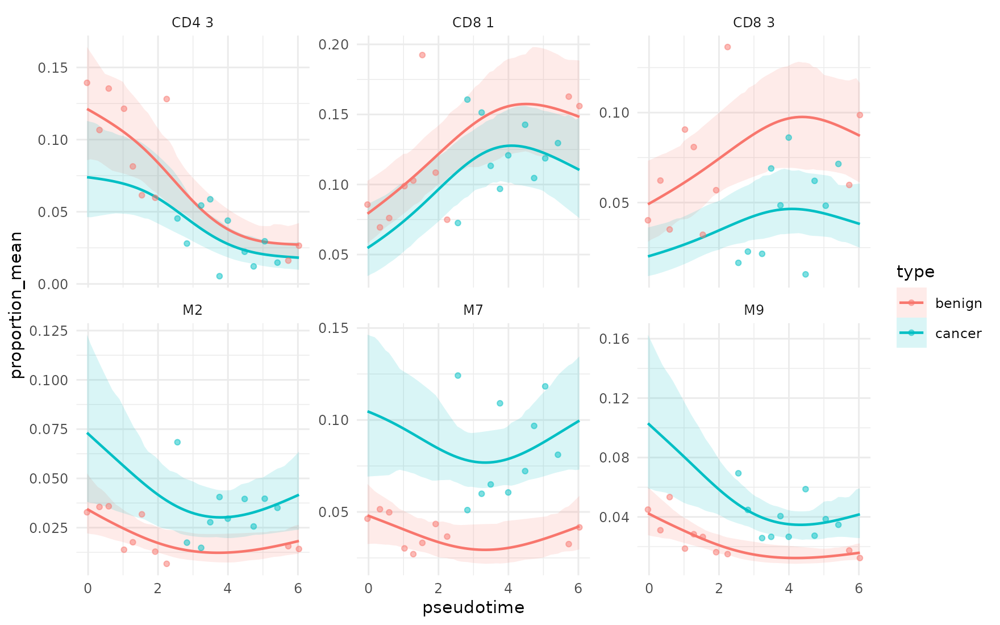
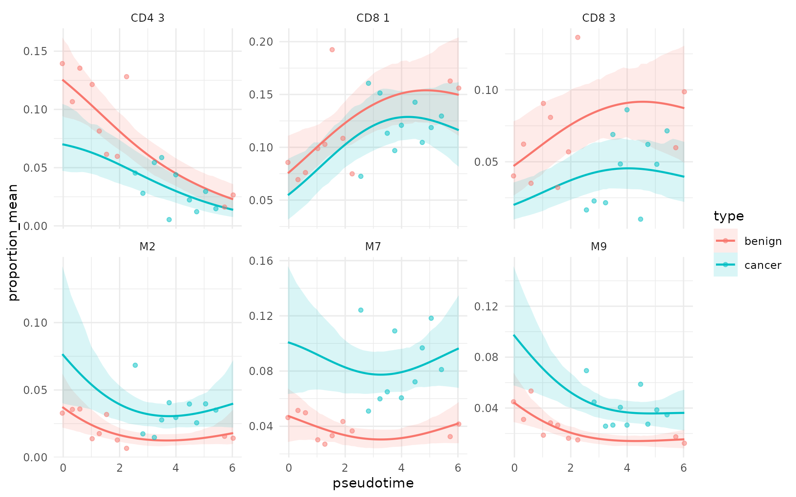
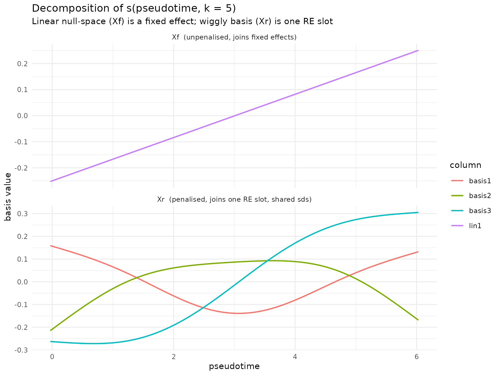
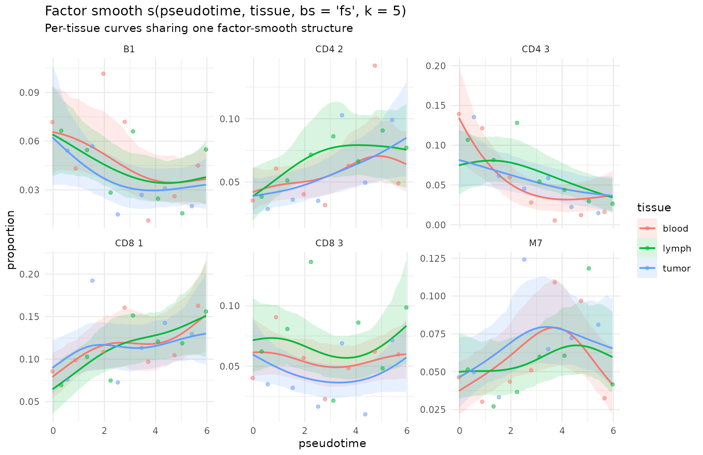

# Smooth (spline) terms in sccomp

Abstract

Splines let you model non-linear compositional effects of a continuous
covariate. For example, pseudotime, age, dose, time-since-treatment, on
cell-type proportions.

## Why smooth terms?

Continuous factors in linear models are tricky, becausegenerally you
need to make assumptions about their linearity of higher polinomial
trend. A spline replaces a single linear column with a small, flexible
basis that lets the curve bend, while a penalty keeps the bend
conservative

`sccomp` adopts the same syntax as `brms` / `mgcv`:

``` r

~ type + s(pseudotime, k = 5)        
```

Under the hood every smooth is split into two pieces:

- an unpenalised **linear trend** block `Xf`, and
- a penalised **wiggly** block `Xr` (the non linear part).

## What is supported

| Feature | Notes |
|----|----|
| `s(x, k = ...)` in `formula_composition` |  |
| `s(x, z, bs = "fs", k = ...)` (factor smooth) |  |
| Multiple smooth terms in the same formula |  |
| Mix smooths with parametric terms (`~ type + s(x)`) |  |
| Mix smooths with explicit `(... | g)` random effects |  |
| `s(x, by = factor)` (independent smooths per level) | Max 2 smooth terms allowed |

``` r

library(dplyr)
library(tidyr)
library(ggplot2)
library(sccomp)
data("counts_obj")
```

## Continuous covariate

``` r

set.seed(1)
samples <- levels(counts_obj$sample)
pt_map <- tibble(
  sample     = samples,
  pseudotime = seq(0, 6, length.out = length(samples)) +
                 rnorm(length(samples), 0, 0.05)
)

counts_pt <- counts_obj |> left_join(pt_map, by = "sample")
counts_pt |> distinct(sample, type, pseudotime) |> head()
#> # A tibble: 6 × 3
#>   sample       type   pseudotime
#>   <chr>        <fct>       <dbl>
#> 1 10x_6K       benign    -0.0313
#> 2 10x_8K       benign     0.325 
#> 3 GSE115189    benign     0.590 
#> 4 SCP345_580   benign     1.03  
#> 5 SCP345_860   benign     1.28  
#> 6 SCP424_pbmc1 benign     1.54
```

### 1. Fit `~ type + s(pseudotime, k = 5)`

``` r

fit <- counts_pt |>
  sccomp_estimate(
    formula_composition = ~ type + s(pseudotime, k = 5),
    formula_variability = ~ 1,
    sample              = "sample",
    cell_group          = "cell_group",
    abundance           = "count",
    cores               = 1,
    verbose             = FALSE,
    max_sampling_iterations = 2000
  )
```

The output will include one new linear parameter

    s(pseudotime, k = 5)__lin1

and three penalised basis

    s(pseudotime, k = 5)___basis01
    s(pseudotime, k = 5)___basis02
    s(pseudotime, k = 5)___basis03

``` r

fit |>
  sccomp_test() |>
  select(cell_group, parameter, c_lower, c_effect, c_upper, c_FDR) 
#> Joining with `by = join_by(cell_group, M, parameter)`
#> sccomp model
#> ============
#> 
#> Model specifications:
#>   Family: multi_beta_binomial 
#>   Composition formula: ~type + s(pseudotime, k = 5) 
#>   Variability formula: ~1 
#>   Inference method: pathfinder 
#> 
#> Data: Samples: 20   Cell groups: 36 
#> 
#> Column prefixes: c_ -> composition parameters  v_ -> variability parameters
#> 
#> Convergence diagnostics:
#>   For each parameter, n_eff is the effective sample size and R_k_hat is the potential
#>   scale reduction factor on split chains (at convergence, R_k_hat = 1).
#> 
#> # A tibble: 216 × 6
#>    cell_group parameter                      c_lower c_effect c_upper    c_FDR
#>    <chr>      <chr>                            <dbl>    <dbl>   <dbl>    <dbl>
#>  1 B1         (Intercept)                      0.918   1.19     1.46  0       
#>  2 B1         typecancer                      -0.859  -0.559   -0.229 0.000625
#>  3 B1         s(pseudotime, k = 5)__lin1      -0.445  -0.0367   0.321 0.222   
#>  4 B1         s(pseudotime, k = 5)___basis01  -1.90   -0.653    0.172 0.0585  
#>  5 B1         s(pseudotime, k = 5)___basis02  -1.56   -0.338    0.399 0.151   
#>  6 B1         s(pseudotime, k = 5)___basis03  -0.944  -0.242    0.419 0.143   
#>  7 B2         (Intercept)                      0.534   0.849    1.15  0       
#>  8 B2         typecancer                      -1.16   -0.811   -0.445 0       
#>  9 B2         s(pseudotime, k = 5)__lin1      -0.256   0.211    0.603 0.0684  
#> 10 B2         s(pseudotime, k = 5)___basis01  -2.22   -1.10    -0.165 0.0113  
#> # ℹ 206 more rows
```

These parameters cannot be interpreted directly, on the contrary of
other parameter in the linear model.

### 2. Visualise the curve

To draw the fitted curve, predict at a regular grid of `pseudotime`
values (remember to also supply any other covariates the formula needs —
here, `type`):

``` r

grid <- expand.grid(
  pseudotime = seq(min(pt_map$pseudotime), max(pt_map$pseudotime), length.out = 60),
  type       = levels(counts_obj$type)
) |>
  as_tibble() |>
  mutate(sample = sprintf("grid_%03d", row_number()))

pred <- fit |>
  sccomp_predict(new_data = grid, number_of_draws = 200)
#> Running standalone generated quantities after 1 MCMC chain, with 1 thread(s) per chain...
#> 
#> Chain 1  Elapsed Time: 1.333 seconds (Generated Quantities) 
#> Chain 1 finished in 0.0 seconds.

head(pred)
#> # A tibble: 6 × 10
#>   pseudotime type   sample   cell_group proportion_mean proportion_lower
#>        <dbl> <fct>  <chr>    <chr>                <dbl>            <dbl>
#> 1    -0.0313 benign grid_001 B1                 0.0612           0.0436 
#> 2    -0.0313 benign grid_001 B2                 0.0298           0.0184 
#> 3    -0.0313 benign grid_001 B3                 0.00812          0.00501
#> 4    -0.0313 benign grid_001 BM                 0.00845          0.00549
#> 5    -0.0313 benign grid_001 CD4 1              0.0256           0.0188 
#> 6    -0.0313 benign grid_001 CD4 2              0.0370           0.0257 
#> # ℹ 4 more variables: proportion_upper <dbl>, unconstrained_mean <dbl>,
#> #   unconstrained_lower <dbl>, unconstrained_upper <dbl>
```

[`sccomp_predict()`](https://mangiolalaboratory.github.io/sccomp/reference/sccomp_predict.md)
already returns the `new_data` columns (`pseudotime`, `type`, `sample`)
alongside `proportion_mean` and the 95% credible interval
`proportion_lower` / `proportion_upper`.

We show the six cell groups with the largest pseudotime range in the
posterior mean.

``` r

top_cgs <- pred |>
  group_by(cell_group) |>
  summarise(rng = max(proportion_mean) - min(proportion_mean)) |>
  arrange(desc(rng)) |>
  slice_head(n = 6) |>
  pull(cell_group)

raw <- counts_pt |>
  group_by(sample) |>
  mutate(prop = count / sum(count)) |>
  ungroup() |>
  filter(cell_group %in% top_cgs)

pred |>
  filter(cell_group %in% top_cgs) |>
  ggplot(aes(pseudotime, proportion_mean, colour = type, fill = type)) +
  geom_ribbon(aes(ymin = proportion_lower, ymax = proportion_upper),
              alpha = 0.15, linewidth = 0) +
  geom_line(linewidth = 0.7) +
  geom_point(data = raw, aes(y = prop), alpha = 0.5, size = 1.2) +
  facet_wrap(~ cell_group, scales = "free_y", ncol = 3) +
  theme_minimal(base_size = 10)
```



The blue/red curves are posterior means, ribbons are 95% credible
intervals, points are observed sample proportions. Note the wiggle —
e.g. CD8 1 peaks around pseudotime ≈ 4 — which a purely linear
`~ type + pseudotime` model could not capture.

### 3. Let’s use a smaller basis (`k = 3`)

The same parametric + smooth layout works with a lower `k`. Fewer basis
functions mean a smoother curve and less risk of over-fitting when
sample size is modest. Here `k = 3` yields one unpenalised linear column
and a single wiggly basis column.

``` r

fit_k3 <- counts_pt |>
  sccomp_estimate(
    formula_composition = ~ type + s(pseudotime, k = 3),
    formula_variability = ~ 1,
    sample              = "sample",
    cell_group          = "cell_group",
    abundance           = "count",
    cores               = 1,
    verbose             = FALSE,
    max_sampling_iterations = 2000
  )
```

``` r

pred_k3 <- fit_k3 |>
  sccomp_predict(new_data = grid, number_of_draws = 200)
#> Running standalone generated quantities after 1 MCMC chain, with 1 thread(s) per chain...
#> 
#> Chain 1  Elapsed Time: 1.317 seconds (Generated Quantities) 
#> Chain 1 finished in 0.0 seconds.
```

``` r

pred_k3 |>
  filter(cell_group %in% top_cgs) |>
  ggplot(aes(pseudotime, proportion_mean, colour = type, fill = type)) +
  geom_ribbon(aes(ymin = proportion_lower, ymax = proportion_upper),
              alpha = 0.15, linewidth = 0) +
  geom_line(linewidth = 0.7) +
  geom_point(data = raw, aes(y = prop, colour = type), alpha = 0.5, size = 1.2) +
  facet_wrap(~ cell_group, scales = "free_y", ncol = 3) +
  theme_minimal(base_size = 10)
```



Compared with the `k = 5` figure above, the credible bands are often a
little tighter and the lines less wiggly: the model has less capacity to
bend, which is appropriate when you want a gentle pseudotime trend on
top of the `type` effect.

### 4. Under the hood: What `s()` actually decomposes into

The smooth metadata used to fit the model is stored on the result, so we
can re-evaluate the basis at any new pseudotime value. This is exactly
what
[`sccomp_predict()`](https://mangiolalaboratory.github.io/sccomp/reference/sccomp_predict.md)
does internally.

``` r

smooth_meta    <- sccomp:::get_smooth_results(fit)
smooth_specs   <- smooth_meta$smooth_specs
smooth_re_objs <- smooth_meta$smooth_re_objs

grid_basis <- tibble(
  pseudotime = seq(min(pt_map$pseudotime), max(pt_map$pseudotime),  length.out = 200),
  type = levels(counts_obj$type)[1]  # any constant works; smooth ignores it
)

basis <- sccomp:::predict_smooth_at_newdata(
  smooth_specs[[1]], smooth_re_objs[[1]], grid_basis
)
# Plain s() has one penalised block — for multi-penalty smooths
# (e.g. bs = "fs", t2(...)) `Xr_blocks` would contain several matrices.
Xr_single <- basis$Xr_blocks[[1]]

basis_long <- bind_rows(
  as.data.frame(basis$Xf) |>
    setNames(sprintf("lin%d", seq_len(ncol(basis$Xf)))) |>
    mutate(pseudotime = grid_basis$pseudotime) |>
    pivot_longer(-pseudotime, names_to = "column", values_to = "value") |>
    mutate(block = "Xf  (unpenalised, joins fixed effects)"),
  as.data.frame(Xr_single) |>
    setNames(sprintf("basis%d", seq_len(ncol(Xr_single)))) |>
    mutate(pseudotime = grid_basis$pseudotime) |>
    pivot_longer(-pseudotime, names_to = "column", values_to = "value") |>
    mutate(block = "Xr  (penalised, joins one RE slot, shared sds)")
)

ggplot(basis_long, aes(pseudotime, value, colour = column)) +
  geom_line(linewidth = 0.7) +
  facet_wrap(~ block, scales = "free_y", ncol = 1) +
  labs(x = "pseudotime", y = "basis value",
       title = "Decomposition of s(pseudotime, k = 5)",
       subtitle = "Linear null-space (Xf) is a fixed effect; wiggly basis (Xr) is one RE slot") +
  theme_minimal(base_size = 10)
```



The top panel is the **linear trend**, the bottom panel is the **wiggly
basis**: each of these columns gets one coefficient per cell group, and
a *single* smoothing standard deviation `sds` per cell group controls
how much wiggle is allowed. Increasing `k` would add more wiggly basis
columns; the penalty would then keep the extra capacity from
over-fitting.

## Hierarchical smooths: per-group curves with shared structure

A common ask is: “fit a smooth per tissue (or per condition, per donor,
…) but partial-pool across groups”. The shorthand for this (also used in
`mgcv`) is `s(x, factor, bs = "fs")`. It builds one common wiggly curve
and a per-level deviation, governed jointly by a small set of smoothing
parameters.

### 1. Fit ~ s(pseudotime, tissue, bs = “fs”, k = 5)

We extend `counts_obj` with a synthetic `tissue` factor (3 levels) on
top of the existing `pseudotime`:

``` r

set.seed(11)
samples <- levels(counts_obj$sample)
covs <- tibble::tibble(
  sample     = samples,
  pseudotime = seq(0, 6, length.out = length(samples)) +
                 rnorm(length(samples), 0, 0.05),
  tissue     = factor(rep(c("blood", "lymph", "tumor"),
                          length.out = length(samples)))
)
counts_tissue <- counts_obj |> dplyr::left_join(covs, by = "sample")
counts_tissue |> dplyr::distinct(sample, type, pseudotime, tissue) |> head()
#> # A tibble: 6 × 4
#>   sample       type   pseudotime tissue
#>   <chr>        <fct>       <dbl> <fct> 
#> 1 10x_6K       benign    -0.0296 blood 
#> 2 10x_8K       benign     0.317  lymph 
#> 3 GSE115189    benign     0.556  tumor 
#> 4 SCP345_580   benign     0.879  blood 
#> 5 SCP345_860   benign     1.32   lymph 
#> 6 SCP424_pbmc1 benign     1.53   tumor
```

``` r

fit_fs <- counts_tissue |>
  sccomp_estimate(
    formula_composition = ~ s(pseudotime, tissue, bs = "fs", k = 5),
    formula_variability = ~ 1,
    sample              = "sample",
    cell_group          = "cell_group",
    abundance           = "count",
    cores               = 1,
    verbose             = FALSE,
    max_sampling_iterations = 2000
  )

# This one smooth occupies 3 RE slots (one per mgcv penalty block);
# you can confirm via:
attr(fit_fs, "model_input")$ncol_X_random_eff
#> [1] 9 3 3 0
```

The three non-zero entries correspond to the wiggly main block (9
columns for `k = 5` × 3 tissues) and two smaller per-level deviation
blocks.

### 2. Predict and plot per-tissue curves

[`sccomp_predict()`](https://mangiolalaboratory.github.io/sccomp/reference/sccomp_predict.md)
takes a grid that crosses `pseudotime` with `tissue`:

``` r

grid_fs <- expand.grid(
  pseudotime = seq(min(covs$pseudotime), max(covs$pseudotime),
                   length.out = 60),
  tissue     = levels(covs$tissue)
) |>
  as_tibble() |>
  mutate(sample = sprintf("fs_grid_%03d", row_number()))

pred_fs <- fit_fs |>
  sccomp_predict(new_data = grid_fs, number_of_draws = 200)
#> Running standalone generated quantities after 1 MCMC chain, with 1 thread(s) per chain...
#> 
#> Chain 1  Elapsed Time: 2.027 seconds (Generated Quantities) 
#> Chain 1 finished in 0.0 seconds.

head(pred_fs)
#> # A tibble: 6 × 10
#>   pseudotime tissue sample      cell_group proportion_mean proportion_lower
#>        <dbl> <fct>  <chr>       <chr>                <dbl>            <dbl>
#> 1    -0.0296 blood  fs_grid_001 B1                 0.0657           0.0399 
#> 2    -0.0296 blood  fs_grid_001 B2                 0.0240           0.0120 
#> 3    -0.0296 blood  fs_grid_001 B3                 0.0103           0.00674
#> 4    -0.0296 blood  fs_grid_001 BM                 0.00680          0.00420
#> 5    -0.0296 blood  fs_grid_001 CD4 1              0.0280           0.0183 
#> 6    -0.0296 blood  fs_grid_001 CD4 2              0.0420           0.0276 
#> # ℹ 4 more variables: proportion_upper <dbl>, unconstrained_mean <dbl>,
#> #   unconstrained_lower <dbl>, unconstrained_upper <dbl>
```

Pick the most pseudotime-responsive cell groups and plot one curve per
tissue:

``` r

top_cgs_fs <- pred_fs |>
  group_by(cell_group) |>
  summarise(rng = max(proportion_mean) - min(proportion_mean)) |>
  arrange(desc(rng)) |>
  slice_head(n = 6) |>
  pull(cell_group)

raw_fs <- counts_tissue |>
  group_by(sample) |>
  mutate(prop = count / sum(count)) |>
  ungroup() |>
  filter(cell_group %in% top_cgs_fs)

pred_fs |>
  filter(cell_group %in% top_cgs_fs) |>
  ggplot(aes(pseudotime, proportion_mean,
             colour = tissue, fill = tissue)) +
  geom_ribbon(aes(ymin = proportion_lower, ymax = proportion_upper),
              alpha = 0.15, linewidth = 0) +
  geom_line(linewidth = 0.7) +
  geom_point(data = raw_fs, aes(y = prop, colour = tissue),
             alpha = 0.5, size = 1.2) +
  facet_wrap(~ cell_group, scales = "free_y", ncol = 3) +
  labs(x = "pseudotime", y = "proportion",
       title = "Factor smooth s(pseudotime, tissue, bs = 'fs', k = 5)",
       subtitle = "Per-tissue curves sharing one factor-smooth structure") +
  theme_minimal(base_size = 10)
```



The three coloured curves are the same smooth applied to different
tissues, allowed to deviate at each pseudotime point. Where the
deviations are small (e.g. CD8 1) the curves track each other; where
they are large (e.g. CD8 2) one tissue diverges. Whether the deviations
are “real” is expressed by the credible-interval ribbons — overlap means
the data don’t support a difference.

### fs vs `s(x, by = tissue)`

`s(x, by = tissue)` is an alternative spelling that *also* gives a
per-tissue curve, but it treats each tissue’s smooth as independent:
each level gets its own smoothing parameter, and the curves can have
totally unrelated shape. Use `bs = "fs"` when you want a single shared
smoothness scale and partial pooling across levels; use `by =` when the
tissues are clearly heterogeneous and a shared smoothness assumption
would be misleading.

## Multiple smooths and mixing with random effects

`sccomp` can model up to two splines together with random effects.

``` r

~ type +
  s(pseudotime, k = 5) +
  s(age,        k = 4) +
  (1 | donor)
```

## Session info

    #> R version 4.6.1 (2026-06-24)
    #> Platform: x86_64-pc-linux-gnu
    #> Running under: Ubuntu 24.04.4 LTS
    #> 
    #> Matrix products: default
    #> BLAS:   /usr/lib/x86_64-linux-gnu/openblas-pthread/libblas.so.3 
    #> LAPACK: /usr/lib/x86_64-linux-gnu/openblas-pthread/libopenblasp-r0.3.26.so;  LAPACK version 3.12.0
    #> 
    #> locale:
    #>  [1] LC_CTYPE=C.UTF-8       LC_NUMERIC=C           LC_TIME=C.UTF-8       
    #>  [4] LC_COLLATE=C.UTF-8     LC_MONETARY=C.UTF-8    LC_MESSAGES=C.UTF-8   
    #>  [7] LC_PAPER=C.UTF-8       LC_NAME=C              LC_ADDRESS=C          
    #> [10] LC_TELEPHONE=C         LC_MEASUREMENT=C.UTF-8 LC_IDENTIFICATION=C   
    #> 
    #> time zone: UTC
    #> tzcode source: system (glibc)
    #> 
    #> attached base packages:
    #> [1] stats     graphics  grDevices utils     datasets  methods   base     
    #> 
    #> other attached packages:
    #> [1] sccomp_2.1.34     instantiate_0.2.3 ggplot2_4.0.3     tidyr_1.3.2      
    #> [5] dplyr_1.2.1      
    #> 
    #> loaded via a namespace (and not attached):
    #>  [1] tidyselect_1.2.1            farver_2.1.2               
    #>  [3] S7_0.2.2                    fastmap_1.2.0              
    #>  [5] SingleCellExperiment_1.34.0 tensorA_0.36.2.1           
    #>  [7] digest_0.6.39               lifecycle_1.0.5            
    #>  [9] processx_3.9.0              magrittr_2.0.5             
    #> [11] posterior_1.7.0             compiler_4.6.1             
    #> [13] rlang_1.3.0                 sass_0.4.10                
    #> [15] tools_4.6.1                 utf8_1.2.6                 
    #> [17] yaml_2.3.12                 data.table_1.18.4          
    #> [19] knitr_1.51                  labeling_0.4.3             
    #> [21] S4Arrays_1.12.0             htmlwidgets_1.6.4          
    #> [23] DelayedArray_0.38.2         RColorBrewer_1.1-3         
    #> [25] cmdstanr_0.9.0              abind_1.4-8                
    #> [27] withr_3.0.3                 purrr_1.2.2                
    #> [29] BiocGenerics_0.58.1         desc_1.4.3                 
    #> [31] grid_4.6.1                  stats4_4.6.1               
    #> [33] scales_1.4.0                SummarizedExperiment_1.42.0
    #> [35] cli_3.6.6                   rmarkdown_2.31             
    #> [37] crayon_1.5.3                ragg_1.5.2                 
    #> [39] generics_0.1.4              otel_0.2.0                 
    #> [41] tzdb_0.5.0                  cachem_1.1.0               
    #> [43] stringr_1.6.0               splines_4.6.1              
    #> [45] parallel_4.6.1              XVector_0.52.0             
    #> [47] matrixStats_1.5.0           vctrs_0.7.3                
    #> [49] Matrix_1.7-5                jsonlite_2.0.0             
    #> [51] callr_3.8.0                 IRanges_2.46.0             
    #> [53] hms_1.1.4                   patchwork_1.3.2            
    #> [55] S4Vectors_0.50.1            ggrepel_0.9.8              
    #> [57] systemfonts_1.3.2           jquerylib_0.1.4            
    #> [59] glue_1.8.1                  ggside_0.4.1               
    #> [61] pkgdown_2.2.1               ps_1.9.3                   
    #> [63] distributional_0.8.1        stringi_1.8.7              
    #> [65] gtable_0.3.6                GenomicRanges_1.64.0       
    #> [67] tibble_3.3.1                pillar_1.11.1              
    #> [69] htmltools_0.5.9             Seqinfo_1.2.0              
    #> [71] R6_2.6.1                    textshaping_1.0.5          
    #> [73] evaluate_1.0.5              Biobase_2.72.0             
    #> [75] lattice_0.22-9              readr_2.2.0                
    #> [77] backports_1.5.1             bslib_0.11.0               
    #> [79] Rcpp_1.1.2                  nlme_3.1-169               
    #> [81] SparseArray_1.12.2          checkmate_2.3.4            
    #> [83] mgcv_1.9-4                  xfun_0.60                  
    #> [85] fs_2.1.0                    MatrixGenerics_1.24.0      
    #> [87] forcats_1.0.1               prettydoc_0.4.1            
    #> [89] pkgconfig_2.0.3
